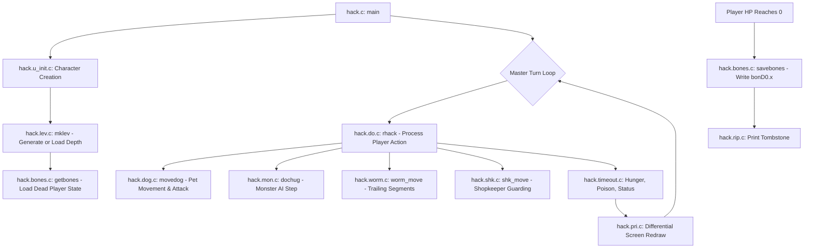
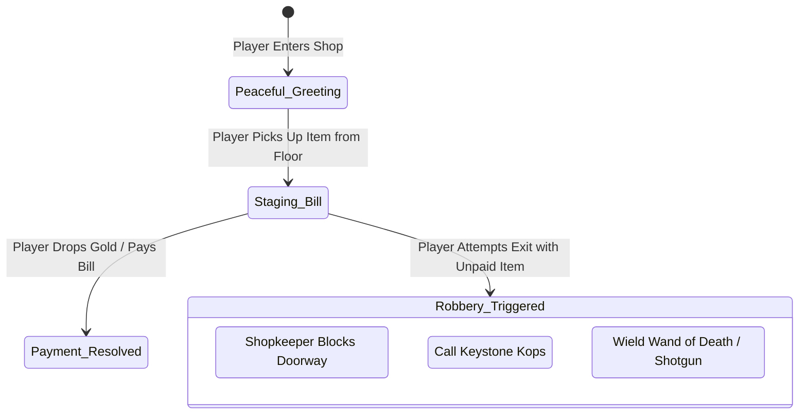

# `hack` — Architecture & Engine Mechanics

> Deep-dive technical analysis of the turn-based event loop, pet AI, shopkeeper economics, procedural level generation, and bones level serialization.

---

## 1. High-Level Engine Architecture

The architecture of *Hack* is organized around a strictly synchronized turn-based state machine:



---

## 2. The Turn Cycle & Energy Scheduling (`hack.c`)

Each player command executes one primary atomic action:
1. **Player Turn (`rhack()` in `hack.do.c`):** Moves the player or applies an item. Takes a base duration depending on player speed and encumbrance.
2. **Pet Turn (`movedog()` in `hack.dog.c`):**
   - If adjacent to player, stays close.
   - If adjacent to hostile monster, rolls attack.
   - If standing on an uncursed item, may pick it up and carry it to player.
   - If standing on a cursed item, stops and whimpers.
3. **Monster AI Loop (`dochug()` in `hack.mon.c`):**
   - Every monster on the current floor executes its turn based on its movement speed (`mlevel, mmove` from `def.permonst.h`).
   - Fast monsters (e.g. giant ants, speed 18) take multiple actions per player turn!

---

## 3. Subterranean Economics & Shopkeeper AI (`hack.shk.c`)

The general store system in *Hack* is an early triumph of emergent game design:



### In-Code Mechanics

- When an item is lifted from a shop tile, the engine moves the item into the player's inventory but tags it with `unpaid = 1`.
- Stepping onto the doorway threshold (`+`) triggers a boundary check. If `unpaid > 0`, the shopkeeper teleports to block the exit and demands payment.
- Attacking the shopkeeper transforms them into a permanent hostile high-level boss (`ac = 0, speed = 18`), summoning squads of Keystone Kops (`K`) to flood the dungeon floor.

---

## 4. Multi-Segment Long Worm Physics (`hack.worm.c`)

Rather than occupying a single square, the Long Worm (`w`) is implemented as a dynamic linked list of body segments:

```c
struct wseg {
    struct wseg *nseg;
    xchar wx, wy;
};
```

When the head moves forward:
1. A new segment is prepended to the head position.
2. The tail segment is popped from the end, clearing that character from the map.
3. Hitting the middle of a long worm with a sharp blade (sword, cleaver) severs the linked list, splitting the worm into **two independent living worms**!

---

## 5. Cross-Session Bones Level Serialization (`hack.bones.c`)

When a player dies, `savebones()` in [`hack.bones.c:35-95`](https://github.com/vattam/BSDGames/tree/master/hack/hack.bones.c#L35-L95) preserves the level state:

```c
void savebones() {
    int fd;
    char whynot[BUFSZ];

    if (dlevel <= 1 || dlevel >= 30)
        return; /* No bones on floor 1 or sanctum */
    
    /* Create bones file: e.g. bonD0.12 */
    fd = create_bonesfile(dlevel, whynot);
    if (fd < 0)
        return;

    /* Serialize level map, traps, and floor objects */
    savelev(fd, dlevel);

    /* Generate ghost of fallen player */
    mkgst(u.ux, u.uy, plname, u.ulevel);

    /* Create tombstone object */
    maketrap(u.ux, u.uy, GRAVE);

    close(fd);
}
```

When another adventurer later reaches that depth, `getbones()` checks for the file. If found, the exact layout, cursed gear, tombstone, and ghost are resurrected into the new game session.
