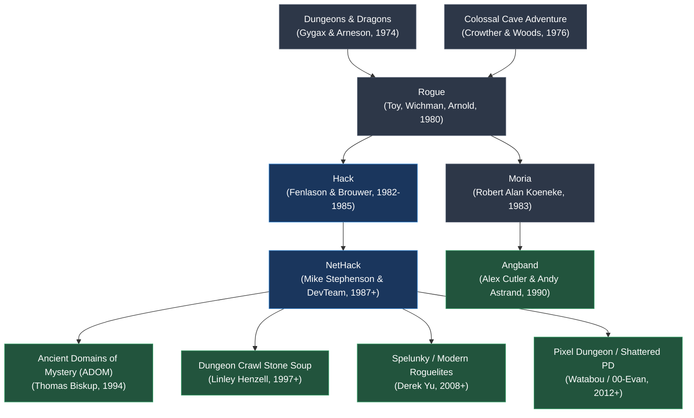

# `hack` — Lineage & Genre Siblings

> Tracing the genealogy of the roguelike genre, from early tabletop D&D to modern action roguelites.

---

## The Roguelike Family Tree

---

## Direct Heritage: From Hack to NetHack

- **1980 (Rogue):** Established ASCII grid movement, procedural dungeons, hunger clocks, and permadeath.
- **1982–1985 (Hack):** Expanded Rogue with interactive shops, pet dogs, bones levels, long worms, and 58+ monster classes.
- **1987 (NetHack):** Mike Stephenson, Izchak Miller, and the DevTeam branched Brouwer's Hack source to add quests, branching branches (Sokoban, Mines, Gehennom), and the famous devteam philosophy: *"The DevTeam thinks of everything."*
- **2000s+ (Modern Roguelikes):** *Pixel Dungeon*, *Brogue*, *Spelunky*, *The Binding of Isaac*, and *Enter the Gungeon* directly inherited the systemic room-and-corridor design and emergent hazard mechanics born in *Hack*.
