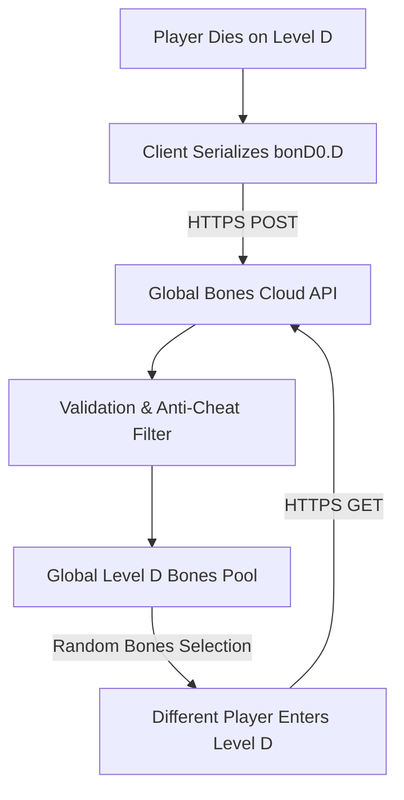

# `hack` — Modernization & Port Ideas

> Brainstorming modern enhancements, cloud-shared bones infrastructure, optional graphical tilesets, and preservation invariants.

---

## 1. Cloud-Shared Bones Server Architecture

In 1985, bones levels were shared only among users on the same Unix machine. In the modern era, a global cloud bones server can unite thousands of players worldwide:

### Community Ecosystem
- Stumble across tombstones left by friends or famous speedrunners.
- Inspect the deceased player's ghost, cause of death, and inventory hoard.

---

## 2. UI / UX Design Ideas

### Dual Display: Classic ASCII & Modern 32x32 Tileset
- **Classic ASCII Mode:** Crisp VT100 characters with 24-bit TrueColor syntax highlighting.
- **Optional Graphical Tileset:** Clean pixel-art tiles depicting character roles, distinct monster sprites, glowing wands, and detailed shop interiors.
- **Mouse Pathfinding & Auto-Explore:** Click any visible corridor or room floor to pathfind automatically using A* algorithm, stopping immediately upon spotting a hostile monster.

### Live Side-Panel HUD
Instead of cycling through menus to check Armor Class or inventory, provide an integrated side panel:
- Visual health gauge, magic energy, and hunger barometer (`Satiated`, `Normal`, `Hungry`, `Weak`).
- Active intrinsic status icons (Poison Resistance, Fire Immunity, Telepathy, Invisibility).
- Interactive inventory panel with quick-action click targets (`[w] Wield`, `[q] Quaff`).

---

## 3. Seedable Procedural Dungeon Runs

- Support `--seed <number>` to guarantee identical floor generation, monster spawns, and item distributions.
- Enables competitive daily challenge runs and tool-assisted speedrun verification.

---

## 4. What NOT to Change (Preservation Invariants)

1. **Permadeath & No Save-Scumming:** Dying is permanent; save files must be deleted upon restoration.
2. **The Turn-Based Tactical Clock:** Time moves only when the player acts. Never introduce real-time action elements into the core dungeon crawl.
3. **The Iconic Mechanics:** The pet dog, the shopkeeper's temper, the mystery of unidentified items, and the protective sanctuary of *"Elbereth"* must remain intact.

---

## 5. Open Questions

1. **Should NetHack Features Be Backported?**
   - *Recommendation:* No. While *NetHack* expanded *Hack* with dozens of new classes (Valkyrie, Monk, Samurai) and branching quests, this port is a spiritual successor to **BSD Hack 1.0.3**. Its historical value lies in presenting the tighter, leaner 1985 CWI design.
