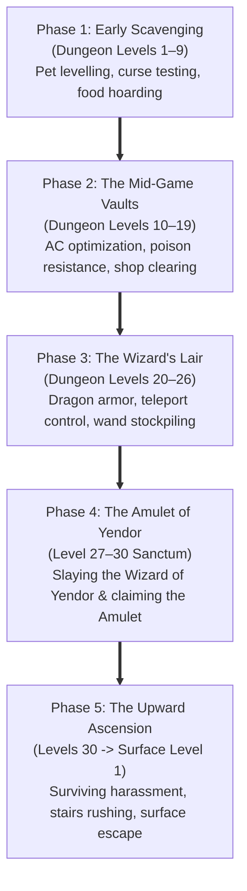

# `hack` — The Universal Ascendant Protocol

> A comprehensive strategic survival and victory doctrine for conquering the procedurally generated Dungeons of Doom, seizing the Amulet of Yendor, and ascending to the surface.

---

## Strategic Overview

Because *Hack* synthesizes its 30 dungeon levels procedurally at runtime, there is no fixed room sequence. Victory requires executing the **Universal Ascendant Protocol**—a rigorous methodology of resource accumulation, threat identification, and tactical risk mitigation divided into five distinct phases:



---

## Phase 1: Early Scavenging & Pet Levelling (D1–D9)

### Primary Goals
1. Keep your pet dog alive and let it kill small monsters (kobolds, rats, bats) so it grows into a ferocious large dog.
2. Establish safe curse-testing: Drop all unknown weapons, armor, and rings on the floor. If your dog steps on the item happily, it is uncursed. If it refuses or hesitates, the item is cursed.
3. Lower Armor Class (AC): In AD&D mechanics used by *Hack*, **lower AC is better** (AC 10 is unarmored naked; AC 0 or negative is heavily protected). Equip uncursed plate mail or chainmail and a helmet.
4. Manage Hunger: Never eat corpses when your status is `"Satiated"`. Only eat fresh, non-poisonous monster corpses (e.g. dogs, rats, newts, lizards) to conserve portable food rations for deep floors.

### Lethal Pitfalls in Phase 1
- **Floating Eyes (`E`):** Never hit a floating eye in melee! Hitting it with a sword or fist paralyses your character for 50+ turns, allowing tiny rats to nibble you to death. Kill it from afar using thrown rocks or daggers.
- **Killer Bees (`k`):** Their poison sting deals massive fatal constitution damage early on. Retreat into a single-tile corridor and fight them one at a time, or engrave *"Elbereth"* in the dust.

---

## Phase 2: Mid-Game Consolidation & Resistances (D10–D19)

### Primary Goals
1. **Acquire Intrinsic Poison Resistance:** Slay and eat a killer bee queen, snake, or centipede until you receive the message: *"You feel healthy."* Poison resistance is mandatory for surviving deeper floors.
2. **Shop Identification & Pricing:** Use subterranean general stores (`hack.shk.c`) to identify items:
   - Selling an unknown wand for 100+ gold identifies it as a powerful combat wand (Death, Fire, Cold, Lightning).
   - Buy scrolls of identify and bless them by dipping in holy water.
3. **Beware Rust Monsters (`R`):** Rust monsters eat and destroy iron armor and swords on contact. When a rust monster approaches:
   - Unequip iron armor immediately (`T`).
   - Switch to a non-metallic wooden club, leather gloves, or use ranged wands.

---

## Phase 3: The Deep Abyss & Dragon Preparation (D20–D26)

### Primary Goals
1. **Acquire Dragon Scale Mail:**
   - Slain dragons drop dragon scales.
   - Wearing dragon scale mail provides base AC -1 and permanent reflection/fire/cold immunity depending on dragon color.
2. **Stockpile Escape Utility:**
   - Keep at least one wand of digging (to drop through floors if cornered).
   - Keep a wand of teleportation or ring of teleport control.
   - Keep multiple scrolls of remove curse.
3. **Cockatrice Protocol (`c`):**
   - If a cockatrice is slain, equip leather gloves (`W`) and pick up the corpse (`%`).
   - Wield the cockatrice corpse as your weapon. Hitting any monster (even minotaurs or dragons) instantly petrifies them into stone statues!
   - *Caution:* Never walk into a pit or down stairs while wielding it, as you will petrify yourself.

---

## Phase 4: Slaying the Wizard of Yendor (D27–D30)

### The Confrontation
1. On the deepest dungeon floor (Level 27–30), locate the Wizard's inner sanctum.
2. The Wizard of Yendor is a high-level spellcaster who casts:
   - Curse spells (cursing all inventory items).
   - Summon monster storms (swarming you with demons and undead).
   - Double trouble (cloning himself into illusory duplicates).
3. **Combat Protocol:**
   - Engrave *"Elbereth"* immediately beneath your feet.
   - Fire high-tier attack wands (Wand of Death or Wand of Fire).
   - Once slain, the Wizard drops the sacred **Amulet of Yendor** (`"`).
   - Pick up the Amulet of Yendor.

---

## Phase 5: The Upward Ascension Run (The Return Trip)

### The Gauntlet
1. The moment the Amulet of Yendor enters your inventory:
   - The dungeon enters high alert.
   - Your character's hunger rate triples.
   - Teleportation is disabled by the Amulet's anti-magic field.
   - The Wizard of Yendor's vengeful ghost periodically resurrects to ambush you on random stairwells!
2. **Ascension Path:**
   - Do not stop to explore rooms or fight unnecessary monsters.
   - Rush directly toward upward staircases (`<`).
   - Use wands of digging or wands of sleep to bypass monster traffic jams in corridors.
   - Climb from Level 30 all the way back up to Level 1.
3. **Surface Escape:**
   - On Dungeon Level 1, ascend the final staircase (`<`).
   - The game announces:
     ```text
     You escaped the Dungeons of Doom with the Amulet of Yendor!
     You ascend to demigod-hood!
     ```
   - Total Grandmaster Victory achieved!
