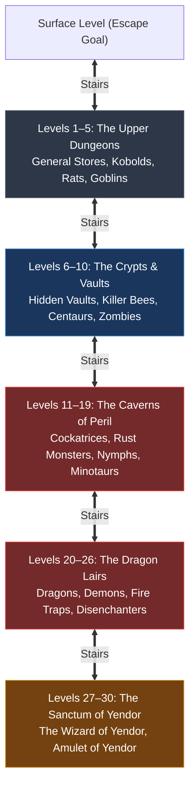

# `hack` — Dungeon Architecture & Procedural Generation

> Procedural level synthesis algorithms, depth tier topologies, and the Master Monster & Feature Directory for the Dungeons of Doom.

---

## 1. Topography of the Dungeons of Doom

In *Hack*, the dungeon is a 30-level vertical descent into subterranean terror:



---

## 2. Procedural Floor Synthesis (`hack.lev.c` & `def.mkroom.h`)

Each dungeon level is synthesized onto an $80 \times 24$ character grid using a 9-cell grid partition ($3 \times 3$ grid of potential room bounding boxes):

```text
+-----------------------+-----------------------+-----------------------+
|                       |                       |                       |
|        Room 0         |        Room 1         |        Room 2         |
|                       |                       |                       |
+-----------------------+-----------------------+-----------------------+
|                       |                       |                       |
|        Room 3         |        Room 4         |        Room 5         |
|                       |                       |                       |
+-----------------------+-----------------------+-----------------------+
|                       |                       |                       |
|        Room 6         |        Room 7         |        Room 8         |
|                       |                       |                       |
+-----------------------+-----------------------+-----------------------+
```

### Generation Algorithm Rules

1. **Room Inception:** For each of the 9 bounding cells, the generator rolls a random probability to place a rectangular room with randomly chosen width and height.
2. **Room Connectivity:** Corridors (`#`) are carved using orthogonal path tracing connecting adjacent rooms through doorway openings (`+`).
3. **Secret Doors:** A fraction of doorways are disguised as solid stone walls (`|` or `-`), requiring explicit search commands (`s`) to reveal.
4. **Vertical Passages:** Exactly one upward staircase (`<`) and one downward staircase (`>`) are spawned per floor in non-overlapping rooms.
5. **Special Room Templates:**
   - **General Stores:** Identified by wooden display shelves holding unpicked items and an active shopkeeper standing near the door.
   - **Hidden Gold Vaults:** 8x8 enclosed rooms completely disconnected from standard corridors, packed with piles of gold (`$`), guarded by the Vault Guard ("Croesus").

---

## 3. Master Monster & Feature Directory by Depth Tier

Below is the authoritative directory mapping dungeon depth bands to resident monster species, environmental hazards, and special structures:

| Depth Band | Typical Monsters | Environmental Hazards & Traps | Special Structures & Features | Survival Priority |
|:---:|---|---|---|---|
| **D1 – D5** | Kobolds (`k`), Jackals (`d`), Giant Rats (`r`), Bats (`b`), Goblins (`o`), Floating Eyes (`E`). | Arrow traps (`^`), Dart traps, Falling rocks. | General Stores, Pet Dogs (`d`), Altars. | Train pet dog; hoard fresh non-toxic food; lower AC. |
| **D6 – D10** | Killer Bees (`k`), Snakes (`s`), Centaurs (`C`), Zombies (`z`), Quivering Blobs (`b`), Hobgoblins. | Trapdoors (plunge down 1 floor), Squeaky boards, Teleport pads (`^`). | Subterranean Vaults (gold hoards), Secret Corridors. | Acquire intrinsic poison resistance; preserve holy water. |
| **D11 – D19**| Cockatrices (`c`), Rust Monsters (`R`), Nymphs (`n`), Leprechauns (`l`), Minotaurs (`H`), Stalkers. | Rust pits, Pit traps with spikes, Polymorph traps. | Large multi-room shops, Bones levels of fallen players. | Protect iron gear from rust; handle cockatrice corpses with gloves. |
| **D20 – D26**| Red Dragons (`D`), White Dragons, Blue Dragons, Umber Hulks (`U`), Disenchanters, Demons (`&`). | Fire traps, Ice traps, Webbing traps, Anti-magic fields. | Dragon roosts, Ancient Temples, High Priest Altars. | Craft dragon scale mail; stockpile escape wands (digging, teleport). |
| **D27 – D30**| **The Wizard of Yendor** (`@`), Major Demons (`&`), Liches (`L`), Nazgûl, Vampires (`V`). | Level-wide anti-magic aura, Lava pools, Instant death runes. | **The Sanctum of Yendor**, The High Pedestal of the Amulet. | Slay the Wizard; seize the Amulet of Yendor; rush upward! |

---

## 4. Bones Level Mechanics (`hack.bones.c`)

When a player dies on depth $D$:
1. If no existing bones file exists for depth $D$, the game writes `bonD0.<D>`.
2. The file preserves:
   - The exact procedural level layout, walls, traps, and secret doors.
   - The player's tombstone at the coordinate of death.
   - The player's restless ghost (`PM_GHOST`), possessing the player's name and level.
   - All inventory items dropped on the floor (often cursed!).
3. Future runs by any player reaching depth $D$ load this exact floor, confronting the player with their predecessor's tragic demise.
