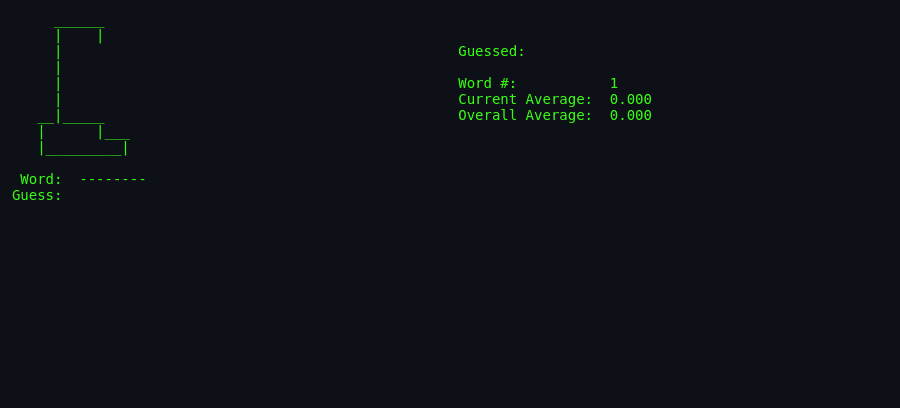
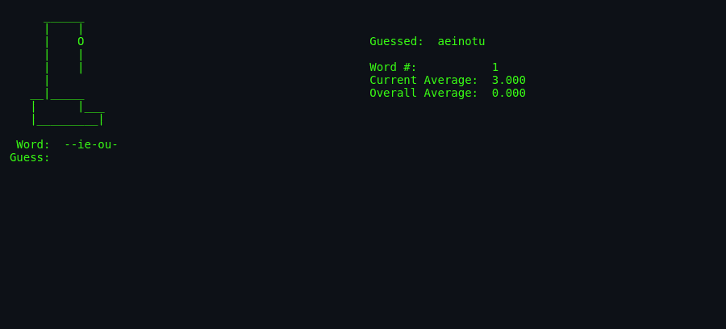
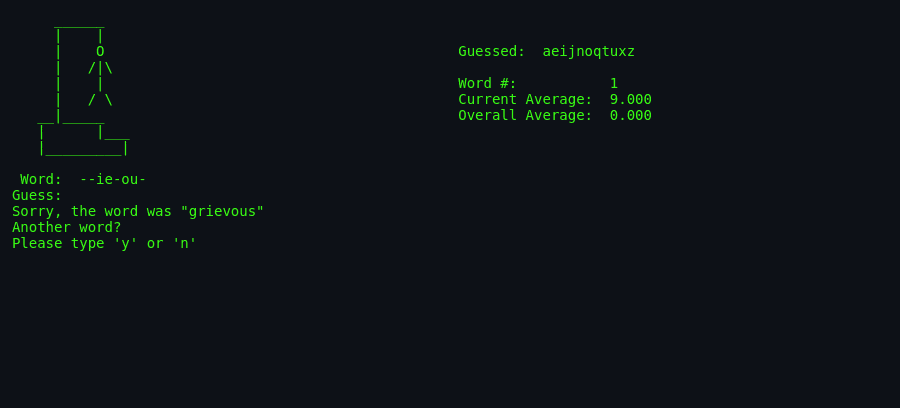

# About `hangman`

> **Brochure.** History, authors, cultural notes, and why this version
> of Hangman is worth your time.

---

## What Is `hangman`?

This is the **BSD Hangman**: the terminal version of the classic word-guessing game that shipped with 4.3BSD. The computer picks a word from the system dictionary, draws a gallows, and waits for you to guess letters one at a time. Every wrong guess brings the stick figure closer to its doom. It is simple, tense, and a perfect miniature example of the early curses terminal UI library.

## Screenshots

*Captured from the original BSDGames binary via
[`docs/scripts/capture-screenshots.sh`](../../../docs/scripts/capture-screenshots.sh).
See root [`AGENTS.md`](../../../AGENTS.md) §6.3.*

*A new game: the noose is drawn, the word is hidden behind dashes, and the first guess is waiting.*

*A few letters guessed, the man partially drawn, and the guessed-letter list growing.*

*The end of a round: the word is revealed and the game asks whether to play again.*

## Authors & Publisher

- **Author(s):** **Ken Arnold** — a central figure in early BSD, also the original author of the `curses` library.
- **Publisher / distributor:** The Regents of the University of California (BSD) and later the NetBSD project.
- **Release year:** 1983 (4.3BSD); the source header carries the 1993 BSD copyright renewal.
- **Language:** C.

## The Era

In the early 1980s, Unix was moving from research systems to mainstream academic and commercial use. Ken Arnold wrote `curses` to give programmers a portable way to build fullscreen terminal applications, and `hangman` became one of its canonical demonstration programs. Running on 80×24 character terminals, the game shows how a little structured text and a few cursor moves can create a compelling UI without graphics hardware.

## Why It's Interesting

- **It is a curses teaching example.** The code is deliberately modular: one file per screen element (`prword`, `prman`, `prdata`). This is how programmers learned to structure terminal apps in the 1980s.
- **It uses almost no memory.** The dictionary is never loaded whole; only one word is read at a time.
- **It has a memorable author.** Ken Arnold's influence on Unix terminal programming is hard to overstate.
- **The tension is timeless.** Seven wrong guesses is a tight, fair budget that keeps every letter meaningful.

## Difficulty & Progression

There is **no explicit progression system**. Every round is independent: a new random word, a fresh seven-error budget, and the same rules. The only difficulty knobs are:

- **Minimum word length** (`-m`, default 6).
- **Dictionary choice** (`-d`), which can be made harder or easier.

The game does track a **running average** of errors per word across the session, giving the player an implicit personal benchmark. There are no levels, bosses, or unlocks — just an endless loop of words until the player quits.

## Making-Of / Anecdotes

- **Author of curses.** Ken Arnold wrote both the game and the library it uses. `hangman` is therefore a piece written by someone who knew exactly what curses was good for.
- **Dictionary as a file, not a database.** The game opens `/usr/share/dict/words` (or equivalent) and seeks to a random byte. This was a practical choice when memory was measured in kilobytes, and it remains elegant today.
- **No save file.** The original has no persistence; your streak ends when you close the terminal.

## Cultural Impact

Hangman is one of the most universal pencil-and-paper games. The BSD version sits at the intersection of that folk tradition and the rise of computer terminal games. It is not a direct ancestor of any modern blockbuster, but it exemplifies the "small, complete, playable in five minutes" design philosophy that still lives in mobile word games and browser puzzles.

For the wider family tree, see [`lineage.md`](./lineage.md).

## Known Bugs (Historical)

- **Random-seek bias.** Because the program picks a random byte position and reads the next line, words that follow long lines are slightly more likely to be chosen. This is negligible for a well-formed dictionary but technically non-uniform.
- **BUFSIZ dependency.** Very long dictionary lines could be truncated by `fgets(Word, BUFSIZ, inf)`.
- **No uppercase input normalization warning for already-guessed letters.** If you guess `A` then `a`, it is handled correctly, but the message simply says "Already guessed 'a'" — a minor quirk.

## See Also

- [`how-to-play.md`](./how-to-play.md) — for actually playing.
- [`architecture.md`](./architecture.md) — for the code side.
- [`lineage.md`](./lineage.md) — for descendants.
- [`references.md`](./references.md) — for source citations.
