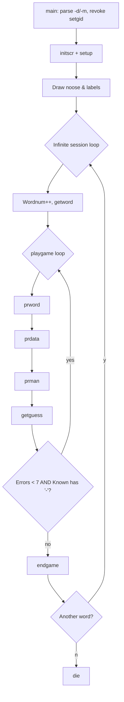
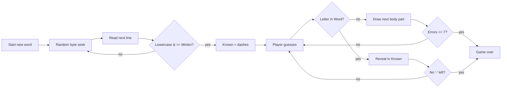

# `hangman` — Original Architecture

> Deep analysis of the original C source. What did the programmer
> build, and how? Focus on what is *clever*, *era-specific*, or
> *transferable*.
>
> Cite upstream file:line references only (never local paths). Upstream
> tree: <https://github.com/vattam/BSDGames/tree/master/hangman>.

---

## Files & Roles

| File | Purpose | Approx. LoC |
|---|---|---:|
| `main.c` | Entry point, argument parsing, main loop | 101 |
| `hangman.h` | Shared declarations, screen coordinates, constants | 94 |
| `setup.c` | Curses init, draw noose, open dictionary, seed RNG | 77 |
| `playgame.c` | Per-word game loop | 64 |
| `getword.c` | Random word selection from dictionary | 78 |
| `getguess.c` | Read and validate a single letter guess | 110 |
| `prdata.c` | Print guessed letters and averages | 62 |
| `prman.c` | Draw the hang-man figure | 59 |
| `prword.c` | Print the partially revealed word | 53 |
| `endgame.c` | Win/loss screen and replay prompt | 80 |
| `extern.c` | Global variable definitions and static data | 78 |
| `hangman.6.in` | Man page source | 65 |
| `pathnames.h.in` | Build-time path template for dictionary | 39 |

## High-Level Flow



## Game Loop Detail

The session is driven by an infinite `for` loop in `main()`:

```c
for (;;) {
    Wordnum++;
    playgame();
    Average = (Average * (Wordnum - 1) + Errors) / Wordnum;
}
```

`main.c:82-86`

Inside `playgame()`:

```c
getword();
Errors = 0;
bp = Guessed;
while (bp < &Guessed[26])
    *bp++ = FALSE;
while (Errors < MAXERRS && strchr(Known, '-') != NULL) {
    prword();
    prdata();
    prman();
    getguess();
}
endgame();
```

`playgame.c:48-63`

Each iteration of the inner `while` draws the current word, the guessed letters, the hang-man figure, and then waits for one letter. The loop terminates when the player either exhausts 7 errors or fills in every letter.

## Data Structures

### Word and guess state

```c
char    Word[BUFSIZ], Known[BUFSIZ];
bool    Guessed[26];
int     Errors, Wordnum;
unsigned int Minlen;
double  Average;
```

`extern.c:43-62`

- `Word` holds the target word.
- `Known` is the same length, initially filled with `'-'` placeholders.
- `Guessed[26]` tracks which letters have been tried.
- `Errors` counts wrong guesses (0–7).
- `Average` is the running mean of errors across all completed words.

### Noose picture

```c
const char *const Noose_pict[] = {
    "     ______",
    "     |    |",
    "     |",
    "     |",
    "     |",
    "     |",
    "   __|_____",
    "   |      |___",
    "   |_________|",
    NULL
};
```

`extern.c:46-57`

The noose is a static array of strings drawn once at startup.

### Body-part positions

```c
const ERR_POS Err_pos[MAXERRS] = {
    {2, 10, 'O'},
    {3, 10, '|'},
    {4, 10, '|'},
    {5, 9, '/'},
    {3, 9, '/'},
    {3, 11, '\\'},
    {5, 11, '\\'}
};
```

`extern.c:64-72`

`ERR_POS` is a small struct:

```c
typedef struct {
    short   y, x;
    char    ch;
} ERR_POS;
```

`hangman.h:61-64`

Each wrong guess draws the next character at its screen coordinate.

## AI Logic

Not applicable. `hangman` is a single-player puzzle against a randomly chosen word. There is no computer opponent.

## Random Events

### RNG source & seeding

```c
srand(time(NULL) + getpid());
```

`setup.c:70`

The RNG is seeded once with the current time plus the process ID.

### Word selection

```c
pos = (double) rand() / (RAND_MAX + 1.0) * (double) Dict_size;
fseek(inf, pos, SEEK_SET);
if (fgets(Word, BUFSIZ, inf) == NULL)
    continue;
if (fgets(Word, BUFSIZ, inf) == NULL)
    continue;
Word[strlen(Word) - 1] = '\0';
if (strlen(Word) < Minlen)
    continue;
for (wp = Word; *wp; wp++)
    if (!islower((unsigned char)*wp))
        goto cont;
break;
```

`getword.c:55-69`

The algorithm:
1. Pick a random byte offset uniformly in `[0, Dict_size)`.
2. Read and discard the partial line at that offset.
3. Read the next complete line as the candidate.
4. Validate length and lowercase-only.
5. If invalid, retry.

This gives a slight bias toward words that follow long lines, but for a typical dictionary it is close to uniform.

### Consequence flow



## Difficulty Progression Logic

There is no explicit level or difficulty progression. The only difficulty knobs are:

- `Minlen` (`-m`): default 6, validated `>= 2` in `main.c:68-70`.
- The dictionary file (`-d`): harder words increase difficulty.

The game is intentionally constant-difficulty: the same 7-error budget applies to every word. The only implicit scaling is that the player's running `Average` is displayed, providing a personal performance target.

## What Was Clever for Its Era

1. **Separation of rendering into tiny functions.** Each screen element has its own file (`prword.c`, `prman.c`, `prdata.c`), making the curses code easy to understand and modify. This mirrors the modular design Ken Arnold also used in `curses` itself.
2. **Random seek into a dictionary file.** Instead of loading the whole dictionary into memory, the program seeks to a random byte and reads one line. This keeps memory usage tiny even with a large word list. `getword.c:55-69`.
3. **Static body-part coordinate table.** `Err_pos[]` maps error count directly to screen coordinates and characters, so `prman()` is just a loop. `prman.c:49-58`.
4. **Running average without storing history.** The session average is updated incrementally: `Average = (Average * (Wordnum - 1) + Errors) / Wordnum`. `main.c:85`.
5. **Clean curses teardown.** `die()` moves the cursor to the bottom-left, calls `endwin()`, and prints a newline, ensuring the terminal is restored. `main.c:93-100`.

## Constraints the Original Had To Handle

- **Memory.** The program does not load the dictionary; it keeps only one word in memory. Globals fit in a few hundred bytes.
- **Terminal capabilities.** It uses `curses` (not raw termcap), relying on the library to handle different terminals. This was a deliberate teaching example for the then-new curses API.
- **CPU.** Word selection may retry several times if the random seek hits an invalid line, but the loop is cheap.
- **Persistence.** No score file; everything is per-process.

## What This Code Would Look Like Today

A modern port would likely:

- Replace curses with a TUI library (e.g., `ratatui`, `blessed`) or a web UI.
- Load the dictionary into memory once for truly uniform random selection and faster startup.
- Add difficulty tiers (easy/medium/hard dictionaries, word-length ranges).
- Add hint modes, keyboard visual feedback, and accessibility features.
- Persist statistics across sessions.

See [`port-ideas.md`](./port-ideas.md) for the full modernization plan.

## See Also

- [`lessons.md`](./lessons.md) — beginner-friendly extraction of techniques from this architecture.
- [`spec.md`](./spec.md) — implementation-independent specification.
- [`references.md`](./references.md) — sources & citations.
