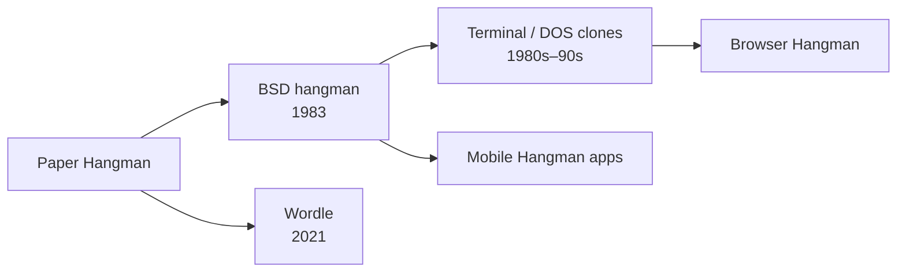

# `hangman` — Lineage

> Genre siblings and modern descendants. Where does `hangman` sit in
> the wider history of games in its style?

---

## Direct Ancestors

- **Paper-and-pencil Hangman** (folk game, centuries old) — the original two-player word-guessing game.
- **Early computer word games** (1970s mainframe / PLATO) — electronic guessing games that preceded the BSD version.

## Direct Descendants

- **Countless Hangman clones** on every platform since the 1980s, often included as a sample program with UI toolkits.
- **Wordle** (2021, Josh Wardle) — while mechanically different, it inherits the same daily single-word guessing appeal.
- **Mobile Hangman apps** — the game is a staple of beginner app-development tutorials.

## Genre Family

## If You Like `hangman`, Try…

- **Wordle** — one word per day, color-coded letter feedback.
- **Spelling Bee** (NYT) — word-building puzzle.
- **Scrabble / Words with Friends** — competitive word formation.
- **Typochondriac** — find the misspelled word under time pressure.

## Communities

- r/wordgames on Reddit.
- Puzzle sections of newspaper apps and websites.

## References

See [`references.md`](./references.md) for primary sources and citations.
