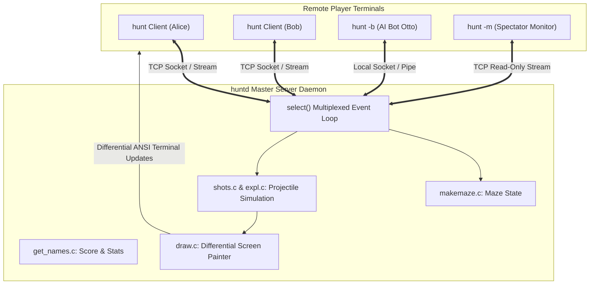
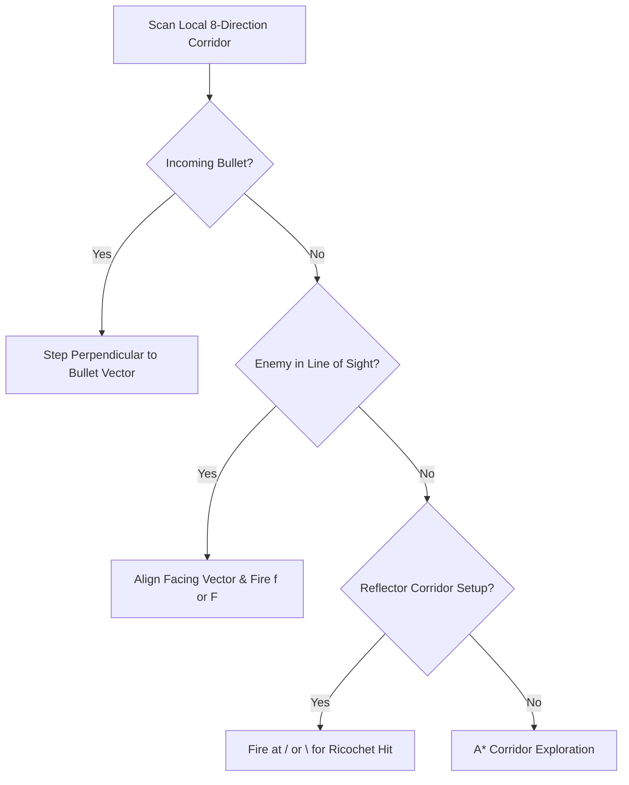

# `hunt` — Architecture & Network Design

> Deep technical analysis of the client-daemon architecture, socket event loops, projectile physics simulation, and bot AI.

---

## 1. Client-Server Daemon Topology



---

## 2. The `select()` Event Loop (`driver.c:150-250`)

The heart of `huntd` is a non-blocking asynchronous event loop driven by BSD `select()` in [`driver.c:150-250`](https://github.com/vattam/BSDGames/tree/master/hunt/huntd/driver.c#L150-L250):

```c
struct timeval linger;
fd_set read_fds;

for (;;) {
    read_fds = Master_fds;
    linger.tv_sec = 0;
    linger.tv_usec = TICK_USEC; /* approx 20-50ms tick rate */

    nfound = select(Max_fd + 1, &read_fds, NULL, NULL, &linger);

    if (nfound > 0) {
        /* Check master listening socket for new incoming connections */
        if (FD_ISSET(Daemon, &read_fds))
            answer();

        /* Process keystrokes and moves from active clients */
        for (pp = Player; pp < End_player; pp++)
            if (FD_ISSET(pp->p_fd, &read_fds))
                execute(pp);
    }

    /* Advance simulation state by one tick: moves bullets, triggers explosions */
    moveshots();

    /* Flush differential screen redraws to all active terminals */
    send_all_screens();
}
```

### Architectural Highlights

1. **Multiplexed Single-Threaded Design:** Long before multi-threading was common on Unix, `huntd` handled up to 32 concurrent players and hundreds of simultaneous flying projectiles using pure I/O multiplexing (`select()`).
2. **Deterministic Tick Clock:** The simulation steps forward at discrete microsecond intervals (`TICK_USEC`), ensuring projectile trajectories and bullet collisions remain synchronized across all connected players regardless of individual network latency.

---

## 3. Differential Screen Drawing (`draw.c`)

To support fast gameplay over 1200–9600 baud serial lines and slow campus modems, `huntd` avoided sending full 80x24 terminal frames (which would require nearly 2,000 bytes per tick).

Instead, [`draw.c:80-140`](https://github.com/vattam/BSDGames/tree/master/hunt/huntd/draw.c#L80-L140) maintains two screen buffers per player: `cur_screen` and `new_screen`:

```c
void redraw_player(PLAYER *pp) {
    int x, y;
    for (y = 0; y < HEIGHT; y++) {
        for (x = 0; x < WIDTH; x++) {
            if (pp->p_cur_screen[y][x] != pp->p_new_screen[y][x]) {
                /* Send cursor jump escape sequence + single modified character */
                c_move(pp, y, x);
                c_putc(pp, pp->p_new_screen[y][x]);
                pp->p_cur_screen[y][x] = pp->p_new_screen[y][x];
            }
        }
    }
}
```

This reduced network bandwidth per tick from 1,920 bytes down to typically **less than 20 bytes** for a moving player!

---

## 4. The Autonomous Bot Engine (`otto.c`)

When run with `hunt -b`, the client instantiates **Otto**, an automated heuristic agent in [`otto.c:60-180`](https://github.com/vattam/BSDGames/tree/master/hunt/hunt/otto.c#L60-L180):



Otto actively parses the screen grid, recognizes incoming projectile characters (`*`, `o`, `$`), predicts their trajectory, and executes instantaneous sidestep evasion before human players can react.
