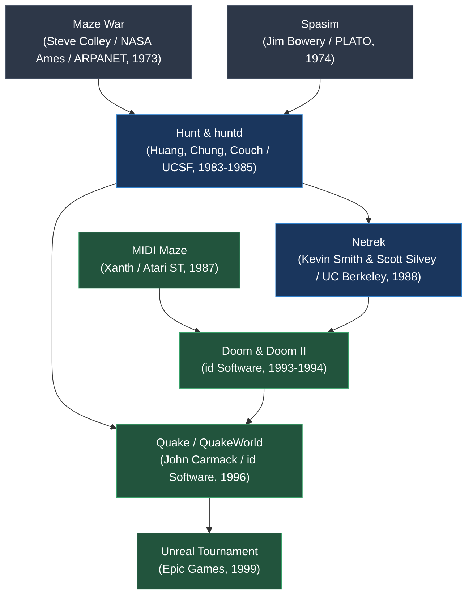

# `hunt` — Lineage & Genre Siblings

> Tracing the genealogy of real-time multiplayer network shooters, from early ARPANET experiments to modern arena deathmatches.

---

## Multiplayer Action Evolution Timeline

---

## Historical Predecessors

1. **Maze War (1973):**
   - Originally created on Imlac PDS-1 computers at NASA Ames and adapted for ARPANET. First network shooter, but operated in 3D wireframe first-person perspective.
2. **PLATO Spasim (1974):**
   - 32-player 3D space flight battle on the PLATO educational mainframe system.

---

## Direct Descendants & Legacy

1. **Netrek (1988):**
   - Created at UC Berkeley; combined real-time 16-player combat with team strategy, tactical torpedoes, and cloaking mechanisms directly influenced by *Hunt*.
2. **Doom & Quake (1993/1996):**
   - John Carmack's *QuakeWorld* architecture (client-side prediction, delta compression, dedicated headless server daemon) solved the exact same problems *huntd* solved on Unix over a decade earlier.
3. **Top-Down Modern Arenas (*Teeworlds*, *Hotline Miami Multiplayer*):**
   - Modern 2D top-down twitch shooters inherit the reflexive line-of-sight and corner-peeking dynamics pioneered by *Hunt*.
