# Hunt — Ricochet · `hunt / fancy-web`

> **hunt(6), the 1985 maze deathmatch of 4.3BSD, as a dark neon arena built
> only from code.** You see only what the original let you see — ahead and
> to the sides, never behind — lit by your own beam; everything you have
> seen stays behind as a blueprint ghost. Shots bank off glass mirrors that
> swivel with every hit. Under the glass: a function-by-function port of
> `huntd` and `otto.c`, golden-tested against the real daemon code.

| | |
|---|---|
| **Status** | 🟢 Released (first port of `hunt`) |
| **Tech** | Vanilla ES modules, zero build · vendored Three.js r186 + hand-written GLSL · Web Audio synthesis · **zero raster and audio assets** ([ADR 002](./docs/decisions/002-zero-raster-assets.md)) |
| **Engine** | pure, JSON-serialisable, fixed step, commands in, deterministic from a seed, no DOM — ready for a Node/WebSocket server ([ADR 003](./docs/decisions/003-v1-scope.md)) |
| **Target** | desktop browsers (Chrome, Edge, Firefox, Safari); keyboard + mouse |
| **Live URL** | *(not deployed yet)* |
| **Author** | Agun Wijaya · built with Claude Opus |
| **License** | MIT (repo default); vendored Three.js is MIT (`src/vendor/THREE-LICENSE`) |

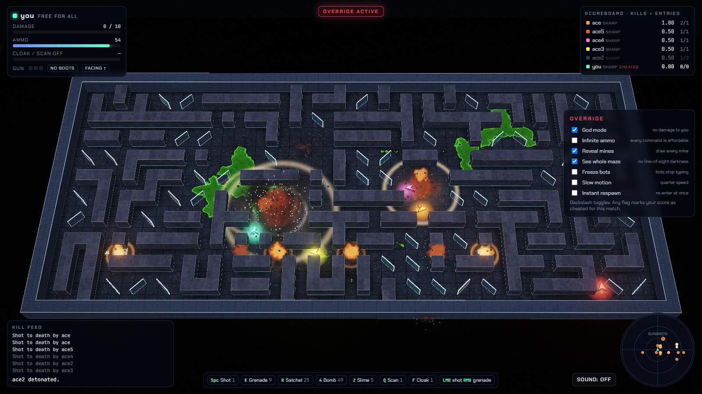
*The Ricochet arena seen whole (Override: *See whole maze* and *Reveal mines* on — note the OVERRIDE ACTIVE badge and the CHEATED mark on the score).*

---

## Play

```sh
cd bsdgames/hunt/ports/fancy-web
node scripts/serve.mjs            # http://localhost:8765/
```

Browsers refuse ES modules from `file://`, so any static server works
(`python -m http.server` too). There is no build and no install to play.

Pick a mode, how many bots and how hard, an arena and a seed, then
**ENTER THE MAZE**. The goal is hunt's: kill the others before they kill
you. Your score is **kills per entry** (a decayed average), exactly as in
`huntd`.

**URL options** (handy for testing; the menu choices are remembered, URL
values override them):

| Option | Values |
|---|---|
| `arena` | `classic` · `veteran` · `ricochet` |
| `bots` · `difficulty` · `mode` | `1`–`8` · `novice` `otto` `sharp` `mixed` · `ffa` `teams` |
| `seed` · `speed` | any integer · `relaxed` `standard` `frantic` |
| `scheme` · `view` · `camera` | `modern` `classic` · `modern` `split` `classic` · `overview` `follow` |
| `quality` | `auto` `high` `low`, or `lite` to force the no-GPU profile (not remembered) |
| `autostart=1` · `coach=1` · `fps=1` | skip the setup screen · open the Coach · show fps and the render profile |
| `flags=god,seeAll,…` | with `autostart=1`: turn Override flags on at start (names in `src/engine/override.js`) |
| `nogl=1` | behave as if WebGL were missing (terminal view) |

Example: `http://localhost:8765/?arena=ricochet&bots=6&difficulty=sharp&autostart=1&fps=1`.
Step-by-step manual checks are in
[`docs/test-scenarios.md`](./docs/test-scenarios.md).

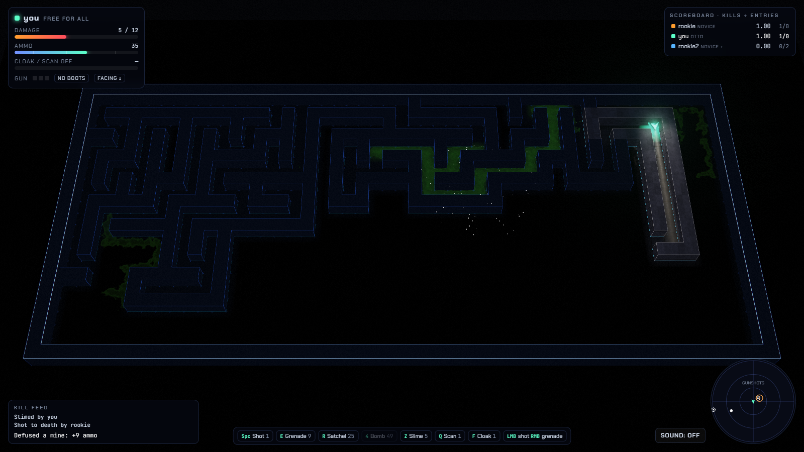
*Line of sight as the original computes it (`draw.c` `look()`): a 3-wide strip ahead and to both sides, never behind. What you have seen stays as blueprint ghosts; the rest is dark.*

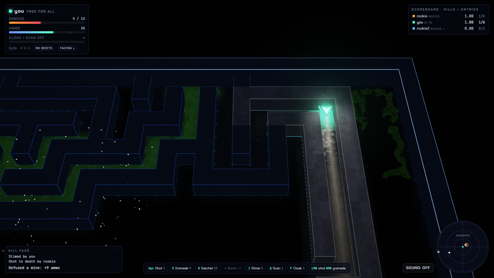
*The follow camera (`F3`): your beam down the corridor you face.*

### Rules in one breath (all verified in the C source — [`docs/notes.md`](./docs/notes.md) §2)

- **Moving never turns you.** `h j k l` (or `WASD`) strafe; `H J K L` (or the
  arrows / the mouse) turn. You fire only the way you face. Backing onto a
  mine trips it 95% of the time; walking onto it facing forward, 2% — and
  otherwise you defuse it for ammo.
- **You see ahead and to your sides, never behind.** Firing shows everyone
  where you are and which way you face.
- **Shots move five cells per step**, you move one. A mirror turns a shot
  90° — and **flips** (`/`↔`\`) every time it does. A door `#` sends a
  shot off in a random direction (and lets players walk through).
- **Any blast destroys interior walls.** At most 40 are missing at once;
  after that the oldest grows back, now and then as a mirror or a door. A
  wall that grows back under you throws you into the air.
- **Three shots and the gun is hot** — only moving cools it.
- **Damage:** 5 per bullet; blasts do 5 per ring from the edge in; you die
  when damage exceeds your capacity (10, +2 per kill). **Slime** oozes
  around walls, 5 damage per cell it touches (it does not slow you).
- **Ammo** is 15 on entry, +5 to everyone each time anyone enters, plus
  defused mines and caught shots. There is no regeneration.
- **Cloak** hides you from scanners (not from sight); **scan** shows every
  uncloaked mover. Both cost 1 and are counted in moves.

### Weapons

| Classic | Modern | Throws | Cost | Blast |
|:---:|:---:|---|---:|---|
| `f` `1` | Space · left click · `1` | shot `:` | 1 | the cell hit |
| `g` `2` | `E` · right click · `2` | grenade `o` | 9 | 3 × 3 |
| `F` `3` | `R` · `3` | satchel charge `O` | 25 | 5 × 5 |
| `G` `4` | `4` | bomb `@` | 49 | 7 × 7 |
| `5`–`9` `0` `@` | `5`–`9` `0` | bigger bombs | 81 … 441 | 9 × 9 … 21 × 21 |
| `o` `O` `p` `P` | `Z` `X` `C` `V` | slime `$` | 5 / 10 / 15 / 20 | oozes over 3 cells per ammo spent (15 … 60) |
| `s` / `c` | `Q` / `F` | scan / cloak | 1 | — |

Ask for something you cannot afford and you get the biggest thing you can.

### Controls

| | Modern (default, remappable) | Classic (hunt's own) |
|---|---|---|
| Move (strafe) | `W A S D` | `k h j l` |
| Face | arrows or the mouse (4-way, with a dead band on the diagonals) | `K H J L` |
| Pause · help | `Esc` · `?` | same |
| Coach · Override | `` ` `` · `\` | same |
| Scores · view · camera | `Tab` · `F2` (3D / split / terminal) · `F3` (overview / follow) | same |

Keys queue like hunt's typeahead (up to 3); a held movement key repeats
once per step. **Controls** (setup or pause menu) remaps every Modern key;
the design is [ADR 004](./docs/decisions/004-input-scheme.md).

When you die you choose how to re-enter — **cloaked** (hunt's default),
**scanning** or **flying** — during a 2-second pause.

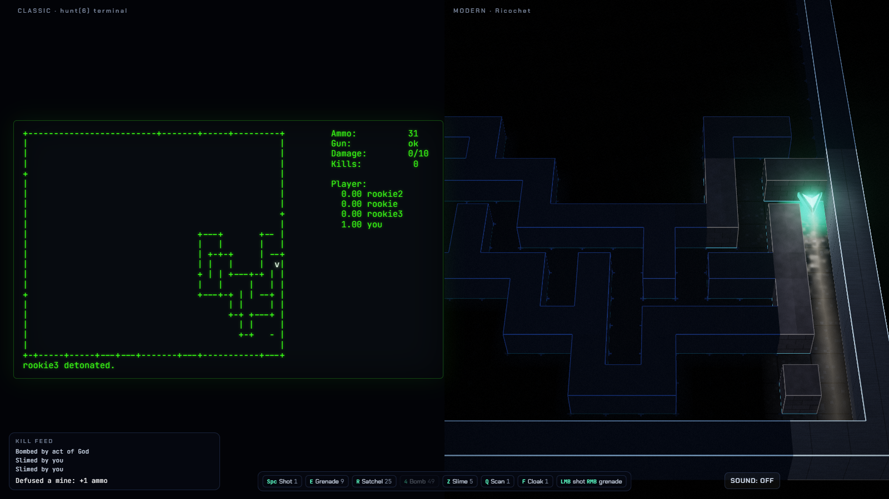
*Split view (`F2`): the hunt client's 80 × 24 screen — your remembered maze, `drawstatus()`'s panel, the message line — next to the 3D follow view of the same state.*

---

## Arenas, bots, modes

**Arenas** ([ADR 006](./docs/decisions/006-arena-mirror-seeding.md)).
Source verification found that **a fresh hunt maze has no mirrors at
all** — `makemaze.c` digs a perfect maze, and mirrors only appear when
blown walls grow back. So:

| Arena | What it is |
|---|---|
| **Classic** | `makemaze.c` exactly. Mirrors and doors arrive as walls regrow. |
| **Veteran** | as if every wall had already regrown once (the original 1% odds) |
| **Ricochet** (default) | a braided maze: loops are opened, and `remap()`'s own rule turns every pillar left standing alone into a mirror — ≈57 free-standing mirrors, bank shots of up to 15 bounces |

**Bots** — each one types keys into its own typeahead and knows only what
its own screen shows:

| Bot | |
|---|---|
| **Classic Otto** | `otto.c` ported literally (its bugs too) and golden-tested against the original; a right-hand wall-follower made for perfect mazes — it circles in the Ricochet arena |
| **Novice** *(extension)* | reacts 3–6 steps late, shoots only straight lines, rarely a grenade |
| **Sharpshooter** *(extension)* | traces its shots through the mirrors it remembers (flips included), leads walking targets, banks grenades into walls next to you, sidesteps, hunts |
| **Mixed** | one of each, in turn |

**Modes:** free-for-all, or two teams (`1` Sodium yellow, `2` Ultramarine
blue with a hollow marker — colour-blind safe and shape-coded). Friendly
fire hurts and costs you a kill, as in `huntd`.

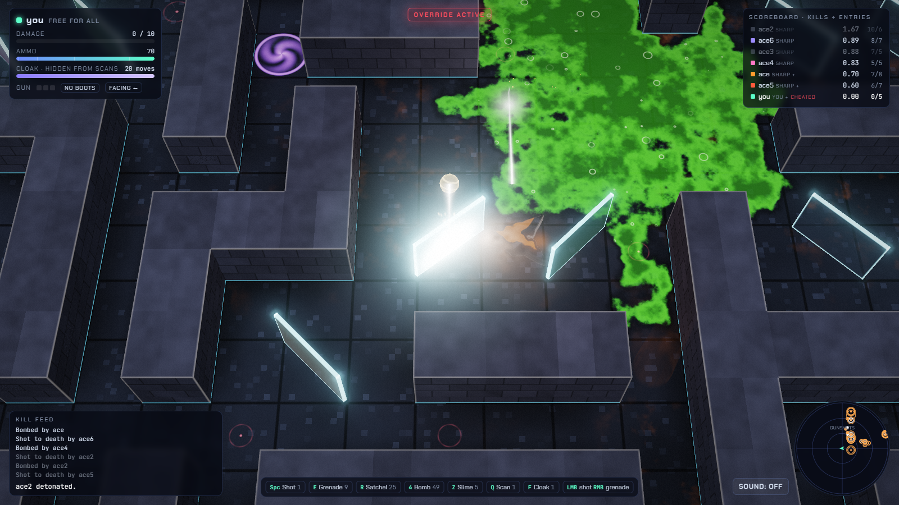
*A ricochet in the Ricochet arena (watched with *See whole maze*): the pane flashes and ripples where it was hit, then swivels 90° — hunt's mirrors flip on every deflection.*

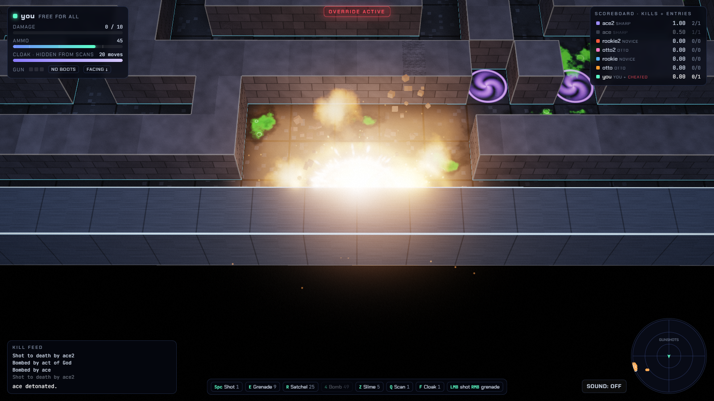
*A satchel charge (5 × 5): hot core, fireballs, shockwave, the blast square glowing on the floor, masonry breaking into debris.*

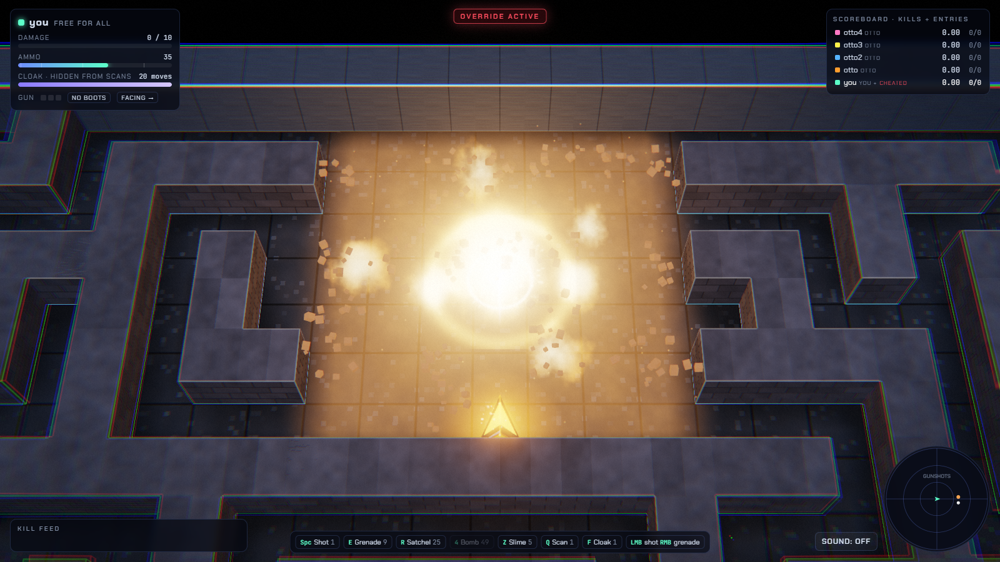
*A 7 × 7 bomb: every interior wall in the square comes down (and will grow back, oldest first).*

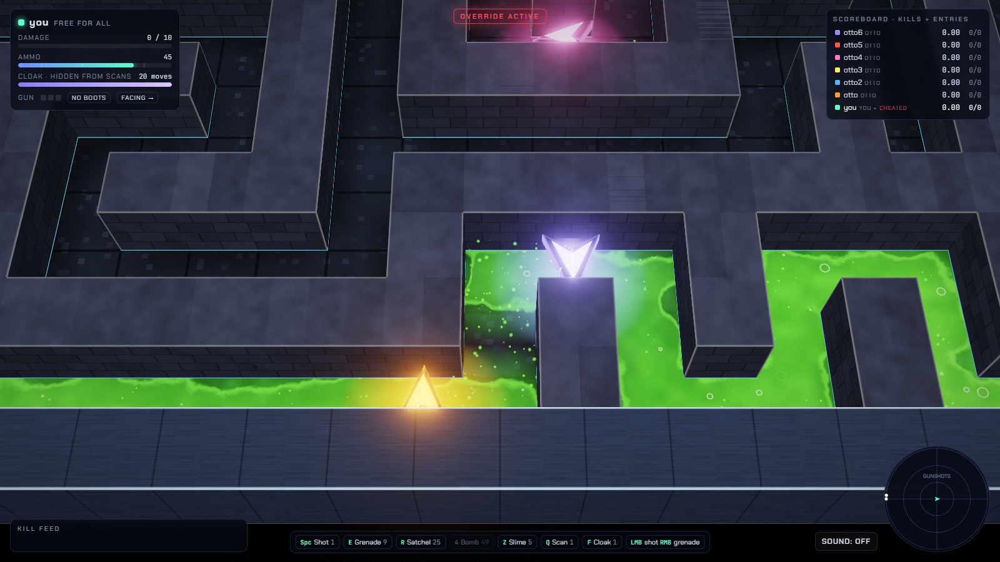
*Slime oozes ahead and to the sides, around walls, one cell per charge; the glossy goo lingers a while after it has moved on.*

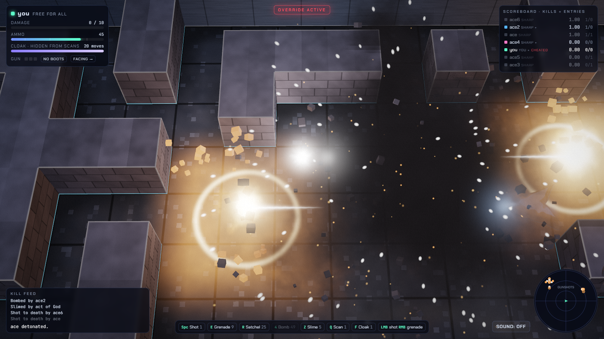
*A death: light shards in the player's colour. Leftover ammo may go off where they fell.*

---

## Cheat mode

Two layers, as in the trek ports.

**Coach** (`` ` ``) — a live ricochet preview for your current facing and
weapon: the path your next shot would take, every bounce marked, every
mirror flip the shot itself would cause taken into account, the blast
square for heavier ordnance, a warning when the shot would come back at
you or enter a door. It uses the walls; it never reveals players you
cannot see. Coach does not mark your score.

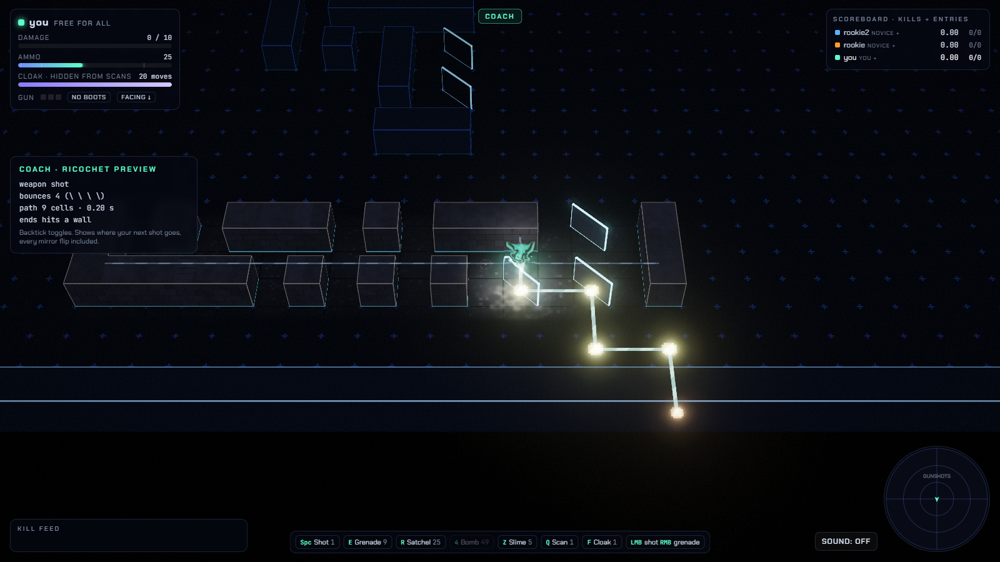
*The Coach previewing a four-bounce bank shot.*

**Override** (`\`) — engine and view flags; turning any on shows
**OVERRIDE ACTIVE** and marks your score **CHEATED** for the rest of the
match:

| Flag | Effect |
|---|---|
| God mode | you take no damage |
| Infinite ammo | every command you type is affordable |
| Reveal mines | every mine is drawn |
| See whole maze | no line-of-sight darkness |
| Freeze bots | bots stop typing |
| Slow motion | a quarter of the speed |
| Instant respawn | you re-enter on the same step |

With every flag off the engine is byte-for-byte the golden-tested daemon
(`tests/override.test.js` replays seeded matches against a recorded
baseline).

---

## Requirements & running without a GPU

| Machine | What you get | Measured (8 bots, bombs and slime every half second) |
|---|---|---|
| any GPU (tested: RTX 4060 Laptop, D3D11) | **High**: MSAA, bloom, refraction, full shaders | 60 fps (p95 frame 16.7 ms) |
| weaker GPU | **Low** (Auto drops to it below 38 fps) | 60 fps on the same GPU |
| **no GPU** (software WebGL: SwiftShader, llvmpipe) | **Lite** picked automatically: half resolution, no bloom, cheap shaders | ≈ 13 fps under that stress; the world still runs at full speed |
| **no WebGL at all** | the classic terminal view — the whole game, in text | instant |

Shaders are compiled asynchronously while the setup screen is up, so a
cold Direct3D compile does not freeze the first frames.

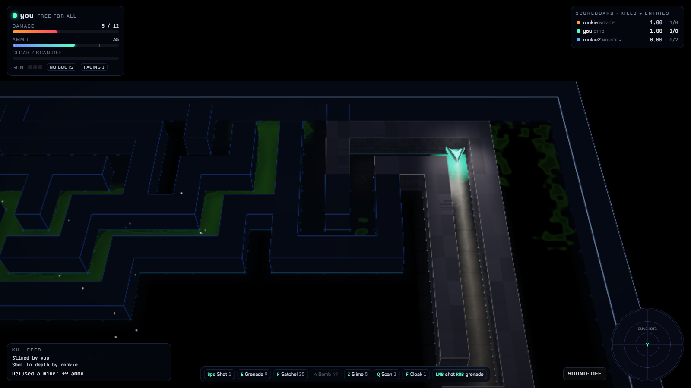
*CPU-only (SwiftShader) Lite profile.*

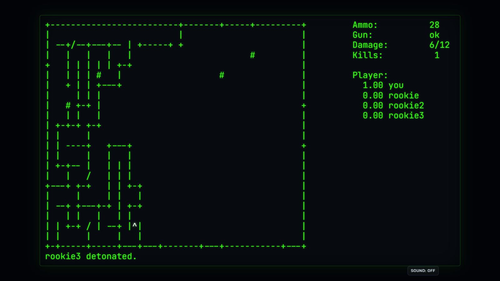
*The terminal view — what a browser without WebGL shows.*

---

## Tests

```sh
npm test                           # 90 node tests (engine, bots, golden traces, view, override, raster, shortcuts)
node scripts/ui-smoke.mjs          # browser checks; GPU=cpu | GPU=nogl for the fallbacks
node scripts/perf.mjs gpu-high gpu-low cpu
node scripts/measure.mjs           # engine / arena / bot numbers in docs/notes.md
npm run shots                      # regenerate media/
npm run check:raster               # ADR 002
```

(`npm install` once for Playwright, which only the browser scripts use.)

**Golden traces.** `hunt` is not in Debian's `bsdgames`, so
`scripts/oracle/` builds the real daemon (and `otto.c`) from a local copy
of the upstream source (never committed) around a scripted driver loop,
and records its whole state every step. Seven traces — about 6,000 steps
of duels, keystroke fuzz, team play, Otto arenas and a crafted mirror
arena — must match the JavaScript engine exactly: the RNG, the maze,
every player's screen, every bullet in list order, the scoreboard in
float32, every message and every key Otto types.

**Also covered:** every heading × mirror plus random multi-bounce fields
against the Coach's prediction; weapons, blasts, walls and regrowth,
mines, slime, doors, flying, boots, visibility and memory, scoring; a
5,000-step bot arena stress per configuration with determinism and JSON
snapshot/restore mid-match; the bot difficulty ladder; the Override
baseline; the zero-raster rule; shortcut collisions.

---

## Docs

- [`docs/diff-log.md`](./docs/diff-log.md) — the story of the port: kept, changed, added, and why
- [`docs/architecture.md`](./docs/architecture.md) — engine, view model, renderer, bots, and the future multiplayer server
- [`docs/notes.md`](./docs/notes.md) — the source as verified, **42 canonical-doc discrepancies** with `file:line` and proposed fixes, daemon quirks kept on purpose, measurements
- [`docs/test-scenarios.md`](./docs/test-scenarios.md) — canonical scenarios mapped, port scenarios, sign-off
- [`docs/decisions/`](./docs/decisions/) — ADRs 001–007

## Attribution

`hunt` and `huntd` were written by **Conrad C. Huang, Gregory S. Couch and
Kenneth C. R. C. Arnold** at the UCSF Computer Graphics Laboratory
(1983–1985) and shipped with 4.3BSD; Copyright © 1983–2003 The Regents of
the University of California. Source:
<https://github.com/vattam/BSDGames/tree/master/hunt> · see the root
[`ATTRIBUTION.md`](../../../../ATTRIBUTION.md). The original C is not copied
into this repository; the engine's comments cite it by `file:line`.
Three.js © 2010–2026 Three.js authors (MIT). Fonts: Chakra Petch and
JetBrains Mono (Google Fonts, OFL).
