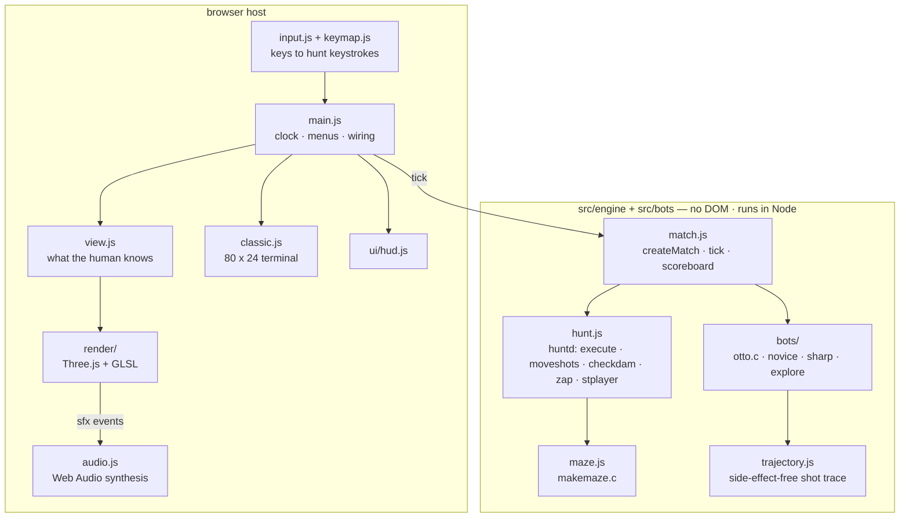
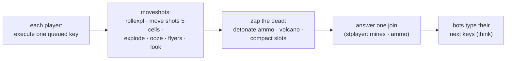
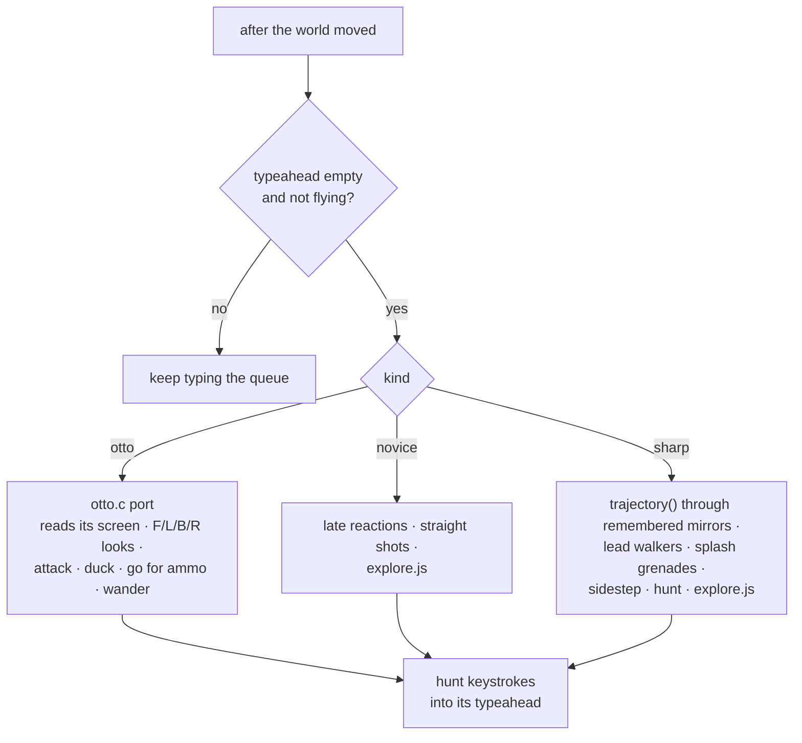
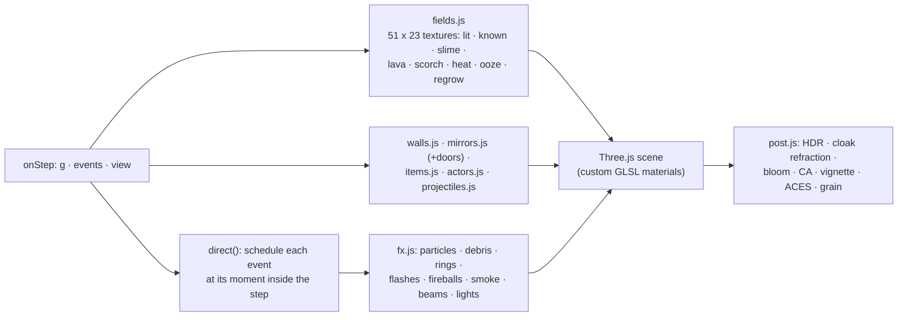
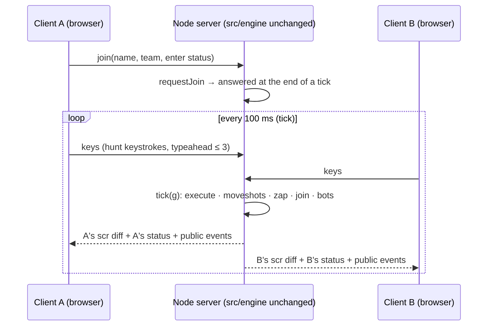
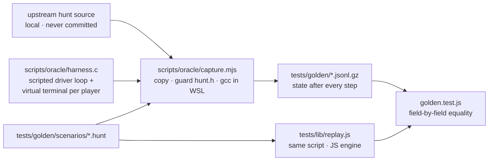

# Architecture — `hunt / fancy-web`

How this port is built. For what the original does and where the canonical
docs are wrong, see [`notes.md`](./notes.md); for why each choice was made,
see [`decisions/`](./decisions/).

---

## 1. Layers

The engine never imports anything from the host. A future server imports
`src/engine/match.js` and nothing else (§7).

## 2. The engine

### 2.1 Data model — the C model, on purpose

The whole game is one plain object `g` that `JSON.stringify` round-trips
(tested mid-match in `tests/stress.test.js`). It keeps huntd's data model
because the rules live in it:

| Field | C original | Why it matters |
|---|---|---|
| `g.maze` (51 × 23 char codes) | `Maze[HEIGHT][WIDTH2]` | bullets and players are drawn *into* the maze; collisions read chars |
| `g.orig` | `Orig_maze` | regrown walls come back as they were |
| `g.slots[]`, `g.np` | `Player[]`, `End_player` | `zap()` compacts slots with `memcpy`; a stale slot copy stays behind |
| `slot.mem` | `p_maze` | the player's screen memory (what they know) |
| `slot.scr` | the client's curses screen | what the terminal shows (translated glyphs, raw `showexpl()` glyphs) |
| `slot.q` | `p_cbuf` / typeahead | one key executes per step |
| `g.bullets[]` (list order) | `Bullets` linked list | order decides interceptions and ooze |
| `bullet.owner` = slot index | `b_owner` pointer | a stale slot keeps a kill bonus (`notes.md` §4) |
| `g.expl[4]` | `Expl[EXPLEN]` | blasts stay on every screen for 4 steps |
| `g.removed[40]`, `remIndex` | `removed[MAXREMOVE]` | the wall-regrowth ring |
| `g.scores[]` (float32 kills/score) | `IDENT` list | the scoreboard, including the decay |
| `g.seed` | `Seed` | the daemon's LCG, `driver.c:50` |
| `g.bots[name].rs` | glibc `random()` state | Otto's own dice, per bot |

Transient per step (not needed to resume, but carried in `g`): `g.ev`
(events for renderer/HUD/audio) and `g.trails` (the exact cells every shot
crossed this step, bends included).

### 2.2 One step = one pass of `driver.c`'s loop

`step(g, think)` in `hunt.js` does exactly this; `match.tick(g)` passes the
bot runner as `think`. The host calls it on a fixed clock (10 Hz by
default, [ADR 005](./decisions/005-time-and-tick.md)); the original woke up
only when someone typed.

### 2.3 Visibility

`lookCells(g, pp, visit)` is `draw.c`'s `look()`/`see()` with the cell
checks factored out, so the same function (a) updates the player's memory
inside the engine and (b) gives the renderer the lit mask without touching
state. Memory also changes when anyone moves (`drawplayer`), on every
blast (`showexpl`/`rollexpl`) and at every shot's previous cell
(`moveshots`) — all ported as they are.

### 2.4 Randomness

Every daemon decision draws from `rn()` (the C LCG); each bot has its own
glibc `random()` stream (seeded from the match seed; the golden traces use
the original's unseeded state). Nothing else is random in the engine. Same
seed + same keys per step = same match, which the stress test proves
across a JSON snapshot/restore.

## 3. Bots

Every bot reads only its own `scr`/`mem`, ammo and gun heat. `explore.js`
is a breadth-first search over the bot's remembered map toward the
stalest area, with goal commitment; Classic Otto keeps `otto.c`'s own
wall-follower (which circles in braided mazes — `notes.md` §5).

## 4. The view model (`src/view.js`)

Per engine step, for the human (or for everyone in the monitor view while
dead, or with *See whole maze*):

| Output | Source |
|---|---|
| `lit[i]` | `lookCells` |
| `terrain[i]` | truth where lit; else the player's memory, with blast glyphs (`- | / \ *` from `g.expl`) masked so they are not read as walls |
| `known[i]` | seen this life, or anything non-floor on the screen |
| `ghosts()` | opponent glyphs on the screen outside the lit area (last seen) |
| `items()` | mines/boots seen, remembered, or revealed by the Override |

## 5. The renderer (`src/render/`)

- **Fields** are tiny data textures sampled with linear filtering, so light,
  memory and goo spread smoothly across cell borders. The floor shader
  draws terrazzo, the beam, contact shadows, blueprint ticks for memory,
  scorch, blast heat, slime (a smoothed threshold with gloss, meniscus,
  bubbles) and lava from them.
- **The beam** (`glsl.js` `BEAM`) is a flashlight from the drone,
  multiplied by the lit mask so it stops exactly where `see()` stops; a
  masked volumetric shaft (`shaft.js`) makes it visible in the air.
- **Walls** are one instanced mesh with neighbour masks, so runs of
  masonry merge; lit = shaded block, remembered = dark block with silhouette
  lines; a destroyed wall flashes cracks, then its debris flies; a regrown
  one rises with a light seam.
- **Mirrors** are instanced glass panes; a deflection flashes the pane,
  ripples it from the touch point and swivels it a quarter turn.
- **Shots** follow `g.trails`: the head runs along the step's exact
  polyline, the tail follows it through the bend.
- **Timing.** `direct()` anchors each event to the shot's path: a spark
  fires when the head reaches the mirror, a blast when it reaches the wall,
  hurt/death/wall events inherit the blast's moment.
- **Profiles:** High (MSAA, full bloom, refraction, grain), Low (no MSAA,
  shorter bloom), Lite (half resolution, no bloom, cheap shader branches —
  picked automatically on software WebGL). All shaders compile
  asynchronously during the setup screen (`warmUp()`).

## 6. Host loop

`main.js` runs `requestAnimationFrame`; `clock.js` turns real time into
engine steps (never more than 4 per frame, a quarter speed in slow motion).
Each step: auto-repeat a held move → `tick(g)` → `updateView` →
`renderer.onStep` + HUD + terminal + sound. Each frame:
`renderer.frame(dt)` interpolates actors (flight arcs included), moves
shots along their trails, runs due effects and renders. A test API
(`window.__hunt`, `?manual=1`) lets Playwright drive steps and frames
deterministically.

## 7. Future multiplayer server

The engine already has the server's shape: authoritative state, a fixed
tick, commands in, per-player views out. `huntd` itself worked this way —
it sent each client only the cells that changed on *that client's*
screen.

- **What each client receives** is exactly what hunt showed that player:
  the diff of *their* `scr`/`mem`, their own status, and the public events
  (explosions, oozing, fired shots and flyers — `showexpl()` put those on
  every screen). No client ever receives the true maze or other players'
  positions, so a hacked client cannot see through walls. The renderer
  would consume the same events it consumes locally; the view model
  (`view.js`) becomes "remembered screen + lit mask" on the client.
- **Inputs** are the same keystrokes the local host queues; the server
  owns the typeahead. Bots run on the server as players without sockets.
- **Latency:** at 10 Hz a keystroke lands on the next tick; the client may
  predict its own avatar's slide (moves never depend on hidden state,
  except walls regrowing and bumps, which the server corrects).
- **Replays and anti-cheat for free:** the seed plus the per-tick key log
  replays a whole match bit for bit (`tests/stress.test.js`).
- **Scaling:** one match costs 0.02–0.6 ms per tick (Otto vs Sharpshooter
  fields, `notes.md` §7), so a single core hosts dozens of matches.
- **Monitors** (`hunt -m`): a spectator gets the true maze stream, which
  the renderer's see-all path already draws.

## 8. Tests and the C oracle

`npm test` runs 90 tests: golden traces (7), mirror reflection and
Coach-vs-engine paths, weapons, world (walls, regrowth, mines, slime,
doors, flying, boots, entries), visibility and memory, scoring, view
model and clock, bots (ladder, reaction delay, fairness), stress (4 ×
5,000 steps + determinism), Override (baseline replay + every flag), zero
raster, shortcut conflicts. `scripts/ui-smoke.mjs` checks the real page on
GPU, CPU-only and no-WebGL.
