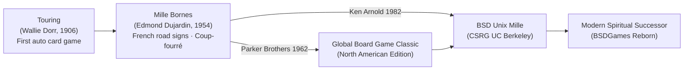

# About Mille

> *"Mille Bornes is the ultimate Parisian grand prix on paper: a duel of speed,
> sudden tire blowouts, empty gas tanks, and the glorious strike of the Coup-fourré."*

---

## 1. Game Overview

**Mille** is a terminal adaptation of the legendary French road-race card game **Mille Bornes**
("A Thousand Milestones"), originally created in France in **1954** by **Edmond Dujardin** and
published in North America by **Parker Brothers** in 1962.

The BSD Unix version was authored in **1982** by **Ken Arnold** at the Computer Systems Research
Group (CSRG), University of California, Berkeley. In BSD computing lore, `mille` holds a place of
distinction alongside `rogue` and `cribbage`: it served as the prime demonstration for Ken Arnold's
pioneering work on partitioned, multi-window screen management using his own newly developed
`curses` library.

---

## 2. Historical & Cultural Context

### The Printer and the Milestones
In 1954, French printing publisher **Edmond Dujardin** conceived *Mille Bornes* inspired by the
iconic red-capped kilometer markers (*bornes kilométriques*) lining the historic National Route 7
(*Route Nationale 7* / "The Highway of the Sun"), which carried vacationing Parisians down to the
French Riviera. Dujardin designed distinctive, charming illustrations for each hazard, remedy, and
safety card, turning everyday highway tribulations—punctured tires, running out of fuel, and police
speed traps—into a gripping competitive duel.

### Fencing Heritage: The Coup-Fourré
The defining mechanic of *Mille Bornes* is the **Coup-fourré**. Originating as a classic 17th-century
French fencing term (*coup fourré* = a deceptive counter-thrust executed simultaneously as one
parries an opponent's attack), the term colloquially evolved in French slang to mean an underhanded,
lethal counter-punch. In the game, holding a Safety card in reserve and slamming it down the moment
an opponent attacks triggers an instantaneous counter-attack, rendering you permanently immune to
that hazard and awarding a massive **+300 point bonus**.

---

## 3. Visual Tour

Below are raw terminal captures of BSD Mille operating within Ken Arnold's multi-window curses
environment.

### Opening Board Layout
The screen partitions into distinct areas: Computer's vehicle status, Player's status, Mileage tally,
and the player's 7-card hand:

*Figure 1: Initial layout showing the Battle pile, Speed pile, Safeties area, and 7-card hand.*

### Hazard Warfare & Coup-Fourré
A mid-game clash where the computer launches an attack, immediately intercepted by a Coup-fourré:

*Figure 2: Active duel where a Flat Tire attack is parried by Puncture Proof, banking 300 points.*

### End-of-Hand Scoreboard
At the conclusion of each hand, the full scoring breakdown is displayed across all categories:

*Figure 3: Comprehensive score audit totaling Milestones, Safeties, Coup-fourrés, and Match totals.*

---

## 4. Why It's Fun: The Core Loop

1. **The Green Light Dependency:** You cannot drive a single mile without a **Go** card (Green Light)
   on your Battle pile. The agonizing tension of sitting stranded while your opponent racks up miles
   makes drawing that elusive Green Light an immense rush.
2. **Sabotage vs. Velocity:** Every turn requires balancing: do you drop a 100-mile card to push
   ahead, or do you slap a *Flat Tire* or *Speed Limit* onto your opponent to halt their sprint?
3. **The 200-Mile Gamble:** 200-mile cards are the fastest route to victory, but you may play at most
   **two** 200-mile cards per hand. Furthermore, finishing without *any* 200-mile cards earns a
   prestigious **+300 point Safe Trip bonus**.
4. **The Extension Dilemma:** When reaching 700 miles, you can declare victory or gamble on an
   **Extension to 1,000 miles** for a +200 point bonus—risking that your opponent might overtake
   you while you struggle to find the final 300 miles!

---

## 5. Making-of Stories: The Multi-Window Curses Pioneer

In 1982, Ken Arnold was refining `curses` for distribution with 4.2BSD. Earlier terminal games
either operated in a crude scrolling teletype format (like `trek`) or treated the entire screen as
a single monolithic buffer that had to be redrawn in bulk.

For `mille`, Arnold wanted to prove that `curses` could manage **multiple independent virtual windows**:
- **`Board`:** Upper section containing player and computer status (Safeties, Battle pile, Speed pile).
- **`Miles`:** Middle horizontal strip keeping track of individual milestone denominations.
- **`Score`:** A dedicated modal window swapped in to tally points at the end of each round.

By calling `wrefresh(Board)` or `wrefresh(Miles)` independently, Arnold ensured that only modified
screen cells were transmitted across slow 300-baud and 1200-baud modem links, creating an astonishingly
snappy visual experience on early VT100 and ADM-3A terminals.

---

## 6. Difficulty & Progression

Mille does not rely on synthetic difficulty modifiers. Progression is structured into a tournament
match format with escalating psychological stakes:

| Level / Stage | Scope | Objective | Escalation Dynamics |
|---|:---:|:---:|---|
| **Hand (Race to 700)** | Per-round sprint | Reach 700 miles (or 1,000 extension) | Race for momentum; frequent hazard attacks. |
| **The Extension (1,000)** | Optional mid-round push | Extend race from 700 to 1,000 miles | High risk of breakdown; deck may run out (*Delayed Action*). |
| **Match (5,000 Points)** | Multi-hand tournament | First to accumulate 5,000 total points | Defensive posture increases as players near 5,000 pts. |

### Strategic Scaling Near Match Point (5,000 pts)
- **Early Match (0–2,500 pts):** Fast offensive play. Players prioritize laying mileage and taking
  the Extension whenever possible to widen the score gap.
- **Mid Match (2,500–4,000 pts):** Tactical balance. Players begin hoarding Safety cards in hand
  to bait opponents into triggering a Coup-fourré.
- **Endgame (4,000–5,000 pts):** Hyper-defensive play. The leading player avoids the Extension to
  lock in guaranteed hand victories; the trailing player plays aggressive hazard disruption.

---

## 7. Known Bugs and Historical Quirks

1. **Terminal Geometry Requirement:** `mille` strictly assumes a terminal window of at least
   $80 \times 24$. Launching on smaller or non-standard terminals can cause window overlapping or
   segmentation faults in older curses releases.
2. **Delayed Action Scoring Edge Case:** If the 101-card draw deck is exhausted, play continues
   until neither player can legally play. If a player completes the trip during this phase, they
   receive the **+300 Delayed Action bonus**. In certain rare edge cases in older BSD versions,
   discarding a card when no plays were possible occasionally failed to register the hand termination.
3. **Binary Save File Portability:** The save mechanism in `varpush.c` uses raw byte writes
   (`write(fd, (char *)var, sizeof(var))`). Save files generated on big-endian architectures
   (like VAX or 68k) could not be restored on little-endian architectures (x86).
