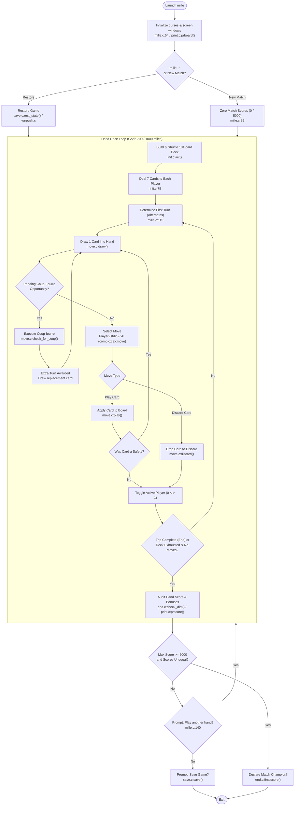

# Mille — Original Code Architecture

A technical deep-dive into Ken Arnold's 1982 multi-window curses architecture, game control loop,
heuristic AI decision engine (`comp.c`), and binary save state serialization.

---

## 1. Upstream Module Map

The original C source code is located in [`vattam/BSDGames/tree/master/mille`](https://github.com/vattam/BSDGames/tree/master/mille):

```
vattam/BSDGames/tree/master/mille/
├── mille.c         # Main driver, argument parsing, curses initialization, game loop
├── mille.h         # Core types, CARD enums, screen dimensions, global externs
├── comp.c          # Ken Arnold's AI decision engine (calcmove, card valuation)
├── move.c          # Turn dispatch, card legality verification (canplay), coup-fourré
├── print.c         # Multi-window curses display engine (Board, Miles, Score windows)
├── init.c          # 101-card deck construction and Fisher-Yates shuffling
├── end.c           # Hand finalization, bonus computation, match winner evaluation
├── save.c          # High-level save/restore interface, prompt handling
├── varpush.c       # Low-level binary state serialization (varpush/varpop)
├── table.c         # Static lookup tables (card names, deck distribution, card points)
├── types.c         # Card type conversion utilities and string formatting
└── mille.6         # UNIX troff manual page source
```

---

## 2. Main Game Loop Control Flow



---

## 3. Ken Arnold's AI Engine (`comp.c`)

The computer AI in `comp.c` ([`comp.c:50`](https://github.com/vattam/BSDGames/tree/master/mille/comp.c#L50))
operates without combinatorial search trees, relying on a sophisticated prioritization matrix:

### 1. Card Priority Assessment (`calcmove()`)
1. **Immediate Trip Completion:** If any distance card in hand completes the current goal
   (`pp->mileage + Value[card] == End`), play it immediately!
2. **Coup-Fourré Traps:** If the AI holds a Safety, it deliberately delays playing it unless forced,
   hoping the player attacks with the matching hazard.
3. **Hazard Neutralization:** If stalled by a Hazard, play the matching Remedy card as priority #1.
4. **Offensive Sabotage:**
   - If player has a **Go** card and no active hazard, slap them with *Stop*, *Accident*, *Flat Tire*,
     or *Out of Gas*.
   - If player has high mileage (> 400 miles) and no speed safety, slap them with *Speed Limit*.
5. **Mileage Sprints:** Play the largest legal distance card available (respecting the 200-mile cap).
6. **Card Discard Valuation (`V_VALUABLE`):**
   When forced to discard, the AI evaluates card utility:
   - Discard low-value duplicates first (e.g. surplus *25-mile* cards or unneeded remedies).
   - Never discard a *Go* or *Safety* card unless completely unavoidable.

---

## 4. Multi-Window Curses Architecture (`print.c` & `mille.h`)

Ken Arnold created three distinct curses `WINDOW *` objects:

```c
/* Upstream window declarations in mille.h:63-75 */
WINDOW  *Board;     /* Top window: 17 lines x 40 cols (Battle, Speed, Safeties) */
WINDOW  *Miles;     /* Middle window: 7 lines x 80 cols (Distance counters)     */
WINDOW  *Score;     /* Modal overlay: 17 lines x 40 cols (End-of-hand summary)  */
```

### Baud-Rate Optimization
In 1982, terminal connections operated over telephone lines at 300 or 1200 baud. Redrawing the
entire terminal took several seconds. Arnold's split-window architecture isolated changes:
- Playing a mileage card called `wrefresh(Miles)` and `wrefresh(Board)`, redrawing fewer than 30 characters.
- Error messages were printed in a designated 1-line error strip (`ERR_Y`, `ERR_X`) and cleared
  with `wclrtoeol()`.

---

## 5. Deck Shuffling & Card Allocation (`init.c`)

- **`init()`** ([`init.c:30`](https://github.com/vattam/BSDGames/tree/master/mille/init.c#L30)):
  Populates the 101-card array `Deck[]` using static frequency counts from `table.c`.
- **`shuffle()`** ([`init.c:60`](https://github.com/vattam/BSDGames/tree/master/mille/init.c#L60)):
  Executes an in-place Fisher-Yates transposition using pseudo-random integers generated by `roll()`.

---

## 6. Binary State Serialization (`varpush.c` & `save.c`)

Game saves in `mille` utilize an ultra-low-overhead memory-dump approach:
```c
/* Conceptual snippet from varpush.c */
void varpush(int fd, void (*func)(int, void *, size_t)) {
    (*func)(fd, &Player, sizeof(Player));
    (*func)(fd, &Deck, sizeof(Deck));
    (*func)(fd, &Topcard, sizeof(Topcard));
    (*func)(fd, &Numseen, sizeof(Numseen));
    (*func)(fd, &End, sizeof(End));
    (*func)(fd, &Hand_no, sizeof(Hand_no));
}
```
While extremely fast, this mechanism bound save-file compatibility strictly to identical CPU architectures
and struct alignment offsets.
