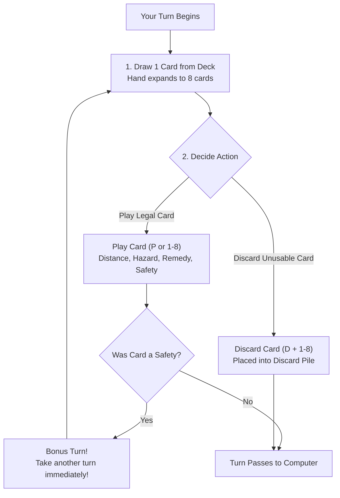

# How to Play Mille

A comprehensive player manual, command reference, and strategic guide for BSD Mille (*Mille Bornes*).

---

## 1. Objective of the Game

The overarching objective is to accumulate **5,000 match points** across multiple hands.
Each individual hand is a high-speed automobile race where players compete to put down
**700 miles** (or take an optional **Extension to 1,000 miles**) before their opponent does,
while sabotaging the opponent with road hazards and protecting their own vehicle.

---

## 2. Command Line Invocation & Setup

```bash
mille             # Start a new match from 0 points
mille -r          # Restore previously saved game session
```

### Rematch and Save Prompts
- At the end of each hand: `"Do you wish to play another hand? [y/n]"`
- At the conclusion of a 5,000-point match: `"Do you wish to play another game? [y/n]"`
- If you answer `n`, the game prompts: `"Do you wish to save the game? [y/n]"`.
  Saving writes the session state to a file (`~/.mille.save` or local file), which can be resumed
  using the `-r` flag.

---

## 3. Terminal Interface & Board Areas

The curses interface is partitioned into five functional zones:

```
   ┌─────────────────────────── BOARD WINDOW ─────────────────────────────┐
   │ COMPUTER:                                 YOU:                       │
   │ Safeties: [Extra Tank    ]                Safeties: [Driving Ace   ] │
   │ Battle:   [  Stop        ]                Battle:   [  Go        ]   │
   │ Speed:    [  Speed Limit ]                Speed:    [            ]   │
   │ Mileage:   350 miles                      Mileage:   475 miles       │
   ├────────────────────────── MILES WINDOW ──────────────────────────────┤
   │ 25: 1   50: 2   75: 1   100: 3   200: 0   | TOTAL:  475 / 700 miles  │
   ├────────────────────────── HAND & PROMPTS ────────────────────────────┤
   │ (1) 100 Miles   (2) 50 Miles    (3) Gasoline     (4) Spare Tire      │
   │ (5) Accident    (6) 25 Miles    (7) Go           (8) Puncture Proof  │
   │                                                                      │
   │ Move: [P]lay [D]iscard [O]rder [S]ave [Q]uit? >                      │
   └──────────────────────────────────────────────────────────────────────┘
```

1. **Safety Area (Top):** Displays played Safety cards. Safeties displayed here grant permanent immunity
   for the remainder of the hand.
2. **Battle Pile:** Where Hazard and Remedy cards are played. You must have a **Go** card on top of
   your Battle pile (or hold the *Right of Way* safety) to play any Distance cards.
3. **Speed Pile:** Where **Speed Limit** and **End of Limit** cards are played. When a Speed Limit is
   active, you cannot play distance cards greater than 50 miles.
4. **Mileage Window:** Displays running counts of 25, 50, 75, 100, and 200-mile cards played.
5. **Hand Window:** Displays the 7 cards (or 8 after drawing) currently in your possession.

---

## 4. Turn Sequence & Controls



### Available Keyboard Commands
| Command | Key | Description |
|---|:---:|---|
| **Play Card** | `p` or `1`–`8` | Plays the selected card from your hand onto the appropriate pile. |
| **Discard Card** | `d` followed by `1`–`8` | Discards the selected card to the discard pile. |
| **Order Hand** | `o` | Automatically sorts and groups your hand cards by type. |
| **Save Game** | `s` | Saves current match state to disk. |
| **Redraw Screen** | `r` or `^L` | Clears and redraws all curses windows if terminal output is corrupted. |
| **Quit Game** | `q` | Exits the match. |

---

## 5. The Cards: Hazards, Remedies, and Safeties

Every Hazard has exactly one corresponding Remedy and one ultimate Safety:

| Hazard (Red) | Remedy (Green) | Safety (Blue/Gold) | Safety Power & Immunity |
|---|---|---|---|
| **Stop** (4 in deck) | **Go** (14 in deck) | **Right of Way** (1 in deck) | Permanent Go status; immune to Stop & Speed Limit! |
| **Speed Limit** (3) | **End of Limit** (6) | **Right of Way** (1 in deck) | Cancels speed limits permanently. |
| **Out of Gas** (2) | **Gasoline** (6) | **Extra Tank** (1 in deck) | Immune to Out of Gas. |
| **Flat Tire** (2) | **Spare Tire** (6) | **Puncture Proof** (1 in deck) | Immune to Flat Tire. |
| **Accident** (2) | **Repairs** (6) | **Driving Ace** (1 in deck) | Immune to Accident. |

### Distance Cards
- **25 Miles** (10 in deck)
- **50 Miles** (10 in deck)
- **75 Miles** (10 in deck)
- **100 Miles** (12 in deck)
- **200 Miles** (4 in deck) — **CRUCIAL RULE:** You may play at most **two** 200-mile cards per hand!

---

## 6. The Signature Mechanic: Coup-Fourré

The **Coup-fourré** is the defining tactical weapon of Mille:

1. **The Trigger:** When your opponent plays a Hazard card on you (e.g. *Flat Tire*), and you hold the
   corresponding Safety card (*Puncture Proof*) in your hand.
2. **Immediate Execution:** You do **not** wait for your turn. You declare Coup-fourré immediately
   when attacked!
3. **The Payoff:**
   - The attacking Hazard card is removed from your Battle pile and discarded.
   - Your Safety card is permanently placed into your Safety Area.
   - You score a massive **+300 point Coup-fourré bonus** (in addition to the 100 pt Safety bonus).
   - You draw a replacement card and **take an immediate turn**!

---

## 7. Scoring Rules and Bonuses

Scores are audited at the end of each hand:

| Scoring Item | Points | Awarded To | Conditions |
|---|:---:|:---:|---|
| **Milestones Played** | 1 pt per mile | Both players | Equal to actual miles accumulated (0–700 or 0–1000). |
| **Each Safety Played** | 100 pts | Both players | Per safety in player's Safety Area. |
| **All 4 Safeties Bonus** | 300 pts | Both players | Achieved if a player plays all 4 safeties in one hand. |
| **Each Coup-Fourré** | 300 pts | Both players | Awarded for each successful Coup-fourré executed. |
| **Trip Completed** | 400 pts | Winner only | Completing the 700 or 1000-mile trip. |
| **Safe Trip** | 300 pts | Winner only | Completing the trip without using *any* 200-mile cards! |
| **Delayed Action** | 300 pts | Winner only | Completing the trip after the draw deck is completely exhausted. |
| **Extension Bonus** | 200 pts | Winner only | Completing the extended 1,000-mile trip. |
| **Shut-Out Bonus** | 500 pts | Winner only | Completing the trip before the opponent played *any* distance cards! |

---

## 8. Strategy & Master Tactics

1. **Baiting the Coup-Fourré:** Do not play a Safety card the instant you draw it. Hold it in your hand!
   An opponent seeing you vulnerable to *Flat Tire* or *Out of Gas* will waste a turn attacking you,
   walking straight into your Coup-fourré trap for 300 bonus points.
2. **Speed Limits as Soft Disruption:** If you do not hold a *Stop* card, a *Speed Limit* is remarkably
   effective: it prevents the opponent from playing 75, 100, and 200-mile cards, slowing their progress
   to a crawl while they search for one of the 6 *End of Limit* cards.
3. **The Safe Trip Decision:** If you have accumulated 500 miles using 100, 75, 50, and 25-mile cards,
   resist the temptation to play a 200-mile card. Reaching 700 miles without 200s nets an extra **+300 points**!
4. **When to Take the Extension:** Take the Extension to 1,000 miles only if:
   - Your opponent is stuck behind a Hazard and has low mileage (< 300 miles).
   - You hold a *Right of Way* or multiple safeties protecting you from retaliatory attacks.
   - You hold distance cards ready to lay down the remaining 300 miles quickly.
