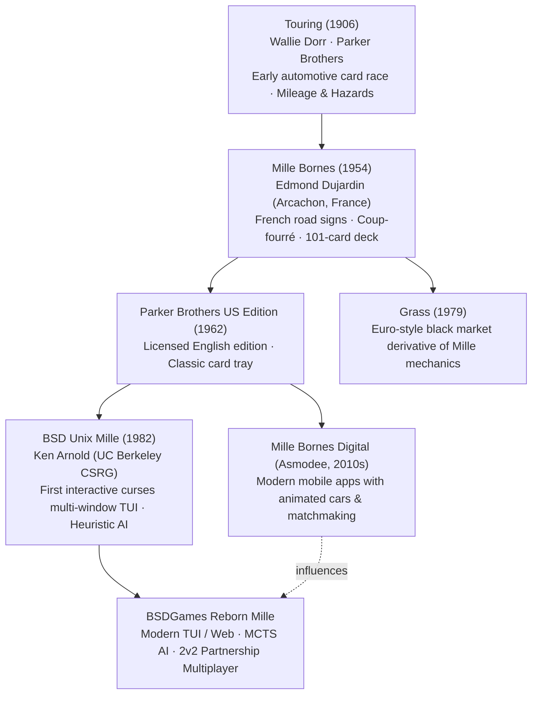

# Mille — Lineage & Heritage

A historical and mechanical genealogy of Mille Bornes, tracing its roots from early 20th-century
card games to Ken Arnold's BSD terminal adaptation and modern digital racing card games.

---

## 1. The Evolutionary Tree

---

## 2. Comparative Mechanic Evolution Across Eras

| Era / Title | Deck Size | Hand Size | Race Goal | Reaction Counter | Target Match Score | Platform |
|---|:---:|:---:|:---:|:---:|:---:|---|
| **Touring (1906)** | 100 cards | 5 cards | 100 miles | None | Single-hand race | Physical card deck |
| **Mille Bornes (1954)** | 101 cards | 6/7 cards | 700 / 1000 miles | **Coup-fourré** | 5,000 points | Physical card tray & score sheet |
| **BSD Mille (1982)** | 101 cards | 7 cards | 700 / 1000 miles | **Coup-fourré** | 5,000 points | Curses 80x24 terminal (`newwin`) |
| **Grass (1979)** | 104 cards | 6 cards | Harvest goal | Heat / Protection | Varies | Physical cards |
| **Asmodee Mobile (2010s)** | 101 cards | 7 cards | 700 / 1000 miles | Touch Coup-fourré | 5,000 points | iOS / Android / Web |

---

## 3. Cultural & Genre Siblings

- **Touring (1906):** The undisputed mechanical ancestor. While *Touring* introduced mileage cards
  and hazards (like *Puncture* and *Collision*), Edmond Dujardin transformed it into an enduring
  masterpiece by introducing the **Coup-fourré**, **permanent Safeties**, and the **Extension to 1,000 miles**.
- **Monopoly (Chance/Community Chest):** Both games represent quintessential 20th-century commercial
  board game design, pairing progressive forward motion with sudden, direct-attack event cards.
- **Kart Racers (Mario Kart):** Digital racing games featuring power-ups and sabotage items (banana peels,
  red shells, lightning bolts) share direct conceptual DNA with *Mille Bornes*' hazard attacks.
