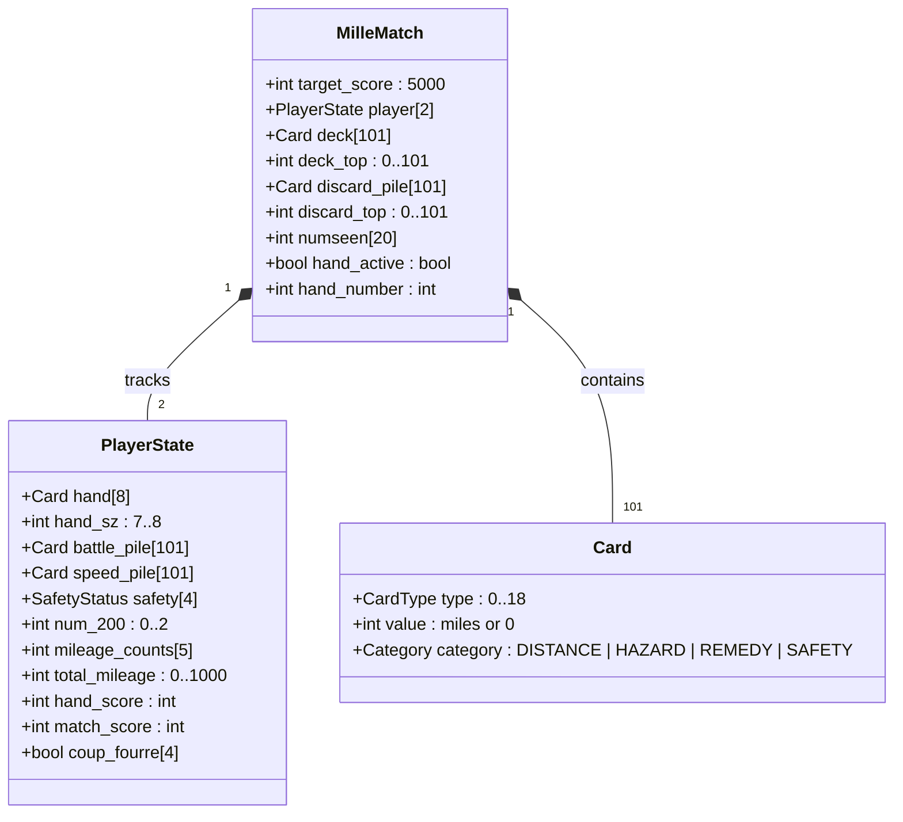

# Mille — Reverse Specification

Formal mechanical specification, state variables, 101-card entity inventory, scoring logic,
and termination invariants reverse-engineered from BSD `mille` (Ken Arnold, 1982).

---

## 1. Mathematical Objective

A match is contested between two players (Human $P_0$ and Computer $P_1$) over successive hands
until at least one player satisfies the winning match condition:
$$\max(S_0, S_1) \ge S_{\text{target}}$$
where $S_{\text{target}} = 5000$ points. If both players exceed 5000 points in the same hand,
the player with the higher total score wins.

Within each hand, the objective is to reach the trip distance:
$$D_{\text{trip}} \in \{700, 1000\}$$

---

## 2. Formal State Variables

| Variable | Type / Domain | Meaning | Upstream C Identifier |
|---|---|---|---|
| `Player[2]` | `PLAY[2]` | Player and Computer state structures | `Player` (`mille.h:175`) |
| `Deck[101]` | `CARD[101]` | 101-card draw pile array | `Deck` (`mille.h:185`) |
| `Topcard` | `CARD *` | Pointer to top of draw deck | `Topcard` (`mille.h:186`) |
| `Discard` | `CARD` | Top card of discard pile | `Discard` (`mille.h:187`) |
| `Numseen[20]` | `int[20]` | Count of cards observed so far per card type | `Numseen` (`mille.h:190`) |
| `End` | `int` $\in \{700, 1000\}$ | Current hand goal (700 or 1000 extension) | `End` (`mille.h:191`) |
| `Hand_no` | `int` $\ge 0$ | Current hand counter | `Hand_no` (`mille.h:192`) |
| `Play` | `int` $\in \{0, 1\}$ | Current active player (`PLAYER` or `COMP`) | `Play` (`mille.h:193`) |

---

## 3. Complete 101-Card Entity Inventory

The game is played with a proprietary 101-card deck comprising 20 distinct card types:

| Upstream Constant | Card Name | Category | Value | Deck Count | Functional & Strategic Rule |
|---|---|:---:|:---:|:---:|---|
| `C_25` | **25 Miles** | Distance | 25 | 10 | Low distance; playable under Speed Limit. |
| `C_50` | **50 Miles** | Distance | 50 | 10 | Playable under Speed Limit. |
| `C_75` | **75 Miles** | Distance | 75 | 10 | Solid distance; blocked by Speed Limit. |
| `C_100` | **100 Miles** | Distance | 100 | 12 | Workhorse distance card; blocked by Speed Limit. |
| `C_200` | **200 Miles** | Distance | 200 | 4 | **Maximum 2 per hand.** Disqualifies for Safe Trip bonus. |
| `C_STOP` | **Stop** | Hazard | 0 | 4 | Halts opponent. Requires Go to resume. |
| `C_GO` | **Go** | Remedy | 0 | 14 | Green light. Mandatory to play distance cards. |
| `C_RIGHT_WAY` | **Right of Way** | Safety | 0 | 1 | **Master Safety.** Permanent Go status; immune to Stop & Limit. |
| `C_LIMIT` | **Speed Limit** | Hazard | 0 | 3 | Limits opponent to $\le 50$ mile cards. |
| `C_END_LIMIT` | **End of Limit** | Remedy | 0 | 6 | Cancels active Speed Limit on Speed pile. |
| `C_EMPTY` | **Out of Gas** | Hazard | 0 | 2 | Halts opponent. Requires Gasoline then Go. |
| `C_GAS` | **Gasoline** | Remedy | 0 | 6 | Repairs Out of Gas on Battle pile. |
| `C_GAS_SAFE` | **Extra Tank** | Safety | 0 | 1 | Immune to Out of Gas. |
| `C_FLAT` | **Flat Tire** | Hazard | 0 | 2 | Halts opponent. Requires Spare Tire then Go. |
| `C_SPARE` | **Spare Tire** | Remedy | 0 | 6 | Repairs Flat Tire on Battle pile. |
| `C_SPARE_SAFE` | **Puncture Proof** | Safety | 0 | 1 | Immune to Flat Tire. |
| `C_CRASH` | **Accident** | Hazard | 0 | 2 | Halts opponent. Requires Repairs then Go. |
| `C_REPAIRS` | **Repairs** | Remedy | 0 | 6 | Repairs Accident on Battle pile. |
| `C_DRIVE_SAFE` | **Driving Ace** | Safety | 0 | 1 | Immune to Accident. |

$$\sum \text{Deck Counts} = (10+10+10+12+4) + (4+14+1) + (3+6) + (2+6+1) + (2+6+1) + (2+6+1) = 46 + 19 + 9 + 9 + 9 + 9 = 101\text{ cards.}$$

---

## 4. Legal Play Rules & Invariants

Let $P$ be the active player, and $O$ be the opponent.

1. **The Green Light Invariant:**
   $P$ may play a Distance card $c \in \{C\_25 \dots C\_200\}$ if and only if:
   $$(\text{top}(P.\text{battle}) = C\_GO \lor P.\text{safety}[S\_RIGHT\_WAY] = \text{PLAYED}) \land \text{top}(P.\text{battle}) \notin \text{Hazards}$$
2. **The 200-Mile Cap Invariant:**
   $$P.\text{mileage\_counts}[C\_200] \le 2 \quad (\forall \text{ hands})$$
3. **The Speed Limit Clamp:**
   If $\text{top}(P.\text{speed}) = C\_LIMIT \land P.\text{safety}[S\_RIGHT\_WAY] \ne \text{PLAYED}$, then:
   $$\text{value}(c) \le 50$$
4. **Exact Milestone Cap:**
   A player cannot play a distance card that would cause $P.\text{total\_mileage} > \text{End}$.
5. **Coup-Fourré Reactive Priority:**
   When $O$ plays hazard $h$ on $P$, if $P$ holds matching safety $s$:
   $$P \text{ may execute Coup-fourré immediately before } P \text{ draws a card.}$$

---

## 5. Scoring Formulas (`end.c:check_dist()`)

At the conclusion of each hand:

### Base Points (Both Players)
$$S_{\text{base}} = \text{Mileage} + 100 \times \sum_{i=0}^3 \mathbb{I}(P.\text{safety}[i] = \text{PLAYED}) + 300 \times \mathbb{I}(\text{All 4 Safeties}) + 300 \times \sum_{i=0}^3 \mathbb{I}(P.\text{coup}[i] = \text{TRUE})$$

### Winner Bonuses ($P = \text{Winner}$)
If $P$ completed the trip ($\text{Mileage} = \text{End}$):
$$S_{\text{winner}} = S_{\text{base}} + 400 (\text{Trip Completed})$$
$$\quad + 300 \times \mathbb{I}(P.\text{mileage\_counts}[C\_200] = 0) \quad [\text{Safe Trip}]$$
$$\quad + 300 \times \mathbb{I}(\text{Topcard} \ge \&\text{Deck}[101]) \quad [\text{Delayed Action}]$$
$$\quad + 200 \times \mathbb{I}(\text{End} = 1000) \quad [\text{Extension}]$$
$$\quad + 500 \times \mathbb{I}(O.\text{total\_mileage} = 0) \quad [\text{Shut-Out}]$$

---

## 6. Termination Conditions

1. **Hand Termination:**
   - Either player reaches $\text{End}$ miles ($700$ or $1000$).
   - OR draw deck is exhausted AND neither player can make a legal play.
2. **Match Termination:**
   - At the end of a hand, if $\max(S_0, S_1) \ge 5000 \land S_0 \ne S_1$.
