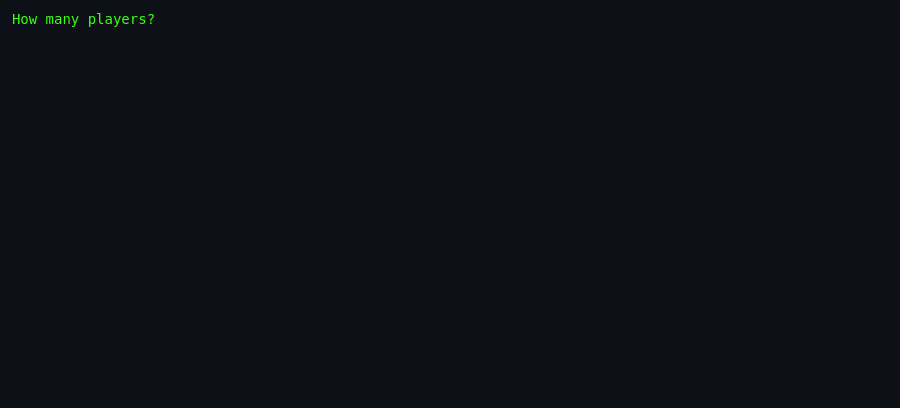
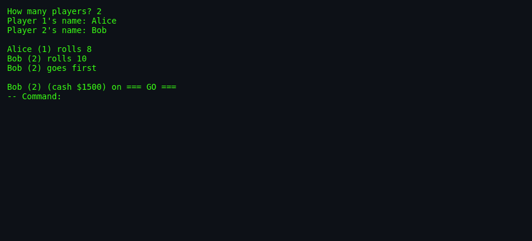
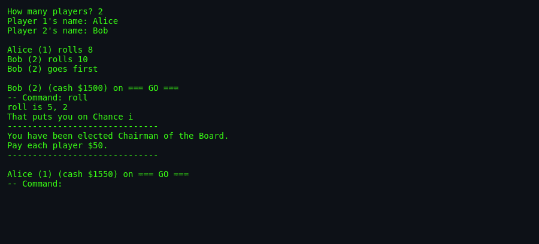
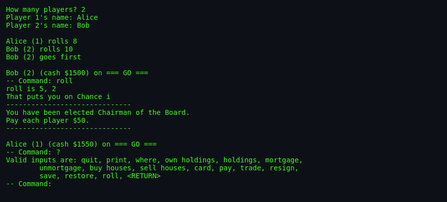
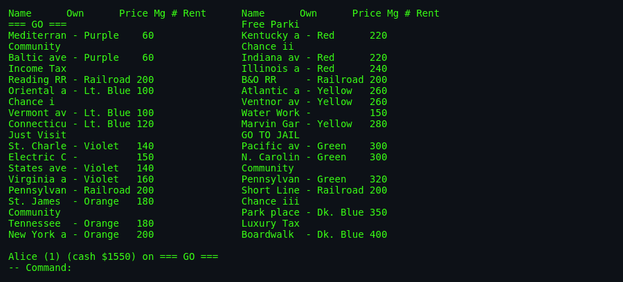
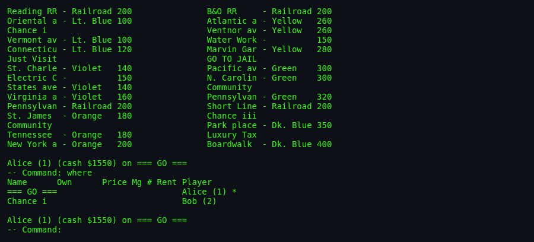
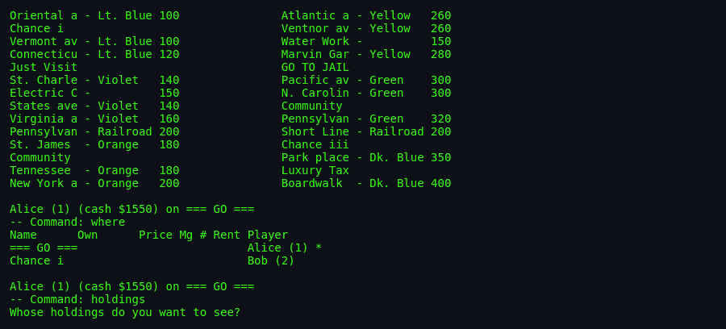

# `monop` — About

> A faithful text-mode implementation of the Parker Brothers game
> Monopoly, playable by 1 to 9 people on a single terminal. Ken
> Arnold wrote it at Berkeley in 1980; NetBSD maintenance later
> handed off to Joseph Samuel Myers.

---

## What is `monop`?

`monop` is a Monopoly referee. It does **not** try to be an
artificial Monopoly opponent — instead, it stages the game for a
group of humans sharing one terminal:

- The dice roller.
- The banker.
- The deed and card holder.
- The rules lawyer for special squares, jail, and the debt system.
- The auctioneer (with one house-rule variant — see below).
- The save/restore engine when a session must pause.

Everything else — negotiations, house purchases, trades — is
mediated through commands you type at a prompt. The game state
prints on demand; you never see a rendered board unless you type
`print`.

## The 1980 context

- **1980**: Version 7 UNIX, VAX 11/780s, VT100 terminals, glass-TTY
  culture. The BSDGames collection is dense with games in this era
  because the terminal was the console: no windowing, no color
  guaranteed, character grid only.
- **Ken Arnold** wrote `monop` in this environment. He also wrote
  the original **curses(3)** library, **rogue**, **snake**, and
  **robots** — a run of foundational Unix games and infrastructure.
- The `malloc.c` bundled with `monop` is **Chris Kingsley's 1982
  Caltech allocator**, not stock libc. Ken Arnold shipped his own
  fast-allocator into the game because at the time libc's malloc
  was slow.

## What makes it interesting

- **Hot-seat 1–9 players.** Long before "couch co-op" was a term,
  `monop` sat multiple people around one terminal.
- **Unique-prefix command grammar.** Type `p` for `print`, `pa`
  for `pay`, `pr` is ambiguous. This is `getinp()`'s job.
- **The debt loop.** A player can go negative but *must* "fix the
  problem" before rolling again. Elegantly-modelled in the code as
  a fixup phase.
- **The 2-solvent-player auction skip.** House-rule tweak: if a
  property is refused during purchase and only 2 solvent players
  remain, no auction is held and the property stays unowned.
  Different from Hasbro's official rules.
- **Data-driven board.** The board, monopolies, properties, and
  card decks are external data files (`brd.dat`, `mon.dat`,
  `prop.dat`, `cards.inp`) not baked into the source.
- **Save and restore.** Serialize state to a file, resume later. A
  1980 innovation for a 2-hour+ game.
- **Encoding trivia.** The `bool` type is a `#define char` at the
  top of `monop.h` — this is 15 years before C's `_Bool`.

## Screenshots

<!-- Real captures from a locally-built monop binary, 2026-09-17. -->

### 1. How many players?
The game opens by asking how many players and collecting each
player's name. Names must be unique (case-insensitive) and cannot
be the reserved word `done`.

### 2. First turn
Each player rolls two dice; highest starting roll goes first.
Everyone begins with **$1500** on **GO**.

### 3. A roll landing on Chance
Bob rolls a 5 and 2, lands on **Chance i**, draws *"You have been
elected Chairman of the Board — Pay each player $50."* The game
automatically resolves the effect.

### 4. The `?` help — command list
Typing `?` at any command prompt lists valid commands. The 16
commands: `quit`, `print`, `where`, `own holdings`, `holdings`,
`mortgage`, `unmortgage`, `buy houses`, `sell houses`, `card`,
`pay`, `trade`, `resign`, `save`, `restore`, `roll`, and pressing
`<RETURN>` alone (equivalent to `roll`).

### 5. Print — the full board
`print` dumps every square in a 2-column layout showing name,
owner, price, mortgage flag, houses, and current rent.

### 6. Where — piece positions
`where` shows each player's location on the board. The `*` marks
the current player.

### 7. Holdings — a player's assets
`holdings` prompts for a player's name and lists their money,
get-out-of-jail-free cards, and property.

## Vintage feel to preserve

- **Two-column board printout** — a triumph of screen density.
- **Chance/Community Chest flavor** ("Chairman of the Board",
  "Second Prize in Beauty Contest", "Grand Opera Opening"). Note:
  original card texts are Parker Brothers-copyrighted; a port must
  reword them.
- **`printline()` banner** — a `------------------------------`
  ruler around each card resolution. Simple and pleasing.
- **`lucky_mes[]` messages** — "You lucky stiff", "Your karma must
  certainly be together", "How beautifully Cosmic". Random flavor
  text for advancement cards.
- **The banker's tone.** Curt, precise. "You lucky stiff.
  Advance to Boardwalk." No hand-holding.

## Difficulty & Progression

- **Difficulty axes:** number of players (more players = tighter
  economy), starting-roll RNG, negotiation skill among humans, and
  luck of cards.
- **No AI opponent.** `monop` cannot play against you — you need at
  least 2 humans (or 1 human simulating both sides for testing).
- **No difficulty setting.** The rules are the rules; the only
  variable is who's at the table.
- **No skill progression.** Each game is independent; there is no
  persistent player profile or high-score table.
- **Game length.** Real-world Monopoly averages 60–120 minutes;
  `monop` sessions can run similarly long — save/restore exists
  because of this.

## Not to be confused with

- **atlantic** — a 2000s Linux clone with X11 GUI.
- **monopd** — 2000s network server for Monopoly-like games (used
  by `atlantik` KDE client).
- **gtkatlantic** — a GTK GUI Monopoly-like client.
- **Debian's `bsdgames` package** — this **does not include**
  `monop` due to the Hasbro trademark. `monop` is BSDGames-source
  only.

## Quick facts

- **First shipped:** ~1980 (Berkeley); NetBSD-refreshed 1997–2004
  (Joseph Samuel Myers).
- **Lines of C (rough):** ~2,900 across 16 files.
- **External data files:** 4 (`mon.dat`, `prop.dat`, `brd.dat`,
  `cards.inp` compiled into `cards.pck`).
- **Max players:** 9 (`MAX_PL`).
- **Starting money:** $1500.
- **Squares:** 40.
- **Chance cards:** 16. **Community Chest cards:** 16.
- **Board:** the canonical Parker Brothers 1935 layout with 22
  properties, 4 railroads, 2 utilities, 4 corner squares, jail,
  tax squares, and card squares.

## Where to go next

- Rules and how to play: [`how-to-play.md`](./how-to-play.md).
- Code architecture: [`architecture.md`](./architecture.md).
- Everything the port must decide:
  [`port-ideas.md`](./port-ideas.md).
- Lineage and inspiration: [`lineage.md`](./lineage.md).

## Author's note

The man page is unusually short — Ken Arnold assumed "the rules of
Monopoly are known". This documentation set intentionally does the
opposite: it treats a modern reader who may never have played
Monopoly on paper, and it treats a porter who has never seen a
Berkeley-era C codebase. Both audiences deserve a full explainer.
