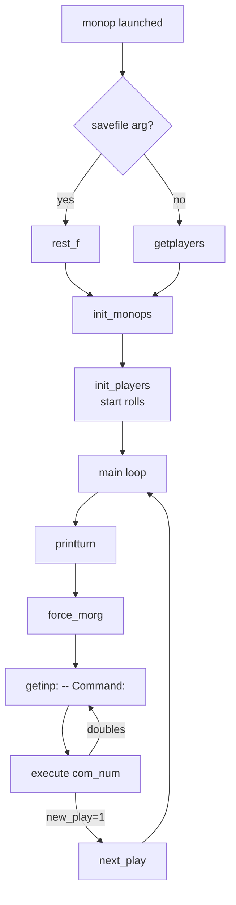

# `monop` — Architecture

> How Ken Arnold's 1980 code is organized. Read this before
> attempting a port.

---

## Source tree

Upstream:
<https://github.com/vattam/BSDGames/tree/master/monop>

```text
monop/
├── monop.h        — types, constants, function declarations
├── monop.def      — global variable definitions (comlist, func[], mon[])
├── monop.ext      — extern declarations
├── monop.c        — main(), player setup, main loop
├── execute.c      — command dispatch, do_move(), move()
├── getinp.c       — unique-prefix command parser
├── print.c        — printboard(), where(), printsq(), printhold()
├── misc.c         — getyn(), get_int(), next_play(), quit(), lists
├── prop.c         — buy(), bid() (auction), prop_worth()
├── rent.c         — rent()
├── houses.c       — buy_houses(), sell_houses()
├── morg.c         — mortgage(), unmortgage(), force_morg()
├── jail.c         — jail resolution: card(), pay(), move_jail()
├── cards.c        — Chance & Community Chest decks
├── spec.c         — special squares: inc_tax(), goto_jail(), lux_tax(),
│                    cc(), chance()
├── trade.c        — trade(), resign()
├── roll.c         — roll(n, sides)
├── initdeck.c     — offline tool: cards.inp → cards.pck
├── malloc.c       — Chris Kingsley's 1982 Caltech fast allocator
├── deck.h         — deck data structure
├── mon.dat        — monopoly (color group) descriptors
├── prop.dat       — property descriptors
├── brd.dat        — board square descriptors
├── cards.inp      — human-readable card text (source)
├── Makefrag       — build fragment
├── Makefile.bsd   — traditional BSD Makefile
└── monop.6.in     — man page (mdoc)
```

## High-level flow



## Command dispatch

`monop.c` main loop calls:

```c
execute(getinp("-- Command: ", comlist));
```

`getinp()` (in `getinp.c`) reads a line, matches it as a unique
prefix against the string array `comlist[]`, and returns the
matching index. `execute()` (in `execute.c`) then dispatches:

```c
(*func[com_num])();
```

where `func[]` is a parallel array of function pointers defined in
`monop.def`:

| Index | comlist string | func[] target |
|--:|---|---|
|  0 | `quit`         | `quit` |
|  1 | `print`        | `printboard` |
|  2 | `where`        | `where` |
|  3 | `own holdings` | `list` |
|  4 | `holdings`     | `list_all` |
|  5 | `mortgage`     | `mortgage` |
|  6 | `unmortgage`   | `unmortgage` |
|  7 | `buy houses`   | `buy_houses` |
|  8 | `sell houses`  | `sell_houses` |
|  9 | `card`         | `card` |
| 10 | `pay`          | `pay` |
| 11 | `trade`        | `trade` |
| 12 | `resign`       | `resign` |
| 13 | `save`         | `save` |
| 14 | `restore`      | `restore` |
| 15 | `roll`         | `do_move` |
| 16 | `""` (RETURN)  | `do_move` |

This is a classic table-driven interpreter — clean and easy to
extend.

## Data model

Defined in `monop.h`:

```c
struct sqr_st {         /* one of 40 squares                    */
    const char *name;
    short owner;         /* player number or -1                 */
    short type;          /* PRPTY | RR | UTIL | SAFE | CC |
                            CHANCE | INC_TAX | GOTO_J | LUX_TAX |
                            IN_JAIL                             */
    struct prp_st *desc; /* property description                */
    int cost;
};

struct mon_st {          /* color group (monopoly)              */
    const char *name;
    short owner;
    short num_in, num_own;
    short h_cost;        /* house price                         */
    const char *not_m, *mon_n;  /* short name variants          */
    unsigned char sqnums[3];    /* square indices               */
    SQUARE *sq[3];
};

struct prp_st {          /* property, RR, or utility            */
    bool morg;           /* mortgaged                           */
    bool monop;          /* part of a monopoly                  */
    short square;
    short houses;
    MON *mon_desc;
    int rent[6];         /* base, +monopoly, +1h, +2h, +3h, +4h */
};

struct plr_st {          /* one of 1-9 players                  */
    char *name;
    short num_gojf;      /* get-out-of-jail-free cards          */
    short num_rr;
    short num_util;
    short loc;           /* board square index                  */
    short in_jail;
    int money;
    OWN *own_list;       /* linked list of owned squares        */
};
```

Note: `bool` is `#define char` — this is 1980 C, well before
`stdbool.h`.

Key constants (from `monop.h`):

- `N_MON = 8` — 8 color groups.
- `N_PROP = 22` — 22 street properties.
- `N_RR = 4` — 4 railroads.
- `N_UTIL = 2` — 2 utilities (Water Works, Electric Co).
- `N_SQRS = 40` — total squares.
- `MAX_PL = 9` — maximum players.
- `MAX_PRP = 28` — total ownable properties.
- `JAIL = 40` — jail is a virtual square beyond the board.

## Data files

### `mon.dat` — monopoly (color group) descriptors

Included at compile time from `monop.def`:

```c
MON mon[N_MON] = { #include "mon.dat" };
```

Each entry defines one color group: display name, house cost, and
the square indices of the properties in that group.

### `prop.dat` — property descriptors

Similarly included:

```c
PROP prop[N_PROP] = { #include "prop.dat" };
```

Rent tables baked in.

### `brd.dat` — board layout

Defines the 40-square sequence. Included by `monop.def`.

### `cards.inp` → `cards.pck`

`cards.inp` is human-readable card text (Chance + Community Chest,
16 each). At build time, `initdeck.c` compiles it into `cards.pck`
— a binary pack file with big-endian 64-bit offsets to each card's
text.

`cards.c` opens `cards.pck` at runtime (path in `_PATH_CARDS`
macro), reads the deck headers, shuffles, and serves cards.

## The turn state machine

`execute.c` implements the turn loop:

```c
void
execute(int com_num)
{
    new_play = FALSE;
    (*func[com_num])();     /* run the command              */
    notify();               /* pending player notifications */
    force_morg();           /* debt check                   */
    if (new_play)
        next_play();
    else if (num_doub)
        printf("%s rolled doubles. Goes again\n",
               cur_p->name);
}
```

Key idea: `new_play` is set to `TRUE` inside `do_move()` when the
current player's turn is complete (not doubles, not currently in
jail from card). All commands that are just "state queries"
(`print`, `where`, `holdings`) leave `new_play = FALSE`, so the
prompt loops back to the same player. `force_morg()` blocks
turn-completion if the player is in debt.

## `do_move()` — the movement subroutine

```c
void do_move() {
    r1 = roll(1, 6);
    r2 = roll(1, 6);
    if (currently in jail) {
        move_jail(r1, r2);
    } else if (r1 == r2 && ++num_doub == 3) {
        goto_jail();       /* 3 doubles = jail            */
    } else {
        move(r1 + r2);
    }
    if (r1 != r2 || was_jail)
        new_play = TRUE;  /* end turn */
}
```

Doubles → 3 consecutive → jail is the classic rule.

## Special square resolution

`spec.c` implements the 5 non-property square types:

- `inc_tax()` — income tax
- `lux_tax()` — luxury tax
- `goto_jail()` — teleport to jail
- `cc()` — draw Community Chest card
- `chance()` — draw Chance card

Chance and Community Chest cards can:
- Give money.
- Take money.
- Advance to a named square (some pass GO).
- Advance to nearest railroad or utility.
- Give a GOJF card.
- Send to jail.
- Assess repairs on houses/hotels.
- Miscellaneous flavor.

The card handler dispatches on the card type read from
`cards.pck`.

## Debt: `force_morg()`

Called on every command dispatch. If the current player's cash is
negative, it forces the player through a "fix the problem" loop:

1. List sellable assets (houses, mortgageable property).
2. Prompt for action.
3. If nothing helps, force `resign`.

Prevents the turn from ending until solvency is restored — but does
NOT force `roll` to happen. State queries still work.

## Save/restore

`save()` writes the entire game state to disk:

- Serializes `play[]`, `mon[]`, `prop[]`, `rr[]`, `util[]`, deck
  state, current player, and dice.
- Format is a **raw binary struct dump** — not portable across
  architectures or compiler settings.
- Restore reads it back with `fread()` and reconstructs pointers
  via `set_ownlist()`.

Modern ports should switch to JSON/JSONL or SQLite.

## Custom allocator

`malloc.c` is **Chris Kingsley's 1982 Caltech allocator** — not
Ken Arnold's own code, but shipped in the monop tree. It provides
power-of-two bucket allocation (2^n-4 bytes) with per-bucket free
lists. In 1982 this was faster than stock libc malloc for the
allocation patterns of games like monop.

In a modern port, this file is deletable. Standard libc malloc (or
`std::allocator`, or Rust's system allocator) is plenty fast.

## Custom `heapstart`

`monop.c` records:

```c
heapstart = sbrk(0);
```

at startup. This is the base of the heap. `save`/`restore` use it
to translate serialized pointers back and forth. Modern ports
serialize with names/indices, not raw addresses.

## Anti-patterns to unwind in a port

- **Raw pointer save format** — replace with a schema.
- **`#define bool char`** — use `<stdbool.h>` or the port
  language's native boolean.
- **`goto` for control flow** — most can become early returns or
  state-machine transitions.
- **All-globals** — `player`, `cur_p`, `num_play`, `play[]`,
  `mon[]`, `prop[]`, `deck[]`, `board[]` are all globals. A port
  should encapsulate into a Game/GameState.
- **`strcasecmp` for command matching** with a static string
  table — a modern parser should be more forgiving (typo
  tolerance, help auto-suggest).
- **`sbrk`** — dead concept in modern C; useless on Windows and
  discouraged on Linux/macOS.
- **`printf`-only I/O** — port should route through a UI
  abstraction so a GUI or web front-end can wrap the same rules
  engine.

## What to preserve

- **Table-driven command dispatch.** Elegant.
- **Data-driven board.** Ship the same 4 data files with the
  port — but as JSON/YAML.
- **Unique-prefix parser.** UX-friendly. Just document it.
- **The 16 commands + `?` help.** UX contract.
- **Rules exactly.** Especially the 2-solvent-player auction skip
  as an optional variant.

## See also

- Lessons and reflections: [`lessons.md`](./lessons.md).
- Port design considerations: [`port-ideas.md`](./port-ideas.md).
- Full spec: [`spec.md`](./spec.md).
