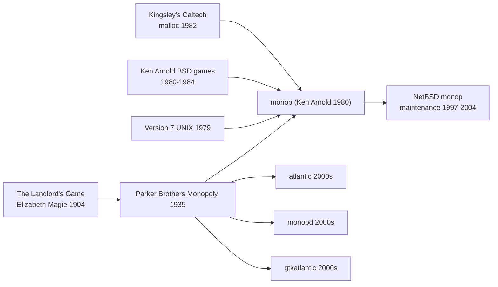

# `monop` — Lineage

> Where `monop` sits in the family tree of Monopoly-adjacent
> computer games and Ken Arnold's Berkeley oeuvre.

---

## Direct Ancestors

- **The Landlord's Game (1904)** by Elizabeth Magie — the
  proto-Monopoly, designed as an anti-monopolist teaching game.
  Predates Parker Brothers' 1935 Monopoly by 3 decades.
- **Parker Brothers Monopoly (1935)** — the direct board-game
  inspiration. Rules, board layout, card decks all inherited.
- **Version 7 UNIX / early BSD (1978–1980)** — the software
  environment. `printf`, `sbrk`, `fork`, curses (also Ken
  Arnold's).
- **Ken Arnold's other Berkeley games** — `snake`, `robots`,
  `rogue`. `monop` shares idioms and coding style with these.
- **Chris Kingsley's 1982 Caltech allocator** — the bundled
  `malloc.c` in `monop`'s tree.

## Direct Descendants

- **Later NetBSD `monop` maintenance** by Joseph Samuel Myers
  (1997–2004) — kept the code alive, refactored some Makefile
  fragments, but preserved the game logic almost entirely.
- **`atlantic`** (Linux, early 2000s) — X11 GUI Monopoly clone.
- **`atlantik`** + **`monopd`** — KDE client and network daemon
  for Monopoly-like games, early 2000s.
- **`gtkatlantic`** — GTK GUI Monopoly clone.
- Countless commercial Monopoly video games (Sega, EA,
  Hasbro-licensed, etc.) — none share code with `monop`, but
  the same design DNA.

## Genre Family

## Ken Arnold's Berkeley catalogue

`monop` is one of many Ken Arnold contributions to early BSD:

- **`curses(3)`** — the terminal-drawing library. Used by
  countless later games.
- **`rogue`** — the roguelike genre's namesake game.
- **`snake`** — a chase game (BSD variant, not the modern
  Nokia-style Snake).
- **`robots`** — chase-and-crash game.
- **`monop`** — this game.

Common Ken Arnold traits observable across all his games:

- `srand(getpid())` seeding.
- Table-driven dispatch.
- Custom fast paths (custom malloc; own input parser).
- Terse, banker-tone user-facing messages.
- ~2K-3K lines of tight C per game.
- Data-driven where feasible (curses's terminfo; monop's data
  files).

## If you like `monop`, try...

**Direct spiritual descendants:**

- **`atlantic`** — Linux GUI Monopoly clone.
- **`atlantik`** + **`monopd`** — KDE Monopoly with online play.
- **Monopoly (Sega Genesis, 1992)** — first-generation console
  Monopoly.
- **Monopoly Plus (2014)** — modern PC Monopoly.
- **Ubisoft Monopoly Madness (2021)** — action-Monopoly hybrid.

**Table-top:**

- **Monopoly** (1935 to present) — the source material.
- **The Landlord's Game** — the anti-monopolist original.
- **Careers** (Parker Brothers, 1955) — different mechanic, same
  path-around-a-board vibe.
- **Life** — same "roll and move" family.

**Modern economic board games** (better designs):

- **Power Grid** — resource management.
- **Puerto Rico** — role-selection + economy.
- **Acquire** — real-estate mergers.
- **Catan** — trading + territory.

**Multi-user text games** (contemporaries):

- **`sail`** (BSD, 1980) — multi-process fork()-based.
- **`phantasia`** (BSD, 1986) — multi-user via shared file.
- **`hunt`** (BSD, 1980s) — real-time UDP multiplayer.
- **MUDs** (1978 onwards) — text worlds.

**Ken Arnold's other games:**

- **`rogue`** — the roguelike ancestor.
- **`snake`** (BSD variant).
- **`robots`**.

## Communities

- **BoardGameGeek** — Monopoly and its variants have huge tags.
- **`r/monopoly`** on Reddit — active discussion.
- **NetBSD community** — maintains upstream.
- **Old-BSDGames enthusiast circles** — smallish, but present.

## Historical curiosity

The 2-solvent-player auction skip is one of the few `monop`-specific
rule tweaks. Original Parker Brothers rules would still auction
between 2 players; `monop` chose to skip. Why? Ken Arnold didn't
document the reason, but the effect is to avoid a degenerate
2-player auction where the mechanic can be gamed. It might have
been a pragmatic UX choice rather than a rules innovation.

## References

See [`references.md`](./references.md).
