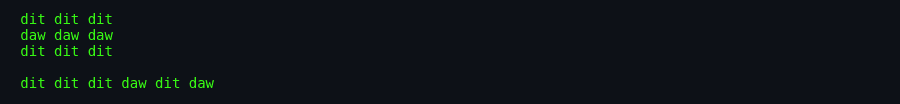
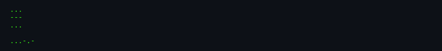

# About `morse`

> **Brochure.** History, authors, cultural notes, and why this utility
> matters.

---

## What Is `morse`?

A tiny Unix utility that translates text to and from International Morse code. Letters, digits, and common punctuation become sequences of dots and dashes; with the `-s` flag it even prints `dit` and `daw` so you can read the rhythm aloud.

## Screenshots

*To be captured from the original BSDGames binary via
[`docs/scripts/capture-screenshots.sh`](../../../docs/scripts/capture-screenshots.sh).*

*Piping a word into `morse` produces one Morse symbol per line.*

*Using `morse -d` converts dots and dashes back into letters.*

*The `-s` flag prints `dit`/`daw` instead of `.` / `-`.*

## Authors & Publisher

- **Author(s):** The Regents of the University of California.
- **Publisher / distributor:** BSD / NetBSD.
- **Release year:** 1988 (source header).
- **Language:** C.

## The Era

In the 1980s many Unix users were also amateur radio operators, so a Morse-code translator was a natural addition to the BSD games/utilities bundle. The code is essentially a lookup table plus a small state machine.

## Why It's Interesting

- **It is bidirectional.** Same tables encode and decode.
- **It includes the SK prosign.** Encoding ends with `...-.-`, the "end of contact" signal.
- **It is tiny but complete.** 266 lines cover letters, digits, and punctuation.

## Difficulty & Progression

No progression. Stateless utility.

## Making-Of / Anecdotes

- **No original man page in BSDGames.** The utility was documented elsewhere (NetBSD `morse.6`).
- **SK at the end.** The encoded output always finishes with the Morse prosign for "end of transmission."

## Cultural Impact

Morse code remains a niche skill among radio amateurs, pilots, and survivalists. The BSD utility is a small educational tool that keeps the code accessible from the command line.

## Known Bugs (Historical)

- **Unknown tokens become `x`.** Any unrecognized Morse token decodes as `x`.
- **10-character token limit.** Tokens longer than 10 symbols are truncated.

## See Also

- [`how-to-play.md`](./how-to-play.md)
- [`architecture.md`](./architecture.md)
- [`lineage.md`](./lineage.md)
- [`references.md`](./references.md)
