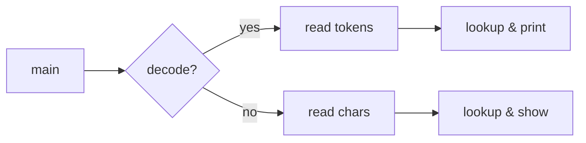

# `morse` — Original Architecture

> Deep analysis of the original C source.
>
> Cite upstream file:line references only. Upstream tree:
> <https://github.com/vattam/BSDGames/tree/master/morse>.

---

## Files & Roles

| File | Purpose | Approx. LoC |
|---|---|---:|
| `morse.c` | Encode/decode Morse code | 266 |
| `Makefile.bsd` / `Makefrag` | Build rules | 46 |

## High-Level Flow

## Data Structures

- `alph[26]` — Morse codes for A–Z. `morse.c:65-92`.
- `digit[10]` — Morse codes for 0–9. `morse.c:52-64`.
- `other[]` — punctuation mappings. `morse.c:94-111`.

## AI Logic

N/A.

## Random Events

N/A.

## Difficulty Progression Logic

N/A. Utility.

## What Was Clever for Its Era

1. **Compact lookup tables.** Letters and digits are stored as string arrays; punctuation as a small struct array. `morse.c:52-111`.
2. **Bidirectional conversion.** The same tables support both encoding and decoding.
3. **Minimal state machine for decoding.** The decoder tracks a token buffer and whitespace state. `morse.c:148-186`.

## Constraints the Original Had To Handle

- **Memory.** Tables are tiny static strings.
- **Portability.** Uses only `stdio` and `ctype`.

## What This Code Would Look Like Today

A modern port might add sound output, visual flashing, or support for non-English Morse variants.

See [`port-ideas.md`](./port-ideas.md).

## See Also

- [`lessons.md`](./lessons.md)
- [`spec.md`](./spec.md)
- [`references.md`](./references.md)
