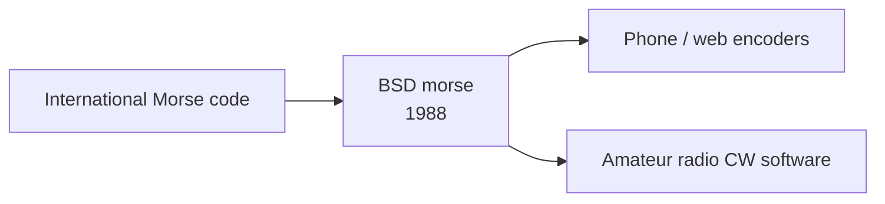

# `morse` — Lineage

---

## Direct Ancestors

- **International Morse code** (Samuel Morse / Alfred Vail, 1830s).

## Direct Descendants

- **Morse encoder/decoder apps** on phones and web.
- **Amateur radio software** supporting CW (continuous wave).

## Genre Family

## If You Like `morse`, Try…

- **LCWO.net** — learn Morse code online.
- **Morse Mania** — mobile trainer.

## References

See [`references.md`](./references.md).
