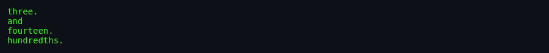

# About `number`

> **The command-line spelling bee for integers.**

---

## What Is `number`?

`number` converts decimal numbers into their English-language equivalents. Ask it for `123` and it prints `one hundred twenty-three`. Feed it `3.14` and it replies `three and fourteen hundredths`. It is a small, deterministic text filter that turns cold digits into something a human can read aloud.

## Screenshots

*Screenshots captured via [`docs/scripts/capture-screenshots.sh`](../../../docs/scripts/capture-screenshots.sh).*

*Converting a modest integer to English words.*

*Handling a fractional value with proper "hundredths" suffix.*

*Pronouncing a number with millions and thousands.*

## Authors & Publisher

- **Author(s):** Unknown (attributed to the Regents of the University of California).
- **Publisher / distributor:** University of California, Berkeley; later NetBSD.
- **Release year:** 1988 (shipped in 4.3BSD).
- **Language:** C.

## The Era

`number` appeared in the late 1980s, when UNIX systems were increasingly used for text processing and shell scripting. The program fits the UNIX small-filter philosophy: read numbers, print words, do one thing well. It was often used to generate cheques, invoices, or any document where numbers needed to be written out in full.

## Why It's Interesting

- **Linguistic precision:** It correctly handles hyphens (`twenty-one`), hundreds, thousands, and scale names up to `vigintillion`.
- **Fraction support:** Decimal input is converted with the right ordinal suffix (`tenths`, `hundredths`, `thousandths`).
- **Batch friendly:** Multiple inputs are separated by `...` so you can pipe a list of numbers through it.
- **Compact algorithm:** The conversion fits in about 300 lines of C using three lookup tables.

## Difficulty & Progression

There is no difficulty or progression. The program processes whatever number it is given, up to a 65-digit limit.

## Making-Of / Anecdotes

The program's scale-name table (`name3[]`) reaches `vigintillion` (10^63), which is far larger than the 65-digit input limit strictly requires. This generous table means the program could be easily extended to handle bigger numbers.

## Cultural Impact

`number` is a direct ancestor of the "spell out number" functions found in accounting software, cheque-printing libraries, and document-generation tools. It also appears in countless programming exercises asking students to convert digits to words.

## Known Bugs (Historical)

- **Zero handling:** `0` prints `zero.` even in `-l` mode, where the trailing period is suppressed for other values.
- **Whitespace handling:** Leading whitespace is skipped; embedded whitespace is treated as an error.
- **Line length:** Stdin lines are limited to 256 characters.

## See Also

- [`how-to-play.md`](./how-to-play.md) — for actually using the tool.
- [`architecture.md`](./architecture.md) — for the code side.
- [`lineage.md`](./lineage.md) — for descendants.
- [`references.md`](./references.md) — for source citations.
