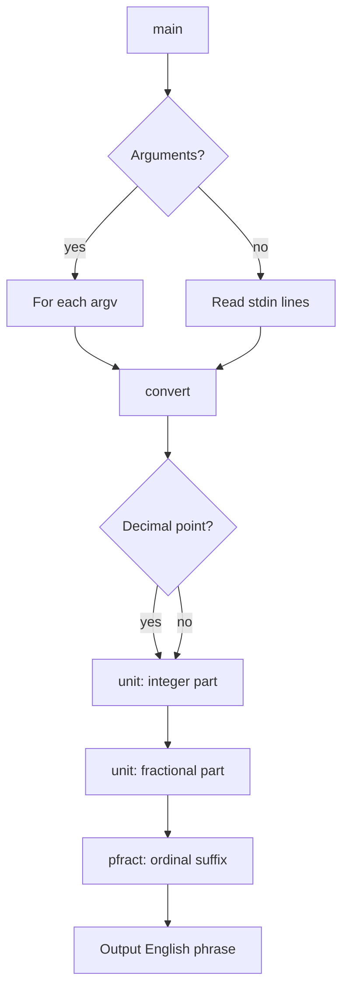

# `number` — Original Architecture

> Deep analysis of the original C source. What did the programmer build, and how?

Cite upstream file:line references only (never local paths). Upstream tree: <https://github.com/vattam/BSDGames/tree/master/number>.

---

## Files & Roles

| File | Purpose | Approx. LoC |
|---|---|---:|
| `number.c` | Argument parsing, input handling, conversion orchestration | 314 |
| `number.6` | Man page | — |

## High-Level Flow



## Game Loop Detail

`number` is a batch text filter. Its main loop iterates over either command-line arguments (`number.c:121-126`) or lines from `stdin` (`number.c:112-120`). Each input is passed to `convert()`.

## Data Structures

The program uses three compact lookup tables:

```c
// number.c:57-77
static const char *const name1[] = {
    "", "one", "two", ..., "nineteen"
};
static const char *const name2[] = {
    "", "ten", "twenty", ..., "ninety"
};
static const char *const name3[] = {
    "hundred", "thousand", ..., "vigintillion"
};
```

- `name1` covers 0–19.
- `name2` covers tens 0–90.
- `name3` covers scale names from `hundred` up to `vigintillion`.

## AI Logic

Not applicable — `number` is a deterministic text utility.

## Random Events

Not applicable — no randomness is used.

## Difficulty Progression Logic

There is no difficulty system. The only limit is `MAXNUM` (65 digits), enforced at `number.c:167-169`.

## What Was Clever for Its Era

- **Three-table decomposition:** The algorithm splits numbers into 3-digit chunks and uses the same `number()` helper for each chunk, appending the appropriate scale name.
- **Singular/plural tracking:** The `singular` flag lets `pfract()` correctly pluralise fractional suffixes (`tenth` vs `tenths`).
- **Line mode flag:** The `-l` option anticipates script use cases by suppressing punctuation.

## Constraints the Original Had To Handle

- **Memory:** Three small string tables and a 256-byte input buffer.
- **Terminal size:** Plain text output, one phrase per input.
- **CPU:** Conversion is O(number of digits), trivial even on 1980s hardware.
- **Persistence:** None; the utility is stateless.

## What This Code Would Look Like Today

A modern port might support locales (Spanish, French, etc.), currency formatting, or a web API that returns the spoken form as JSON. See [`port-ideas.md`](./port-ideas.md) for more.

## See Also

- [`lessons.md`](./lessons.md) — beginner-friendly extraction of techniques.
- [`spec.md`](./spec.md) — implementation-independent specification.
- [`references.md`](./references.md) — sources & citations.
