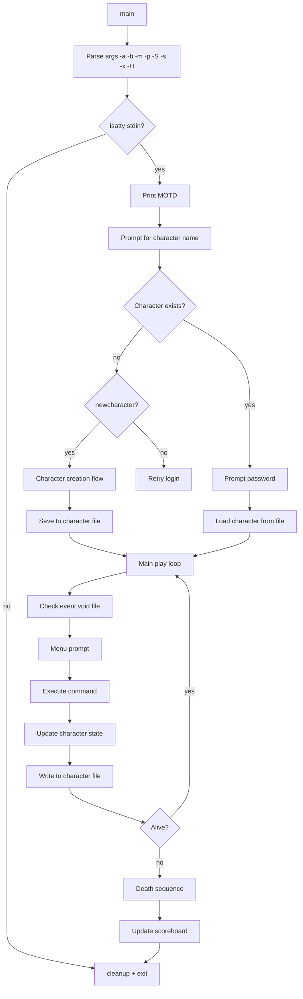
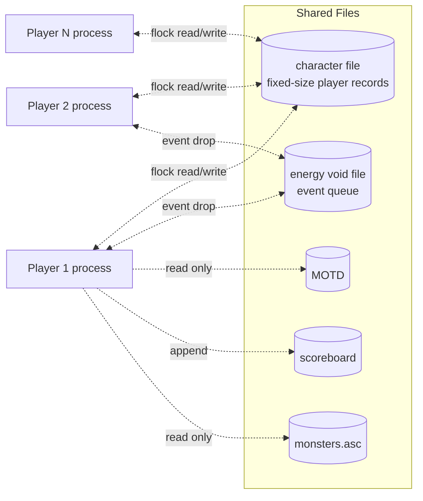
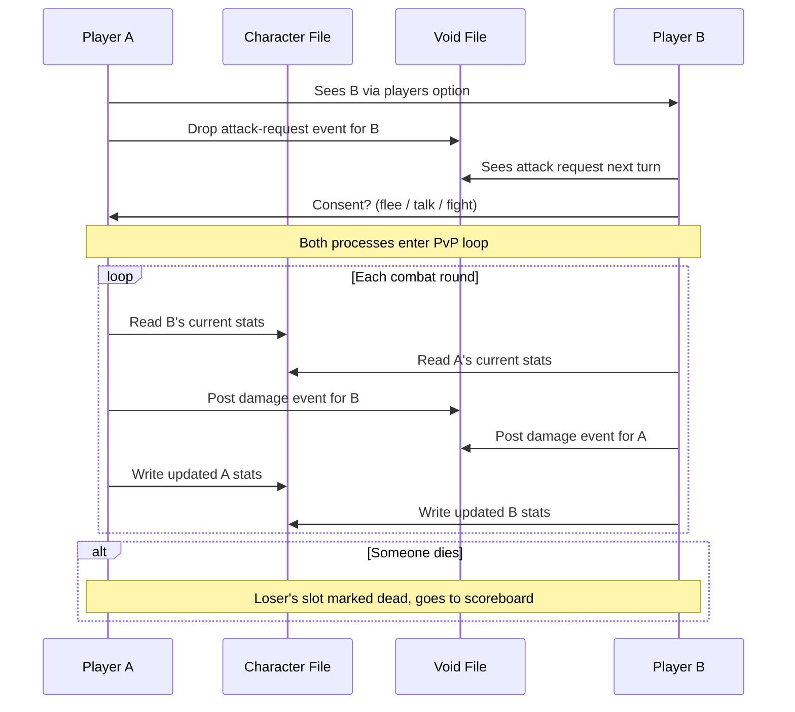

# `phantasia` — Original Architecture

> A multi-user RPG built on **file-based IPC** — no sockets, no
> daemons, no message queues. Just a shared character file, a
> shared event void file, and `flock()`. Edward Estes wrote this
> in 1986 and it worked.

Upstream source (not redistributed):
<https://github.com/vattam/BSDGames/tree/master/phantasia>

---

## Files & Roles

**~20 source files.** Broken into concerns:

| File | Purpose |
|---|---|
| `main.c` | Entry, arg parsing, main play loop |
| `include.h` | Includes for all globals + system headers |
| `phantdefs.h` | `#define` constants (stats, spell levels, etc.) |
| `phantstruct.h` | All struct definitions (Player, Monster, etc.) |
| `phantglobs.h` | Global variable declarations |
| `phantglobs.c` | Global variable definitions |
| `macros.h` | Small helper macros |
| `setup.c` | Initial database setup, file creation |
| `fight.c` | Monster combat resolution |
| `interplayer.c` | **The proto-MMO** — inter-terminal PvP |
| `gamesupport.c` | Miscellaneous game utilities |
| `misc.c` | Small helpers |
| `io.c` | I/O with terminal and files |
| `map.c` | Cartesian world map operations |
| `monsters.asc` | ASCII monster data file (100 monsters) |
| `phantasia.6` | Man page |

## High-Level Architecture



## The Shared-File Multi-User Model

**This is the architectural masterpiece of `phantasia`.**

There is no server daemon. There is no socket. There is no
message queue. Multi-user coordination happens through **flat
files on disk**, coordinated by **file locks**.



### Character File Format

`phantasia` maintains a **fixed-size record file** where each
character has a slot indexed by `playerid`. Structure (from
`phantstruct.h`):

- Name, password
- Character type (1..6)
- All 10+ stats
- Position (x, y)
- Inventory + gold
- Cloak state
- Login time
- Age

A new player = find a free slot or append. Deleted player = mark
slot free. Update = seek to slot, write record. `flock()` on the
file prevents concurrent write corruption.

### Event Void File

The **energy void file** is `phantasia`'s **event queue**:

- Player A wants to attack Player B → drops an "attack pending"
  event in the void file at B's slot.
- Player B's process, on its next play loop iteration, checks
  the void file, sees the event, and enters PvP mode.
- No polling latency guarantees — but "next turn" is fast enough
  for a text RPG.

This is a **file-based mailbox** — one of the earliest patterns
of async inter-process communication in a game.

## Per-Turn Loop

Simplified from `main.c`:

```c
while (Player.p_status != S_CLOAKED_DEAD && !quit_flag) {
    checkbattle();          // Any pending PvP?
    checkevents();          // Any monster-summon or event?
    display_stats();        // Redraw the status pane
    cmd = getcommand();     // Menu prompt
    execute_command(cmd);   // Move / fight / cast / talk
    aging();                // Age += 1; degeneration check
    writerecord(&Player, playerid);   // Persist state
}
```

Every turn writes the character file. This means:

- **No save/load** — persistence is automatic.
- **Concurrent players are consistent** — file is authoritative.
- **Disk I/O per turn is high** — modern port would batch or
  cache.

## Combat System (Monster)

Reference: `fight.c`.

Six action types, each with a distinct resolution function:

| Action | Formula (approximated) |
|---|---|
| `melee` | Damage = Player.strength × modifier |
| `skirmish` | Reduces monster.quickness first |
| `evade` | Success rate ∝ (Player.brains + Player.quickness) / (Monster.brains + Monster.quickness) |
| `spell` | Sub-menu of magic-combat spells |
| `nick` | Player.sword + 1; grants 10% monster.experience |
| `luckout` | Battle-of-wits based on brains |

Monster stats decay under damage; player takes counter-damage.

### The `all or nothing` Spell

Most dramatic single mechanic: cast for 1 mana, 25% chance to
instant-kill. On failure, **doubles** monster's strength AND
quickness. Legendary risk/reward.

## Inter-Terminal Battle (PvP)

Reference: `interplayer.c`.

This is the *proto-MMO* piece — where `phantasia` is genuinely
ahead of its time.



**Turn timing**: not perfectly real-time — each player's turn
resolves in their own event loop, so latency = one turn-tick per
player (fractions of a second on a lightly loaded machine).

**Power blast** is the signature PvP spell — high damage, no
level requirement, mana × 5.

## Random Event System

Randomness sources (from `phantglobs.c`, `misc.c`, `map.c`):

- **`random()`** — standard Unix `random(3)`.
- **`ROLL(base, range)`** — a macro rolling `base + rand() % range`.
- **`drandom()`** — floating-point uniform [0, 1).

### Random Events

| Site | Trigger | Effect |
|---|---|---|
| Monster spawn | Movement into new area | Random monster from 100 |
| Trading post encounter | Rest at certain (x, y) | Trade menu |
| Event void — call to fight | Player action | Enter PvP |
| Death chance in luckout | Combat action | Instant win or lose chance |
| All-or-nothing | Combat spell | 25% instant kill / 75% double monster |
| Chest / item drop | Post-monster-kill | RNG item |
| Age-related degeneration | Every turn | Stat decrease |
| Sin trigger events | Certain actions | Increase sin counter |
| Poison damage | Every turn if poisoned | Reduce energy |

### Seeding

`srandom(time(NULL) ^ getpid())` typically — each player's process
gets a unique seed.

## Difficulty Progression Logic

Unlike `atc` or `trek`, `phantasia` has **no user-selected
difficulty**. All players are on the same scale. Progression
happens along multiple orthogonal axes:

### 1. Character Level

Level is the primary progression axis. `level` is derived from
`experience` via a geometric progression:

```c
#define EXPTOLEVEL(exp) (some function of log/exp)
```

Higher level = higher stat maximums, more spells available,
further movement per turn.

### 2. Spell Availability by Magic Level

Spells unlock at fixed magic-level thresholds (5, 15, 20, 25,
35, 40, 45, 60). Combined with character-level requirements for
some spells (7 for cloak, 12 for teleport).

### 3. Stat Progression per Level

Type-specific rates (see [`about.md`](./about.md) §Difficulty).

### 4. Ambient Difficulty from Other Players

The **hardest thing in `phantasia` is another player**. High-
level enemies attacking you = death. Low-level victims to prey
on = free XP. Server population defines your difficulty.

### 5. Age-Based Decline

Every turn increments `age`. Beyond a threshold, stats
degenerate. Old characters become progressively harder to play.
This is the game's built-in obsolescence mechanic.

### 6. Sin Accumulation

`sin` acts as a hidden "karma" tracker. Certain nasty actions
increment it. Certain endgame outcomes are gated by sin.
Details deliberately obscure.

## Clever Era Techniques

1. **File-based mailbox for PvP.** No sockets, no daemons — just
   files + `flock()`. Runs on any Unix, no special permissions.
2. **Fixed-size records for O(1) player lookup.** Player ID = file
   offset / record size.
3. **ASCII monster file editable by admin.** User-generated
   content in 1986.
4. **Purge system to bound file growth.** Idle characters auto-
   deleted after threshold.
5. **Password protection per character.** Basic but effective.
6. **Cartesian world.** No fixed rooms → infinite exploration.
7. **Type-driven stat progression.** Each character type has its
   own growth vector. Enables real class differentiation.
8. **Rich spell taxonomy** categorized by context (normal /
   monster combat / PvP). Rare for its era.
9. **Cloak mechanics** with real trade-offs (can't collect mana
   while cloaked).
10. **Wizard mode** for admin operations (root-gated).

## Constraints Handled

- **Multi-user coordination** without networking → `flock()`.
- **PDP-11 memory** → fixed-size records, no dynamic allocation.
- **Terminal I/O** via `curses`.
- **File descriptor limits** → careful reuse.
- **Race conditions** → cover with sleep + retry.

## What This Code Would Look Like Today

- **Persistence** → SQLite / PostgreSQL / cloud DB.
- **Multi-user** → proper socket-based server or WebSocket.
- **Real-time PvP** → WebSocket or WebRTC.
- **Character DB** → normalized relational schema.
- **World** → 3D or richer 2D grid.
- **RNG** → proper CSPRNG.
- **UI** → responsive web + terminal + mobile.
- **Chat / talk** → integrated real-time chat.
- **Admin console** → web dashboard, not `-S` flag.

See [`port-ideas.md`](./port-ideas.md).

## See Also

- [`lessons.md`](./lessons.md) — technique extracts.
- [`spec.md`](./spec.md) — mechanical contract.
- [`references.md`](./references.md) — sources.
