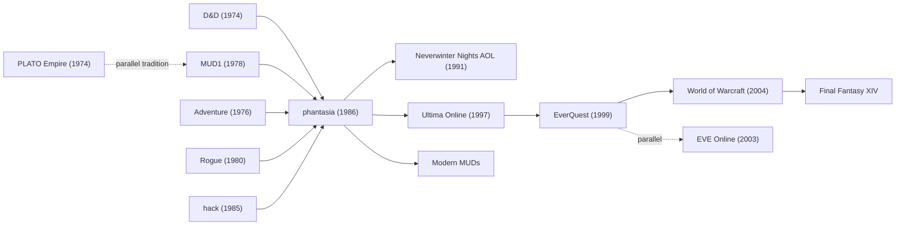

# `phantasia` — Lineage

> Where `phantasia` sits in the MMO family tree.

---

## Direct Ancestors

- **MUD1** (Roy Trubshaw + Richard Bartle, Essex University, 1978)
  — the first Multi-User Dungeon; text-based, multi-user,
  persistent. `phantasia` shares the proto-MMO DNA.
- **Dungeons & Dragons** (Gygax + Arneson, 1974) — the D&D stat
  system, character types, monsters, spells directly inspired
  `phantasia`'s mechanics.
- **Rogue** (Toy + Wichman + Arnold, 1980) — inspired the
  character-with-stats-and-progression idea.
- **`hack`** (Fenlason et al., 1985) — expanded roguelike lineage
  in progress in parallel.
- **PLATO Empire** (1974) — very early multi-user game on the
  PLATO educational network.
- **Adventure** (Crowther + Woods, 1976) — text adventure ancestor;
  `phantasia` inherits the text-mode fantasy sensibility.

## Direct Descendants

- **MUDs** (1980s–1990s) — vast ecosystem of text-based multi-user
  fantasy games, many influenced by `phantasia`.
- **Neverwinter Nights** (AOL, 1991) — one of the first
  commercial online RPGs.
- **Ultima Online** (Origin, 1997) — first mass-market MMO.
- **EverQuest** (Sony, 1999).
- **World of Warcraft** (Blizzard, 2004) — mass-market MMO
  standard.
- **EVE Online** (CCP, 2003) — hardcore persistent universe.
- **RuneScape** (Jagex, 2001).
- **Final Fantasy XI/XIV** — modern MMO iterations.

## Genre Family

## If You Like `phantasia`, Try…

**Direct spiritual descendants:**

- **Modern MUDs** — `DikuMUD`, `LPMud` family, TinyMUD, Achaea.
  Still active communities.
- **Discworld MUD** — long-running text MMO.

**Persistent multi-user fantasy:**

- **World of Warcraft** — the mainstream inheritor.
- **Final Fantasy XIV** — Japanese MMO standard.
- **Elder Scrolls Online**.
- **Guild Wars 2**.

**Hardcore persistent world:**

- **EVE Online** — the "one shard" ideal `phantasia` couldn't
  quite achieve.
- **Star Citizen** (in progress) — the spiritual next step.

**Text-mode RPG revival:**

- **Kingdom of Loathing** — humor MMO.
- **Torn** — persistent browser MMO.
- **A Dark Room** — minimalist text RPG.

**Roguelike-adjacent:**

- **NetHack, DCSS, Angband** — single-player descendants of
  the same fantasy tradition.

## Communities

- **MUD Coders Guild** — modern text-MUD developer community.
- **`t=r0`** and similar retro-computing forums.
- **Reddit r/MUD** and r/roguelikes.
- **Public archives of Estes's original source** on various
  retro-computing sites.

## References

See [`references.md`](./references.md).
