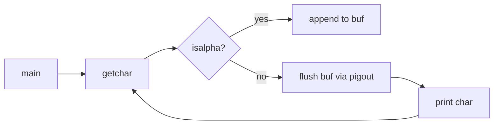

# `pig` — Original Architecture

> Deep analysis of the original C source.
>
> Cite upstream file:line references only. Upstream tree:
> <https://github.com/vattam/BSDGames/tree/master/pig>.

---

## Files & Roles

| File | Purpose | Approx. LoC |
|---|---|---:|
| `pig.c` | Pig Latin translator | 142 |
| `pig.6` | Man page | 46 |

## High-Level Flow

## Data Structures

- `buf[1024]` — one word buffer. `pig.c:66`.
- `len` — current word length. `pig.c:64`.

## AI Logic

N/A.

## Random Events

N/A.

## Difficulty Progression Logic

N/A. Utility.

## What Was Clever for Its Era

1. **Streaming word parser.** The program never holds more than one word in memory. `pig.c:80-92`.
2. **Case-aware suffix.** It distinguishes all-uppercase, title-case, and lowercase words. `pig.c:104-134`.
3. **QU handling.** The consonant-moving loop treats `qu` as a unit. `pig.c:127-130`.

## Constraints the Original Had To Handle

- **Memory.** Buffer size 1024 is generous for normal words but prevents runaway input.
- **Speed.** Pure character-by-character processing is trivial.

## What This Code Would Look Like Today

A modern port might use regular expressions or Unicode-aware segmentation, and offer a reverse-translate mode.

See [`port-ideas.md`](./port-ideas.md).

## See Also

- [`lessons.md`](./lessons.md)
- [`spec.md`](./spec.md)
- [`references.md`](./references.md)
