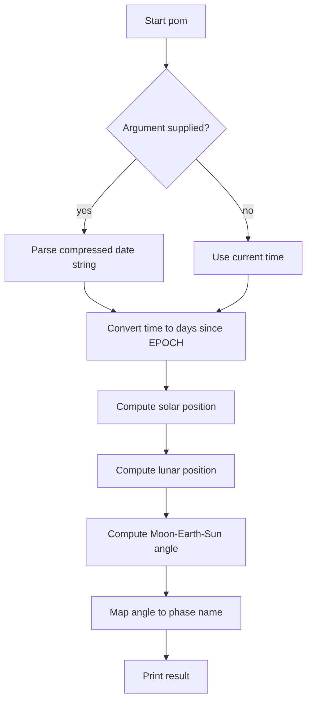

# `pom` — Architecture

`pom` is a small C program that converts the system clock (or a user
date) into a lunar-phase description using textbook orbital mechanics.

---

## Control Flow



## Game Loop / Control Flow

There is no loop. The program computes one value and exits.

## AI Logic

None.

## Random-Event System

None.

## Difficulty Progression & Runtime Setup

Not applicable. The only inputs are the current system time or a
user-supplied date string.

## Key Code Excerpts

### Constants (`pom.c:79-85`)

```c
#define EPOCH_MINUS_1970 (20 * 365 + 5 - 1)
#define EPSILONg  279.403303
#define RHOg      282.768422
#define ECCEN     0.016713
#define lzero     318.351648
#define Pzero     36.340410
#define Nzero     318.510107
```

### Main driver (`pom.c:103-148`)

```c
days = (tmpt - EPOCH_MINUS_1970 * 86400) / 86400.0;
today = potm(days) + .5;
/* ... tense selection ... */
if ((int)today == 100)
    printf("Full\n");
else if (!(int)today)
    printf("New\n");
else {
    tomorrow = potm(days + 1);
    if ((int)today == 50)
        printf("%s\n", tomorrow > today ?
            "at the First Quarter" : "at the Last Quarter");
    else {
        today -= 0.5;
        printf("%s ", tomorrow > today ? "Waxing" : "Waning");
        if (today > 50)
            printf("Gibbous (%1.0f%% of Full)\n", today);
        else if (today < 50)
            printf("Crescent (%1.0f%% of Full)\n", today);
    }
}
```

### Phase computation (`pom.c:155-186`)

The `potm()` function implements the algorithm from *Practical
Astronomy with Your Calculator* sections 46, 65, and 67. It computes:

- Solar mean anomaly and ecliptic longitude.
- Lunar mean longitude, anomaly, and node.
- Corrections for evection, annual equation, variation, and more.
- The Moon-Sun elongation `D`.
- Returns `50.0 * (1 - cos(D))`, a percentage-like illumination value.

### Angle normalisation (`pom.c:203-214`)

```c
void
adj360(double *deg)
{
    for (;;)
        if (*deg < 0)
            *deg += 360;
        else if (*deg > 360)
            *deg -= 360;
        else
            break;
}
```

## Data Format

No external data. All orbital constants are `#define`s in the source.

## See Also

- [`spec.md`](./spec.md) — formal behaviour.
- [`lessons.md`](./lessons.md) — teaching points.
- [`references.md`](./references.md) — sources.
