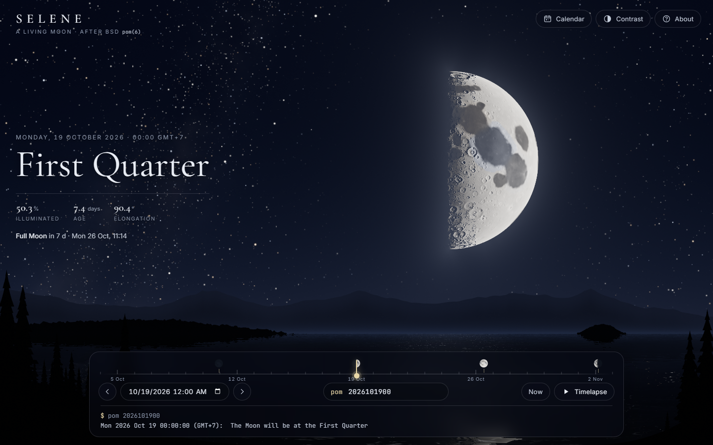
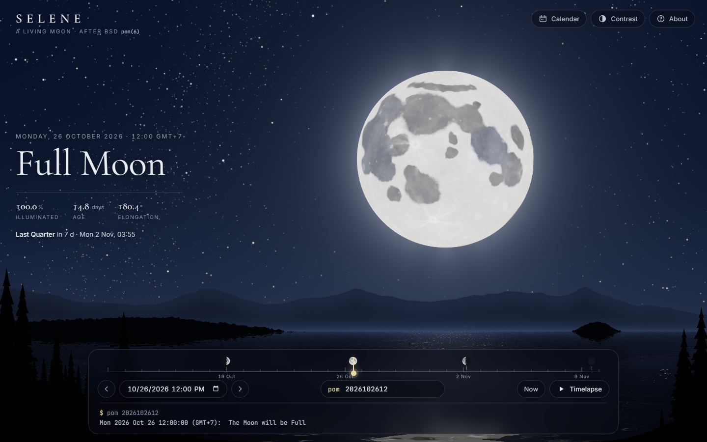
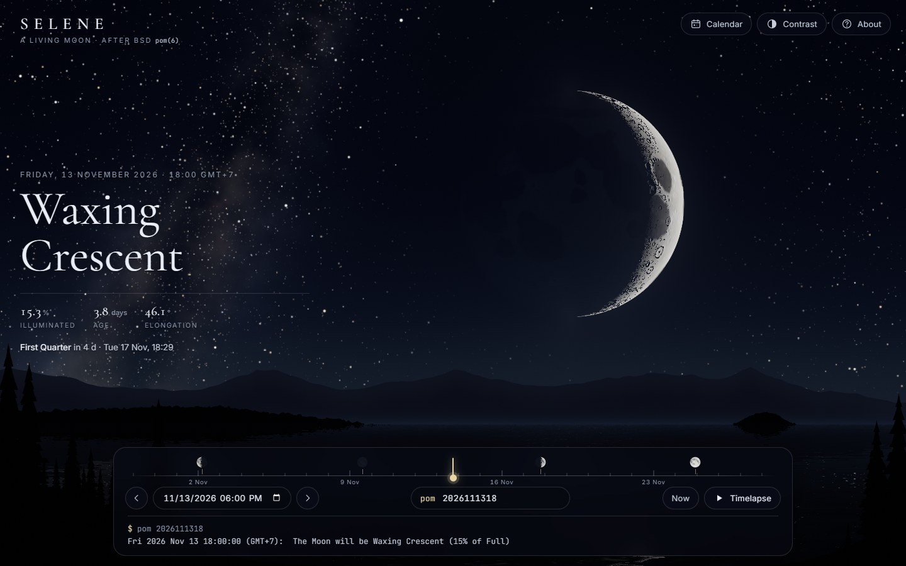
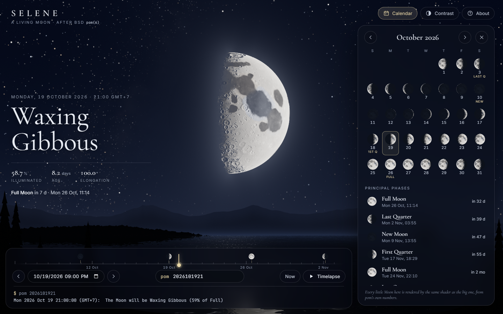
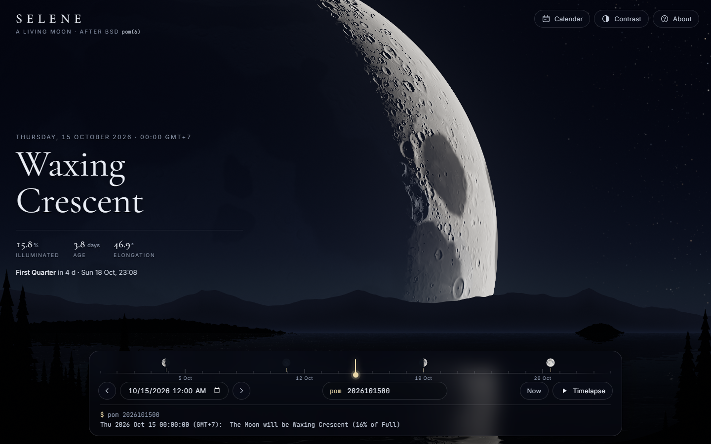
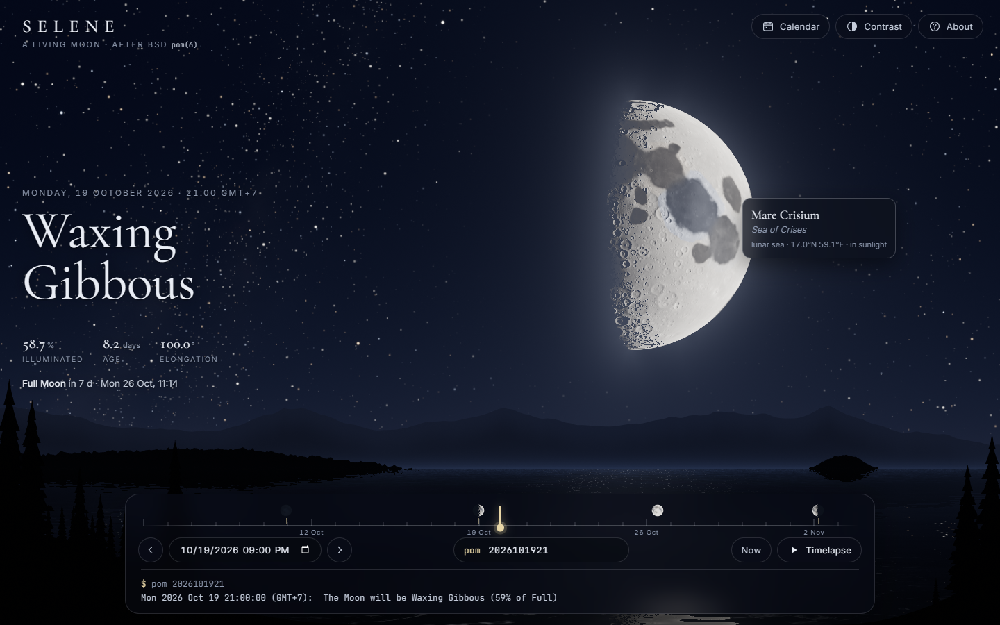
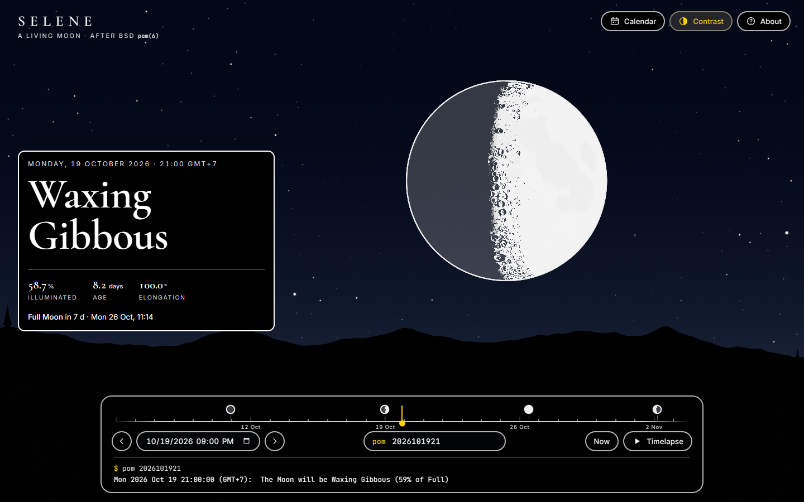
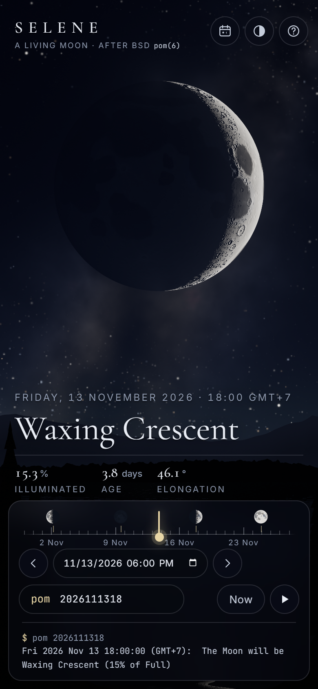

# pom · fancy-web — *Selene, A Living Moon*

> The phase of the Moon, computed by the original 1984 BSD `pom`
> algorithm and painted **entirely from code**: a ray-traced Moon with
> real seas and craters, a night sky, a lake. **No images.**

[](../../../../docs/progress.md)
[](../../../../docs/decisions/006-multi-port-architecture.md)
[](./docs/decisions/002-zero-raster-assets.md)
[](../../../../LICENSE)


*First Quarter, 19 Oct 2026. The terminator position comes straight from
pom’s `potm()` elongation. The craters along it cast real shadows,
computed by marching a procedurally baked height field toward the Sun.*

## What it is

BSD [`pom(6)`](../../docs/about.md) answers one question in one line:

```
$ pom
The Moon is Waxing Gibbous (90% of Full)
```

*Selene* keeps that exact answer, **byte for byte**, as a caption at the
bottom of the screen. Above it, the answer is painted: a Moon whose lit
fraction, terminator and earthshine are all driven by pom’s own numbers,
hanging over a procedural lake at night.

It is a **showcase port**. Its thesis is in
[ADR-002](./docs/decisions/002-zero-raster-assets.md): stunning graphics
can come purely from code. There is not a single PNG, JPG, WebP or GIF
in `src/`, and a test fails the build if one appears.

## Gallery

| | |
|---|---|
|  |  |
| *Full Moon. The disc goes topographically flat, as the real one does; the moon glade breaks up on the rippled lake.* | *A 15% crescent. Moonlight is weak, so the Milky Way, its dust lanes and the fainter stars come out.* |
|  |  |
| *Moon calendar. Every mini Moon is rendered by the **same shader** as the hero Moon, not by icons.* | *Telephoto close-up. Mare Crisium and Mare Fecunditatis on the crescent, rising behind the ridge.* |
|  |  |
| *Hover names real features (IAU coordinates) and says whether they are in sunlight.* | *High-contrast mode: a crisp limb, a slate-grey night side, solid black panels.* |

<p align="center"><br><em>Phone layout.</em></p>

## Features

- **Faithful engine.** A line-by-line port of Duffett-Smith’s algorithm
  from `pom.c` (1990 epoch, `potm(days)`), with the same phase names,
  the same *was / is / will be* tense rule, and the same
  `[[[[[cc]yy]mm]dd]HH]` parser, including the `yy < 69 → 20yy` hack.
  It is verified against **1,534 invocations of the real
  `/usr/games/pom` binary**.
- **The Moon.** Ray-traced per pixel (an exact limb at any resolution).
  The surface is baked at load time from 35 maria lobes and 24 named
  craters at their real selenographic coordinates, plus up to seven
  octaves of procedural craters. Lighting is lunar-Lambert photometry with an
  opposition surge, cast shadows near the terminator, and bluish
  earthshine that grows toward New Moon.
- **The sky.** A twinkling five-layer starfield, a Milky Way with
  dust lanes, faint airglow, and a halo that radiates from the *lit*
  part of the disc. Moonlight brightens the sky and washes out faint
  stars and the Milky Way as the Moon fills.
- **The land.** A far mountain range, valley mist, a forested headland,
  an island, and a lake that mirrors everything with
  perspective-correct ripples and a moon glade, all framed by pines.
- **Time travel.** A ±15-day scrubber with mini-Moon event markers,
  a date picker, pom’s compressed-date field (with pom’s own error
  message), day steps, **Now**, and a **Timelapse** through one lunar
  month.
- **Moon calendar.** A month grid of shader-rendered mini Moons and the
  next eight principal phases (New, First Quarter, Full, Last Quarter),
  located by bisection on pom’s elongation.
- **Micro-interactions.** Drag to rock the Moon on its axis (it springs
  back). Hover tooltips on the Moon and the calendar days. Animated
  transitions between dates.
- **Accessibility.** Respects `prefers-reduced-motion` (no twinkle, no
  ripples, stepped timelapse, instant transitions) and
  `prefers-contrast: more`, with a manual high-contrast toggle, full
  keyboard control, and a polite live region that stays quiet during
  timelapse.

## Play / run

ES modules cannot be loaded from `file://`, so serve the folder. The
included server has zero dependencies:

```bash
cd bsdgames/pom/ports/fancy-web
npm start               # → http://localhost:5391/
# or any static server:  npx serve .   /   python -m http.server
```

The engine also runs as a terminal `pom`, identical to the original:

```bash
npm run pom -- 2026102600
# Mon 2026 Oct 26 00:00:00 (GMT+7):  The Moon will be Full
npm run pom -- 20261031
# pom: illegal time format
# usage: pom [[[[[cc]yy]mm]dd]HH]
```

Useful URL parameters: `?date=<pom argument>` (for example
`?date=2026102612`), `?calendar=1`, `?hc=1`, `?motion=0`, `?q=high`.

### Controls

| Input | Action |
|---|---|
| Drag on the timeline | Scrub ±15 days (snaps to the hour, pom’s resolution) |
| `←` / `→` | ± one hour |
| `Shift` + `←` / `→`, or the ‹ › buttons | ± one day |
| `PgUp` / `PgDn` | ± one lunar month |
| `Space` / **Timelapse** | Play one lunar month (≈14 s) |
| `N` / **Now** | Back to the live Moon |
| `C` / **Calendar** | Moon calendar and principal phases |
| `H` / **Contrast** | High-contrast mode |
| `?` / **About** | About and shortcuts |
| Drag the Moon | Rock it on its axis |
| `pom` field | Type any `[[[[[cc]yy]mm]dd]HH]` and press Enter |

## Tests

```bash
npm test     # node --test "tests/*.test.js"   (26 tests, no dependencies)
```

- `engine.test.js`: golden byte-for-byte comparison against the real
  binary, the canonical scenarios, parser edge cases, printf rounding,
  and tense.
- `events.test.js`: principal-phase search and month grids.
- `zero-raster.test.js`: enforces ADR-002 over `src/` and `index.html`.

See [`docs/test-scenarios.md`](./docs/test-scenarios.md) for the
canonical scenario sign-off. Porting surfaced an error in the canonical
scenarios 2–4 (8-digit arguments are `yymmddHH`); they were corrected
against the real binary.

## Tech stack

- **Vanilla ES modules, zero build**, like the sibling
  [`atc`](../../../atc/ports/fancy-web/) and
  [`trek`](../../../trek/ports/fancy-web/) ports.
- **Raw WebGL2 + GLSL ES 3.0**. There is no Three.js; see
  [ADR-001](./docs/decisions/001-rendering-stack.md) for why.
- Three shader programs: a surface **bake** (albedo + height), a
  **slope** pass (normals), and one full-screen **scene** shader, which
  also draws the calendar’s mini Moons.
- Fonts: Cormorant Garamond, Inter and JetBrains Mono (Google Fonts,
  vector glyphs), with system fallbacks.
- **Targets:** any browser with WebGL2 and `EXT_color_buffer_float`
  (it falls back to 8-bit targets without it). Desktop and mobile.
  Adaptive resolution kicks in on slow GPUs.

How it works, with diagrams: [`docs/architecture.md`](./docs/architecture.md).

## Status

**Released**, 2026-09-24. Live URL: *(not deployed yet)*.

## Documentation

| Doc | Contents |
|---|---|
| [`docs/diff-log.md`](./docs/diff-log.md) | What was kept, changed and added, and why, including the art-direction critique loop |
| [`docs/architecture.md`](./docs/architecture.md) | Engine → shaders → UI data flow |
| [`docs/test-scenarios.md`](./docs/test-scenarios.md) | Canonical sign-off (scenarios 1–7), history of the scenario fix, port-specific scenarios |
| [`docs/notes.md`](./docs/notes.md) | Working notes, legacy layout, known limitations |
| [`docs/decisions/`](./docs/decisions/) | ADR-001 rendering stack · ADR-002 zero raster assets |

## Author & license

Port by **Agun Wijaya** with Claude (Anthropic). MIT, as the root
[`LICENSE`](../../../../LICENSE).

## Attribution

Based on **`pom`** by **Keith E. Brandt** (1984), updated to the
third edition of Duffett-Smith by **Paul Janzen** (1998), as shipped in
BSDGames. Copyright © 1989, 1993 The Regents of the University of
California. Upstream: <https://github.com/vattam/BSDGames/tree/master/pom>.
Algorithm: Peter Duffett-Smith, *Practical Astronomy with Your
Calculator*, 3rd ed., Cambridge University Press. Feature coordinates:
IAU/USGS Gazetteer of Planetary Nomenclature. See
[`ATTRIBUTION.md`](../../../../ATTRIBUTION.md).
