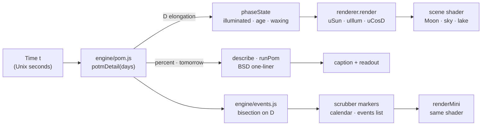
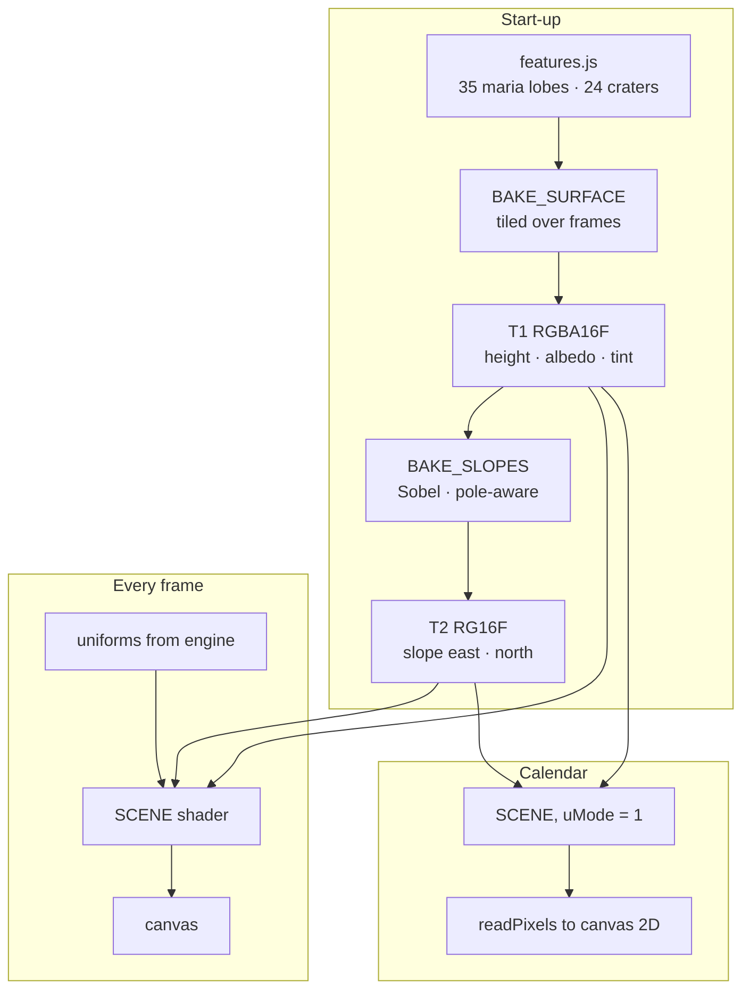

# Architecture — `pom / fancy-web` (*Selene*)

How one number from a 1984 C program becomes a night sky.

---

## Data flow

Everything visual derives from pom’s elongation **D** (degrees, 0 = New,
90 = First Quarter, 180 = Full):

| Quantity | Formula | Used for |
|---|---|---|
| Sun direction (view space) | `(sin D, 0, −cos D)` | Terminator, shading, shadows |
| Lit fraction | `(1 − cos D) / 2` = pom’s `potm / 100` | Halo strength, sky brightness, star and Milky Way wash-out |
| Phase angle *g* | `acos(dot(L, V)) = 180° − D` | Lunar-Lambert weight, opposition surge, relief flattening |
| Earth’s phase from the Moon | `(1 − cos g) / 2` | Earthshine strength |
| Terminator ellipse | `x = √(1 − y²) · cos D` | Halo radiating from the *lit* region |

## Engine (`src/engine/`)

- `pom.js` is a line-for-line port of `pom.c`: the same constants, the
  same `adj360` loop, the same `sec NN #M` comments. It adds two helpers
  that the C code computes but does not expose. `potmDetail` returns the
  raw elongation `D`, and `phaseState` packages it for rendering.
  `potm(days)` itself is unchanged.
- Time zones are injected (`localZone()` in the browser;
  `fixedZone(offset, name)` in tests) to stand in for `localtime`,
  `mktime` and `strftime %Z`.
- `cRound0` reproduces glibc’s `printf("%1.0f")` (round half to even on
  the exact binary value).
- `events.js` scans D in 6-hour steps and bisects to 1 s where D
  crosses 0°, 90°, 180° or 270°.

## Rendering (`src/render/`)

1. **Surface bake (once).** An equirectangular texture (4096×2048 on
   desktop, 2048×1024 on mobile), baked 64 rows at a time so the page
   never stalls:
   - *Maria*: a soft union of lobes at IAU coordinates, domain-warped
     shorelines, broad tonal zones, darker shoreline bands.
   - *Crater population*: up to seven octaves of 3-D cellular scatter
     with a power-law size distribution, mostly degraded, a few fresh
     ones with bright ejecta and short rays. Most are buried under the
     maria.
   - *Named craters*: profile per crater (flat floor, central peak,
     terraces), dark floors (Plato, Grimaldi), long ray systems (Tycho,
     Copernicus, Kepler…).
   - *Basin rims*: broken mountain arcs (Apennines, around Crisium,
     Nectaris, Humorum).
2. **Slopes (once).** A Sobel filter over the height map. Near the poles
   the longitude stencil widens so it covers a constant ground distance.
3. **Scene (per frame).** One full-screen fragment shader:
   - **Moon**: ray–sphere per pixel, normal from slopes, **lunar-Lambert**
     BRDF (McEwen) with opposition surge. **Cast shadows** come from
     marching up to 24 samples of the height field toward the Sun, only
     within about 17° of the terminator, with a penumbra from the Sun’s
     angular size. Relief fades toward Full Moon (the real Full Moon
     looks flat). Bluish **earthshine** ∝ Earth’s phase⁴.
   - **Sky**: a gradient that brightens and blues with moonlight, faint
     airglow, a Milky Way (domain-warped star clouds, Great Rift, Hα
     knots), five star layers with a power-law magnitude distribution,
     twinkle, extinction near the horizon, a moonlight limiting
     magnitude, and glare near the Moon.
   - **Halo**: forward scattering whose distance is measured to the
     **lit region** (a soft minimum over 25 rows of the terminator
     ellipse), so a crescent glows from its bright side only.
   - **Landscape**: far ridges (ridged fBm), valley mist, a forested
     headland and an island, **a lake** that re-evaluates the upper
     scene through a perspective-correct ripple mirror, a moon glade,
     and pine silhouettes on the foreground banks.
   - ACES filmic tone map, sRGB encoding, and a dither against banding.
4. **Mini Moons.** The same program with `uMode = 1`, rendered into a
   small framebuffer and copied into calendar and scrubber canvases.

## UI (`src/ui/`)

- A single `requestAnimationFrame` loop owns the time state: `live`
  (follows the clock), `anim` (eased jump between dates), `lapse` (one
  lunar month in ~14 s), and scrubbing.
- The caption is literally `runPom(arg)`: `$ pom` when live, otherwise
  `$ pom ccyymmddHH` for the displayed hour, or pom’s own error text.
- Hover tooltips invert the ray–sphere mapping in JS (`R^T · n`) and
  query `featureAt()` from the same table the bake used.
- Adaptive resolution lowers the drawing-buffer scale on slow GPUs, with
  a ceiling so it doesn’t oscillate.

## Performance (RTX 4060 Laptop, ANGLE/D3D11)

| Viewport | GPU frame |
|---|---|
| 1440×900 @1× | ≈ 6 ms |
| 1440×900 @2× | ≈ 10 ms |
| 2560×1440 @1× | ≈ 8.5 ms |
| Mini Moon (68 px) | ≈ 1 ms each |
| Surface bake (4096²/2) | < 0.5 s, spread over frames |

## See also

- [ADR-001 — rendering stack](./decisions/001-rendering-stack.md)
- [ADR-002 — zero raster assets](./decisions/002-zero-raster-assets.md)
- Canonical [`../../../docs/architecture.md`](../../../docs/architecture.md)
  — the original C program.
