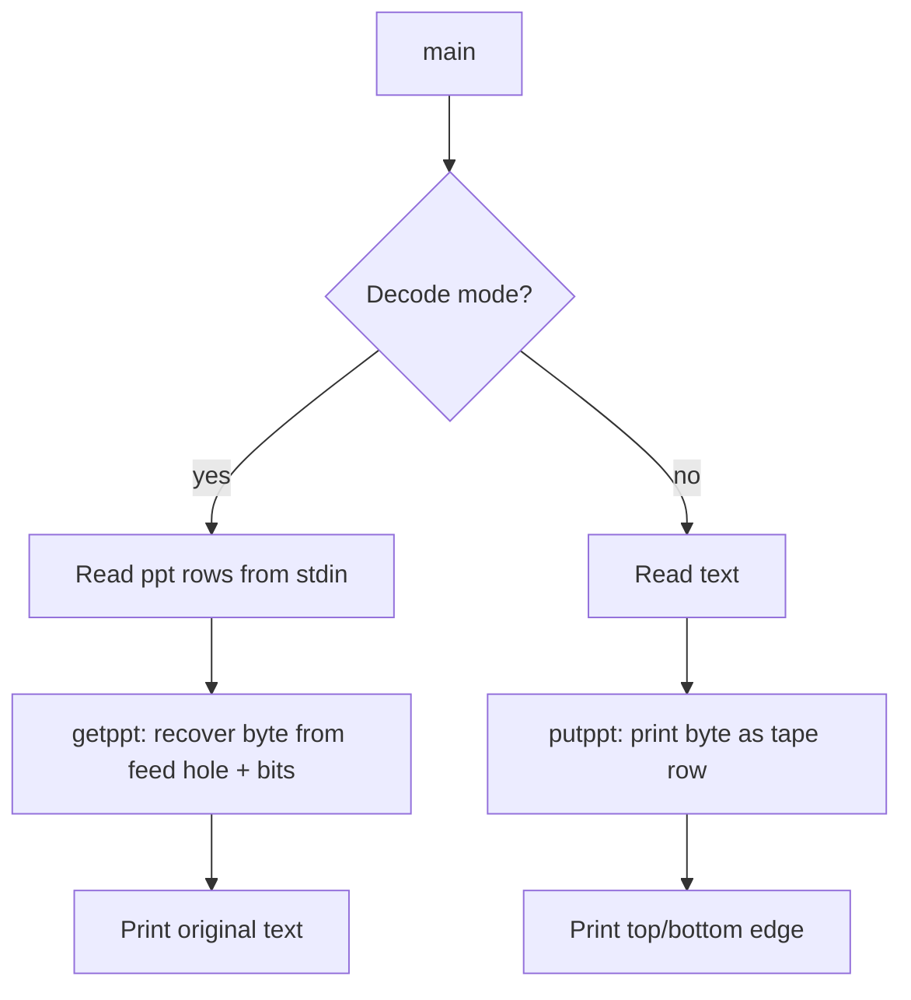

# `ppt` — Original Architecture

> Deep analysis of the original C source. What did the programmer build, and how?

Cite upstream file:line references only (never local paths). Upstream tree: <https://github.com/vattam/BSDGames/tree/master/ppt>.

---

## Files & Roles

| File | Purpose | Approx. LoC |
|---|---|---:|
| `ppt.c` | Argument parsing, encode/decode driver | 180 |
| `bcd.6` / `ppt.6` | Shared man page with `bcd` and `morse` | — |

## High-Level Flow



## Game Loop Detail

Encode mode (`ppt.c:118-129`) reads each character and calls `putppt()`. Decode mode (`ppt.c:92-116`) reads lines, calls `getppt()`, and prints recovered bytes.

## Data Structures

No complex data structures; only scalar variables and the `EDGE` string.

```c
// ppt.c:52
#define EDGE "___________"
```

## AI Logic

Not applicable — `ppt` is a deterministic formatter.

## Random Events

Not applicable — no randomness is used.

## Difficulty Progression Logic

There is no difficulty system. Output scales linearly with input length.

## What Was Clever for Its Era

- **Symmetric encode/decode:** The same row format is used in both directions.
- **Feed hole as anchor:** The `.` in the middle gives the decoder a reliable reference point.
- **Minimal I/O:** Only `getchar()`, `putchar()`, and `fgets()`.

## Constraints the Original Had To Handle

- **Memory:** Essentially zero dynamic allocation.
- **Terminal size:** Output is 11 characters wide per row.
- **CPU:** O(n) per byte.
- **Persistence:** None.

## What This Code Would Look Like Today

A modern port might render realistic paper tape with torn edges, generate animated reels, or decode from images. See [`port-ideas.md`](./port-ideas.md) for more.

## See Also

- [`lessons.md`](./lessons.md) — beginner-friendly extraction of techniques.
- [`spec.md`](./spec.md) — implementation-independent specification.
- [`references.md`](./references.md) — sources & citations.
