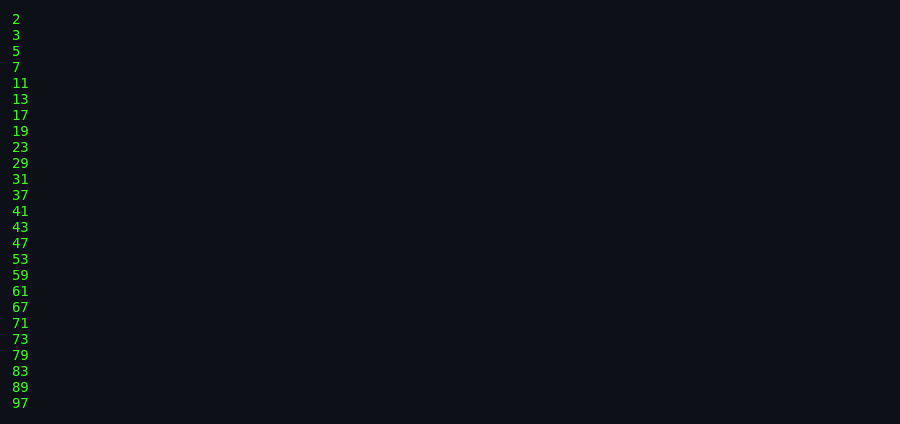
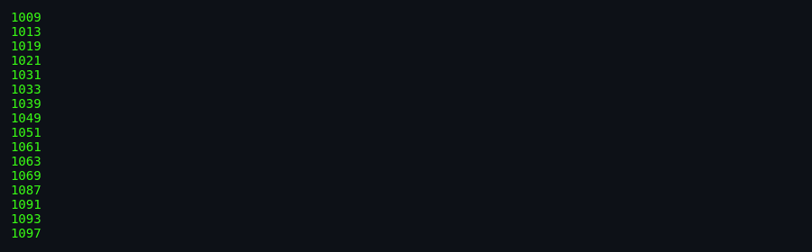
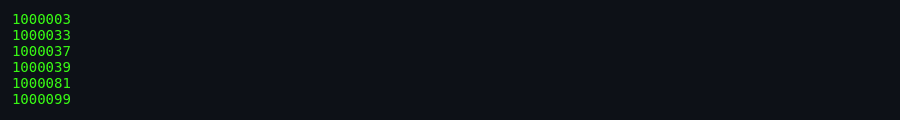

# About `primes`

> **Ask for primes, get primes — one per line, ascending, no duplicates.**

---

## What Is `primes`?

`primes` is a small BSD utility that prints every prime number in a range `[start, stop)`. Give it `2 100` and it lists `2`, `3`, `5`, ..., `97`. Give it no arguments and it reads the start value from standard input, then marches upward toward the 32-bit limit. It is the natural companion to `factor`: while `factor` tears a number apart, `primes` builds a stream of indivisible numbers.

## Screenshots

*Screenshots captured via [`docs/scripts/capture-screenshots.sh`](../../../docs/scripts/capture-screenshots.sh).*

*Generating primes from 2 up to (but not including) 100.*

*Primes starting at 1000 — the program skips even numbers and sieves odd candidates.*

*Generating primes in a higher range, showing the segmented sieve in action.*

## Authors & Publisher

- **Author(s):** Landon Curt Noll (`chongo@toad.com`), then at Sun/Tolsoft.
- **Publisher / distributor:** University of California, Berkeley; later NetBSD.
- **Release year:** 1989 (shipped in 4.3BSD-Reno).
- **Language:** C.

## The Era

`primes` arrived in the late 1980s alongside `factor`, when workstations had 32-bit CPUs and prime tables were still useful for cryptography education, benchmarking, and recreational mathematics. The program targets the command line and standard I/O, fitting neatly into pipelines and shell scripts.

## Why It's Interesting

- **Efficient sieving:** Combines a pre-computed prime table, a wheel pattern for small factors, and a segmented Sieve of Eratosthenes.
- **Companion to `factor`:** Same author, same prime table, complementary purpose.
- **Validation built in:** The source comments mention a known check — 664,579 primes between 0 and 10^7.
- **Compact code:** A complete prime generator in about 340 lines of C.

## Difficulty & Progression

There is no explicit difficulty or progression. The challenge is entirely computational: wider ranges and higher start values require more sieving work.

## Making-Of / Anecdotes

Like `factor`, the source header carries Landon Curt Noll's signature: `chongo <for a good prime call: 391581 * 2^216193 - 1> /\oo/\`. The man page ends with the dry note: "won't get you a world record."

## Cultural Impact

`primes` is the ancestor of countless online prime generators and a staple of introductory number-theory programming exercises. It sits next to `factor` in every discussion of classical prime algorithms.

## Known Bugs (Historical)

- **No output for stop <= start:** The function silently returns when the range is empty or inverted (the main program validates `start < stop`).
- **Input line limit:** Stdin input must not exceed 100 bytes in `read_num_buf()`.
- **Stops at 2^32-1:** Hard-coded 32-bit limit.

## See Also

- [`how-to-play.md`](./how-to-play.md) — for actually using the tool.
- [`architecture.md`](./architecture.md) — for the code side.
- [`lineage.md`](./lineage.md) — for descendants.
- [`references.md`](./references.md) — for source citations.
