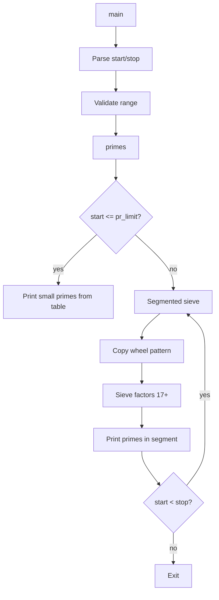

# `primes` — Original Architecture

> Deep analysis of the original C source. What did the programmer build, and how?

Cite upstream file:line references only (never local paths). Upstream tree: <https://github.com/vattam/BSDGames/tree/master/primes>.

---

## Files & Roles

| File | Purpose | Approx. LoC |
|---|---|---:|
| `primes.c` | Argument parsing, segmented sieve driver | 340 |
| `primes.h` | Type definitions and table size | — |
| `pr_tbl.c` | Pre-computed prime table up to 65537 | — |
| `pattern.c` | Wheel pattern for 3, 5, 7, 11, 13 | — |
| `primes.6` | Man page | — |

## High-Level Flow



## Game Loop Detail

`primes()` (`primes.c:221-332`) is not interactive; it is a deterministic loop over sieve windows. For each window it:

1. Copies the wheel pattern for 3, 5, 7, 11, 13 into `table[]`.
2. Sieves multiples of primes from 17 up to `sqrt(window_end)`.
3. Prints every cell in the window that survived sieving.
4. Moves the window upward by `TABSIZE*2` until `stop` is reached.

## Data Structures

```c
// primes.c:87
char table[TABSIZE];     /* Eratosthenes sieve of odd numbers */
```

- `table[]` — one byte per odd number in the current window.
- `prime[]` / `pr_limit` — pre-computed primes up to 65537.
- `pattern[]` / `pattern_size` — bit pattern of composites for the wheel {3,5,7,11,13}.

## AI Logic

Not applicable — `primes` is a deterministic mathematical utility.

## Random Events

Not applicable — no randomness is used.

## Difficulty Progression Logic

There is no difficulty system. Runtime cost scales with:

- The width of the range (`stop - start`).
- The density of sieve operations near the start of each window.
- The number of small primes used as sieve factors.

## What Was Clever for Its Era

- **Segmented sieve:** The table sieves only a window at a time, keeping memory usage constant regardless of how high the range goes.
- **Wheel pattern:** Pre-computing the repeating pattern of composites for 3, 5, 7, 11, 13 eliminates most small-factor work with `memcpy`.
- **Prime table bootstrap:** For candidates below 65537, the program simply prints from the pre-computed table.

## Constraints the Original Had To Handle

- **Memory:** `TABSIZE` bytes for the sieve window (a few hundred KB in typical builds).
- **Terminal size:** Plain text output, one prime per line.
- **CPU:** Segmented sieve is O(n log log n) but with a small constant thanks to the wheel.
- **Persistence:** None.

## What This Code Would Look Like Today

A modern port might use a bit-packed segmented sieve, multi-threading, or arbitrary-precision limits. A web demo could visualise the sieve window moving across a number line. See [`port-ideas.md`](./port-ideas.md) for more.

## See Also

- [`lessons.md`](./lessons.md) — beginner-friendly extraction of techniques.
- [`spec.md`](./spec.md) — implementation-independent specification.
- [`references.md`](./references.md) — sources & citations.
