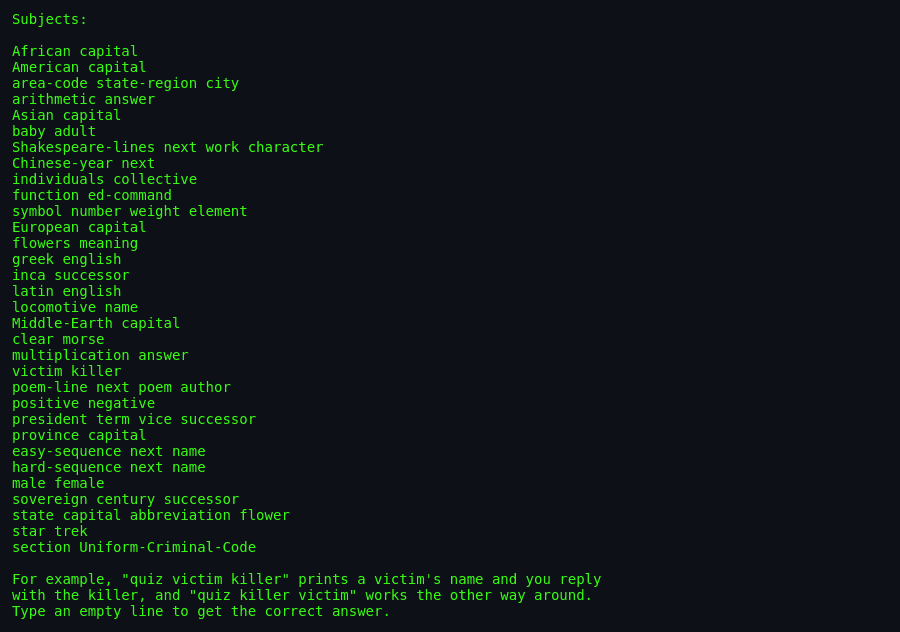

# About `quiz`

> **`quiz`** — the original Unix trivia tutor. Pick any subject, pick
> any two categories, and drill yourself both ways.

---

## What Is `quiz`?

`quiz` is a command-line quiz program. It reads an index file that
lists subjects and their data files; each data file contains lines of
colon-separated categories. You choose a subject and two categories,
and `quiz` asks you to map an item from the first category to the
second. For example, `quiz victim killer` might show a famous victim
and expect you to name the killer; `quiz killer victim` reverses the
direction.

The program is notable for its custom mini-regexp parser, its cynical
subject matter (murderers, dictators, accidents), and its tutorial
mode that repeats the questions you miss.

## Screenshots

*Running `quiz` with no arguments shows the available subjects.*

*A question from the chosen categories and a correct response.*

*The final tally after the player quits or exhausts the file.*

## Authors & Publisher

- **Author(s):** Jim R. Oldroyd (The Instruction Set) and Keith
  Gabryelski (Commodore Business Machines).
- **Publisher / distributor:** University of California / BSDGames
  package.
- **Release year:** 1991 / 1993 (BSD 4.3).
- **Language:** C.

## The Era

`quiz` was written when Unix workstations were common in universities
and research labs. It provided a quick, extensible way to memorise
facts — from capitals to murder victims — without leaving the terminal.

## Why It's Interesting

- **Data-driven design:** New subjects require only a text file in the
  right format.
- **Custom regexp engine:** `rxp.c` is a tiny pattern matcher built
  specifically for the quiz file syntax.
- **Reversible categories:** The same data file can be drilled in both
  directions.

## Difficulty & Progression

There is no explicit difficulty curve. The challenge depends entirely
on the subject and categories chosen. Tutorial mode (`-t`) adds a
learning curve by repeating missed items.

## Making-Of / Anecdotes

The man page warns that `quiz` is "pretty cynical about certain
subjects", reflecting the dark sense of humour in some of the bundled
data files.

## Cultural Impact

`quiz` is the ancestor of flash-card apps, trivia bots, and
spaced-repetition quizzes. Its text-file format is still one of the
simplest ways to author a drill dataset.

## Known Bugs (Historical)

- The custom regexp engine supports only a small set of metacharacters
  (`|`, `{}`, `[]`).
- Cynical subject matter may not suit all audiences.

## See Also

- [`how-to-play.md`](./how-to-play.md) — controls and rules.
- [`architecture.md`](./architecture.md) — parsing and data flow.
- [`lineage.md`](./lineage.md) — descendants.
- [`references.md`](./references.md) — sources.
