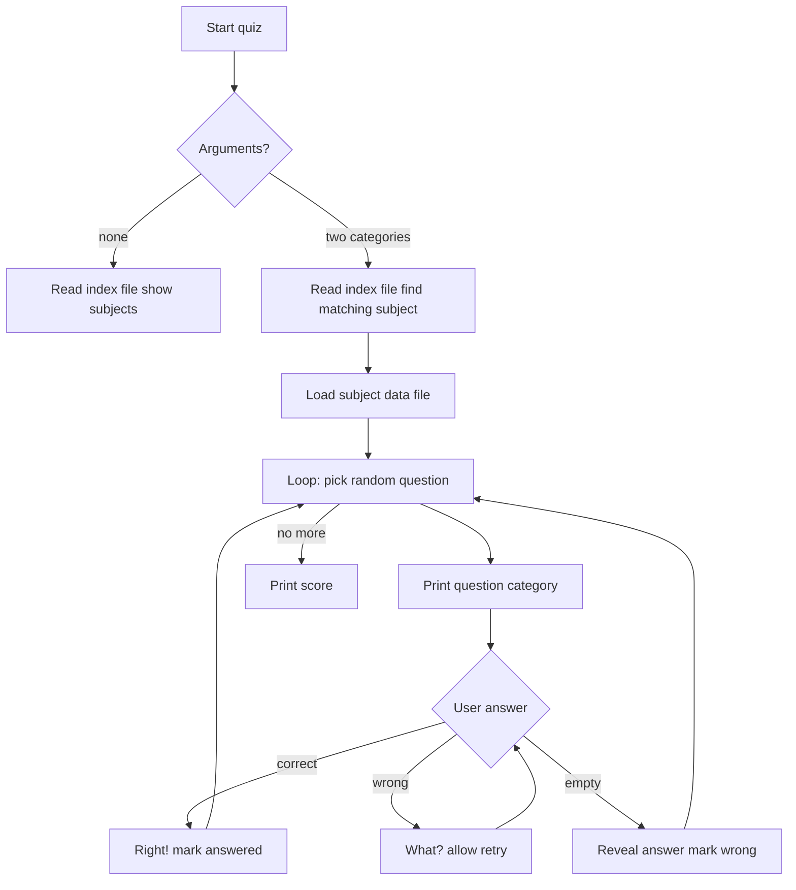

# `quiz` — Architecture

`quiz` is a data-driven C program that parses index and data files,
selects questions, and checks answers with a tiny custom regexp
engine.

---

## Control Flow



## Game Loop / Control Flow

The main loop in `quiz()` (`quiz.c:228-309`) randomly selects an
unanswered question, extracts the question and answer categories,
prints the question, and loops until the answer matches, the user
reveals it, or EOF is reached.

## AI Logic

There is no AI. The program selects questions randomly and, in
tutorial mode, biases toward previously-asked questions.

## Random-Event System

`random()` selects the next question index. In tutorial mode
(`tflag`), 80% of the time the program tries to repeat an already-asked
but unanswered question to reinforce learning.

## Difficulty Progression & Runtime Setup

- Subject and categories are chosen at launch.
- `-t` enables tutorial mode.
- No other difficulty controls.

## Key Code Excerpts

### Subject lookup (`quiz.c:195-226`)

```c
void get_cats(cat1, cat2) {
    for (qp = qlist.q_next; qp; qp = qp->q_next) {
        s = next_cat(qp->q_text);
        catone = cattwo = i = 0;
        while (s) {
            if (!rxp_compile(s))
                errx(1, "%s", rxperr);
            i++;
            if (rxp_match(cat1))
                catone = i;
            if (rxp_match(cat2))
                cattwo = i;
            s = next_cat(s);
        }
        if (catone && cattwo && catone != cattwo) {
            if (!rxp_compile(qp->q_text))
                errx(1, "%s", rxperr);
            get_file(rxp_expand());
            return;
        }
    }
    errx(1, "invalid categories");
}
```

### Question loop (`quiz.c:241-309`)

```c
for (;;) {
    if (qsize == 0)
        break;
    next = random() % qsize;
    qp = qlist.q_next;
    for (i = 0; i < next; i++)
        qp = qp->q_next;
    while (qp && qp->q_answered)
        qp = qp->q_next;
    /* ... ask question, check answer ... */
}
```

### Custom regexp engine (`rxp.c`)

The program does not use POSIX regex. It uses a small engine that
supports alternation (`|`), optional patterns (`{}`), and delimiters
(`[]`). This engine compiles a pattern, expands it to a string, and
matches user input.

## Data Format

### Index file

Each line lists a subject data file followed by category titles,
separated by colons:

```
data/victim:killer:victim
```

### Data file

Each line is a record with colon-separated categories:

```
Lincoln:Booth
Kennedy:Oswald
```

Backslash escapes special characters or continues a line.

## See Also

- [`spec.md`](./spec.md) — formal rules.
- [`lessons.md`](./lessons.md) — teaching points.
- [`references.md`](./references.md) — sources.
