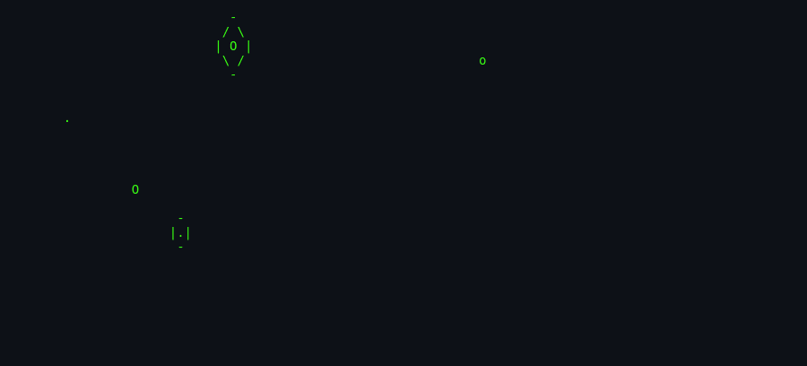
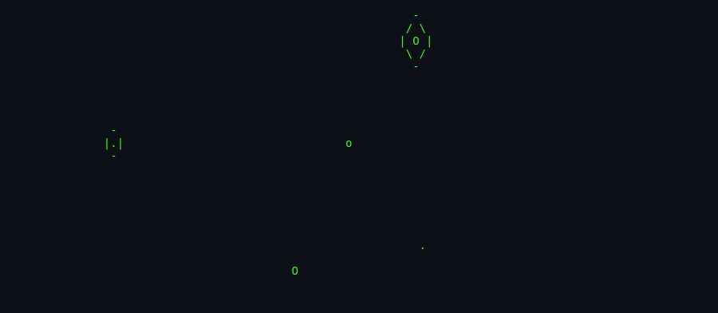
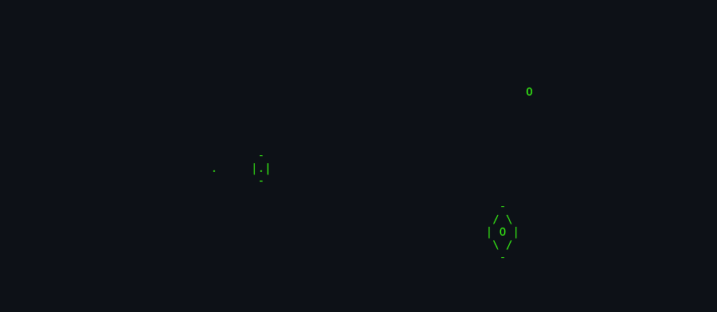

# About `rain`

> **Watch ASCII raindrops splash across your terminal.**

---

## What Is `rain`?

`rain` is a classic curses screensaver that animates falling raindrops on a terminal screen. Each drop lands, expands into a splash pattern, and then fades away, creating a calm, hypnotic visual effect. It was written for the slow 9600-baud terminals of the early 1980s and remains a charming example of terminal-based graphics.

## Screenshots

*Screenshots captured via [`docs/scripts/capture-screenshots.sh`](../../../docs/scripts/capture-screenshots.sh).*

*A fresh screen with the first raindrops appearing.*

*Multiple drops expanding and fading at once.*

*The screen as the program is about to exit.*

## Authors & Publisher

- **Author(s):** Eric P. Scott (Caltech High Energy Physics).
- **Publisher / distributor:** University of California, Berkeley; later NetBSD.
- **Release year:** 1980 (shipped in 3BSD).
- **Language:** C.

## The Era

`rain` was written for the VAX/VMS and BSD environments of the early 1980s, when video terminals were becoming common but graphics hardware was rare. Programmers used curses to create visual effects entirely from text characters. The original compilation command was `cc rain.c -o rain -O -ltermlib`.

## Why It's Interesting

- **Terminal graphics pioneer:** It turns ordinary characters into a believable rain simulation.
- **Minimal code:** The entire animation fits in under 160 lines of C.
- **Historical portability:** It was modelled after a VAX/VMS program of the same name.
- **Calm aesthetic:** Unlike action games, `rain` is meditative — a screensaver in the truest sense.

## Difficulty & Progression

There is no difficulty or progression. The animation runs indefinitely until interrupted. The only runtime control is the delay between frames.

## Making-Of / Anecdotes

The source header notes that `rain` was written on 11/3/1980 at EPS/CITHEP. Its simplicity made it a popular demo for showing off curses on new terminals.

## Cultural Impact

`rain` is part of a family of ASCII art screensavers (`worms`, `banner`, `gravity`) that demonstrated the creative potential of text terminals. Modern descendants include browser-based ASCII animations, terminal dashboards, and retro-gaming visualisers.

## Known Bugs (Historical)

- **No boundary bleed:** Drops are constrained to `COLS-4` and `LINES-4`, leaving a small border.
- **Default delay too fast:** On modern terminals, delay `0` produces a frantic flicker; users must supply `-d`.
- **Signal handling:** Only `SIGHUP`, `SIGINT`, and `SIGTERM` are caught; `SIGQUIT` is not handled.

## See Also

- [`how-to-play.md`](./how-to-play.md) — for running the screensaver.
- [`architecture.md`](./architecture.md) — for the code side.
- [`lineage.md`](./lineage.md) — for descendants.
- [`references.md`](./references.md) — for source citations.
