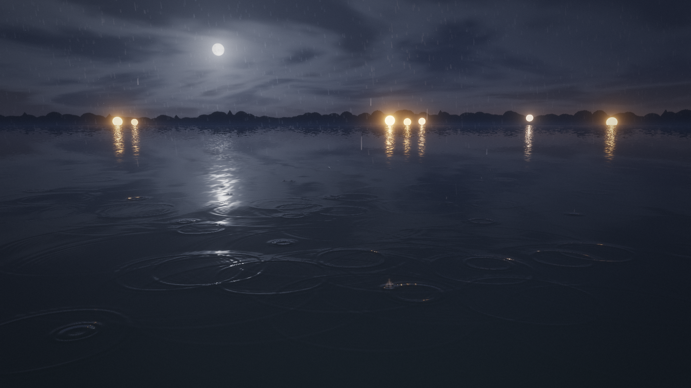
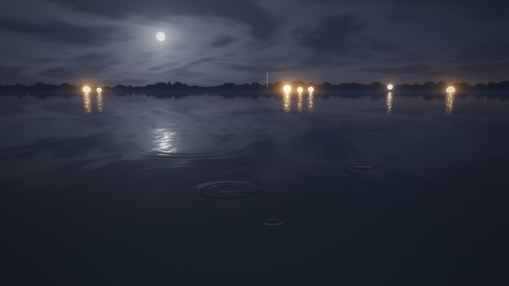
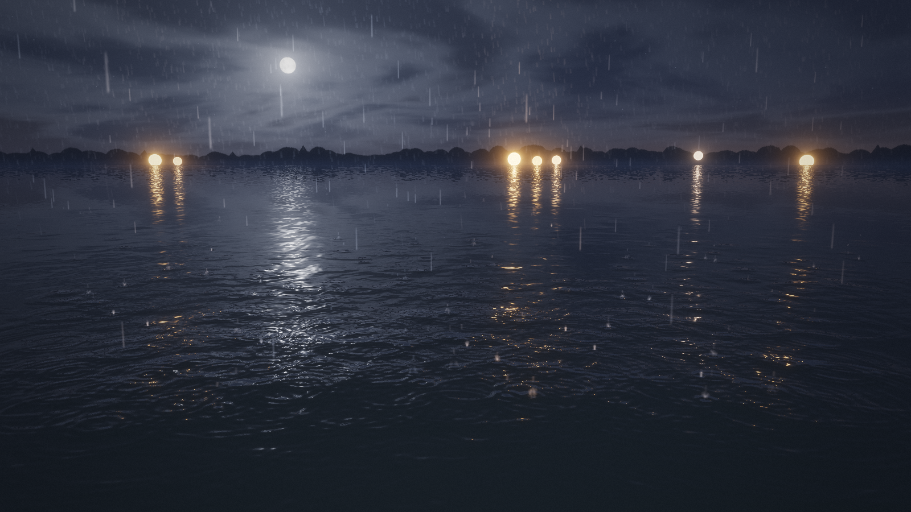
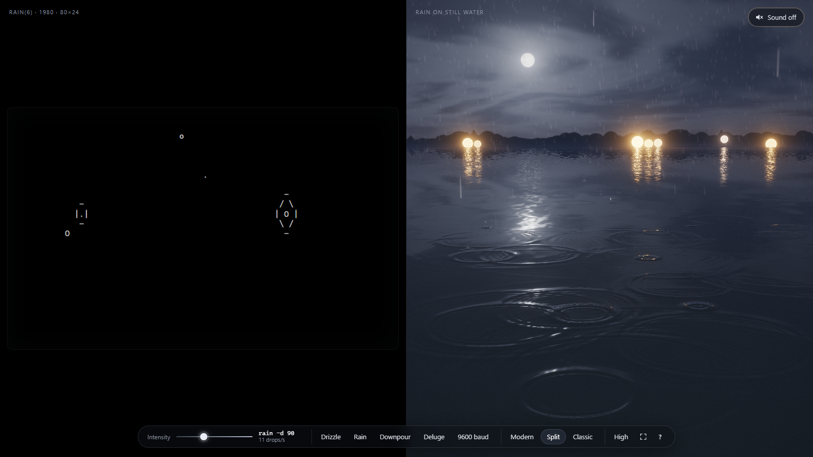
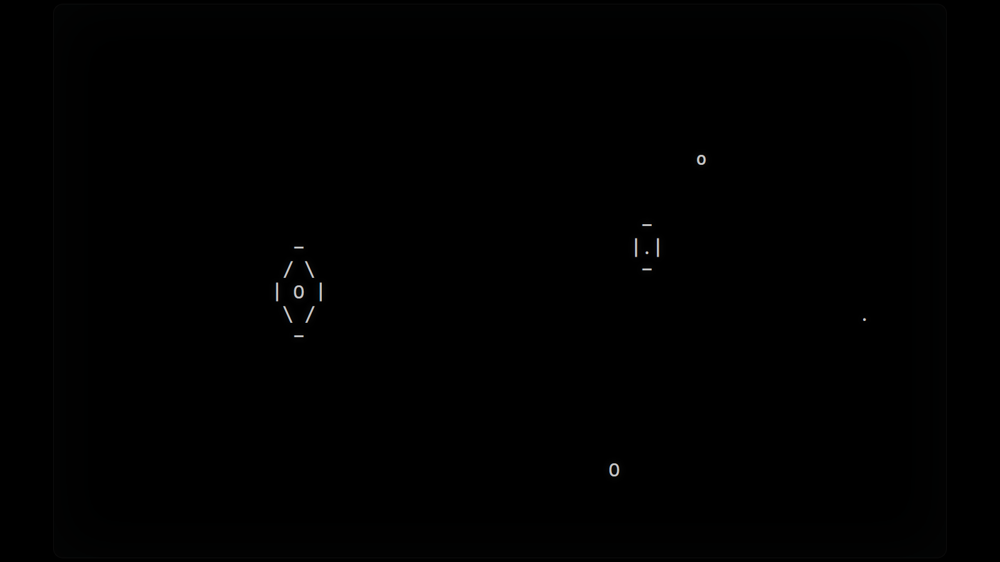
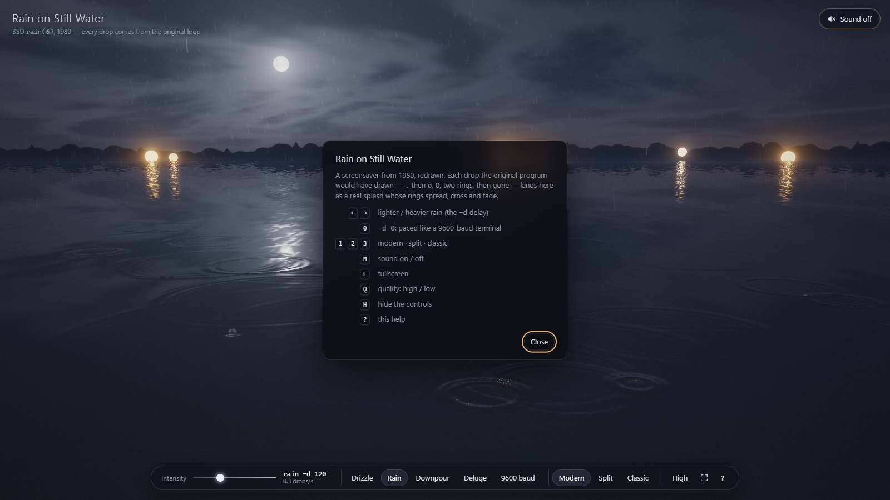
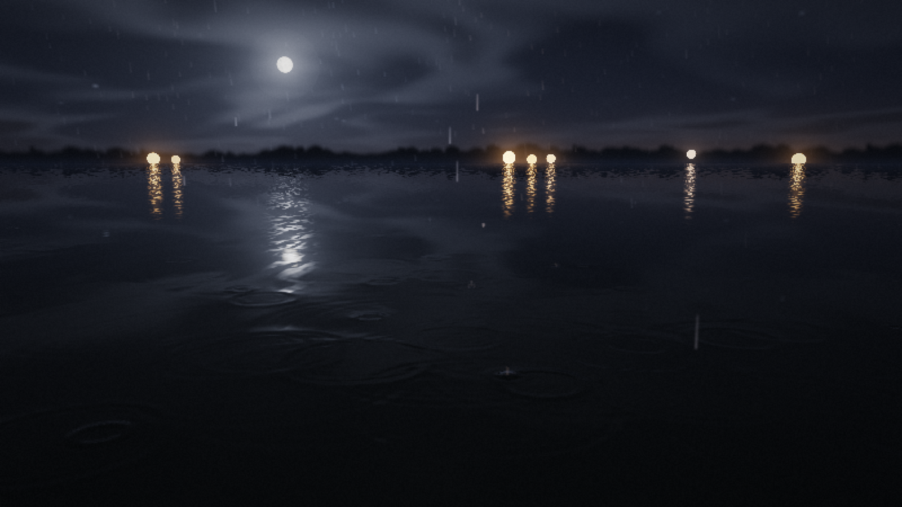
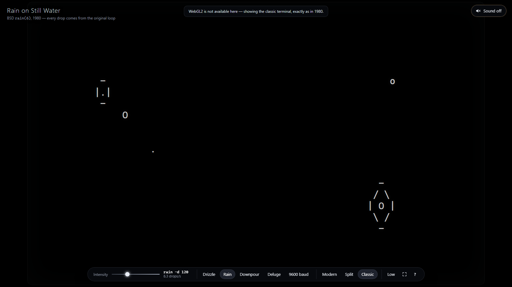
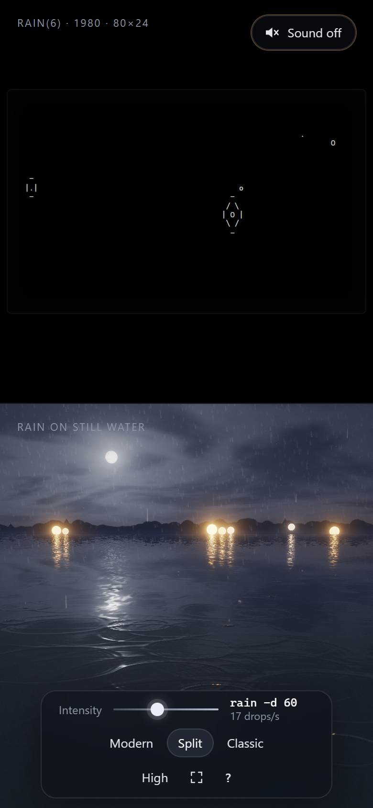

# `rain` — `fancy-web` port: *Rain on Still Water*

> Eric P. Scott's 1980 terminal screensaver as a night pond in the rain.
> Every drop comes from the original loop, byte for byte; each of its six
> ASCII ages becomes a moment of a real splash on a GPU-simulated water
> surface. **Zero raster assets**: sky, moon, trees, lanterns, water, rain
> and sound are all made by code.


*`rain -d 40`. The rings are a wave-equation simulation; they cross and interfere. Moonlight and seven lanterns glitter in columns on the water; out-of-focus rain streaks catch the light.*

| | |
|---|---|
|  *`-d 400`, a drizzle: two or three drops a second on a mirror.* |  *`-d 3`, a downpour: 330 drops a second; the glitter columns stretch.* |
|  *Split view: the original's 80 × 24 screen and the pond, driven by one engine and one clock.* |  *Classic view: exactly what `rain` drew in 1980 — `.` `o` `O`, a small ring, a large ring, gone.* |

## Status

- **Status:** Active (v1)
- **Author:** Agun Wijaya (<https://github.com/agunawijaya>), implemented with Claude
- **License:** MIT (repository default)
- **Live URL:** *(not deployed yet)*

## Pitch

`rain` was a screensaver for a 9600-baud terminal: a dot, then an `o`, an
`O`, a ring of `-` and `|`, a wider ring of slashes, then nothing — five
drops alive at a time. This port keeps that program exactly (it
reproduces screens captured from the real binary) and lets you see what
it was drawing: a raindrop hitting still water. The `.` is the impact,
the `o` the crown, the `O` the jet thrown back up, the rings the rings.
Slide the delay from a drizzle to a downpour; turn the sound on to hear
each drop.

## Tech Stack

- **Language:** JavaScript (ES modules), GLSL ES 3.0
- **Framework:** none — vanilla ES modules, zero build, no dependencies at run time ([ADR 001](./docs/decisions/001-rendering-stack.md))
- **Rendering:** raw WebGL 2: a wave-equation simulation on ping-pong float render targets, a procedural sky/water shader, instanced rain streaks and splash droplets, bloom and a filmic tone curve
- **Audio:** Web Audio API, synthesised — noise hiss, a soft splash per drop, and for about one drop in four a short bubble "plink" (no samples)
- **Target:** any modern desktop or mobile browser; WebGL 2 for the pond, nothing at all for the classic view

## Run

No build step. Serve the folder with any static server:

```bash
cd bsdgames/rain/ports/fancy-web
node scripts/serve.mjs          # http://localhost:8765/ (or the next free port; it prints the URL)
```

(Opening `index.html` from `file://` does not work: browsers block ES
module imports from disk.)

Useful URLs: `?d=10` (a delay, like `rain -d 10`; `?d=0` is 9600-baud
pacing), `?view=split`, `?view=classic`, `?q=low`, `?seed=7`.

## Test

```bash
npm test                        # 23 node tests: engine vs the 1980 binary, clock, geometry, mappings
npm install                     # only for the browser tools below
npm run smoke                   # browser: 35 checks — sound, controls, views, fallbacks
npm run check:raster            # ADR-002: src/ has no images and no audio samples
npm run measure                 # start-up and fps with a GPU, without one, without WebGL
npm run shots                   # regenerate media/
```

## Controls

The controls fade away after three seconds of stillness and come back
when the mouse moves.

| Key | Does |
|---|---|
| <kbd>←</kbd> <kbd>→</kbd> (or <kbd>−</kbd> <kbd>+</kbd>) | lighter / heavier rain — the `-d` delay, 999 … 1 ms |
| <kbd>0</kbd> | `-d 0`: as fast as a 9600-baud terminal could draw (≈ 150 ms a frame) |
| <kbd>1</kbd> <kbd>2</kbd> <kbd>3</kbd> | modern · split · classic (<kbd>C</kbd> and <kbd>S</kbd> toggle classic and split) |
| <kbd>M</kbd> | sound on / off — **off until you ask** |
| <kbd>F</kbd> | fullscreen |
| <kbd>Q</kbd> | quality: High / Low |
| <kbd>H</kbd> | hide the controls completely |
| <kbd>?</kbd> | help |

The bar also has presets: Drizzle (`-d 400`), Rain (`-d 120`, the man
page's suggestion), Downpour (`-d 10`), Deluge (`-d 1`) and 9600 baud.



## How a 1980 drop becomes a splash

The engine ([`src/engine/`](./src/engine/)) is the original main loop
(`rain.c:109-151`) on a persistent character screen, with a
reimplementation of the C library's `random()` — which `rain` never
seeded, so it always rains the same way. Each frame it reports six
events, one per drop age. The picture runs a constant 0.35 s behind the
engine so each new drop can be seen falling before it lands exactly on
its `.` ([ADR 003](./docs/decisions/003-lifecycle-to-ripples.md)).

| Age | 1980 | On the pond |
|--:|---|---|
| 0 | `.` | the streak lands: a crater, a crown of droplets, a plink |
| 1 | `o` | the crown collapses: a ring of water pushed out |
| 2 | `O` | the Worthington jet: a bump, one droplet thrown up |
| 3 | `-` `\|.\|` `-` | the droplet falls back: a dip, a higher, quieter plink |
| 4 | the wide diamond | the centre rebounds, softly |
| 5 | blanks | nothing new — the rings run on, cross others, and fade |

The terminal is laid over the visible water — columns across, rows into
the distance ([ADR 004](./docs/decisions/004-pond-geometry.md)) — so a
drop in the classic pane's top-left corner lands far out on the left of
the pond. The delay *is* the rain: drops per second = 1000 / delay. The
rain streaks in the air, the haze, the hiss and the far water's texture
all follow it.

## Requirements & running without a GPU

The page degrades in steps instead of failing
([ADR 005](./docs/decisions/005-degradation-ladder.md)):

| Machine | What you get |
|---|---|
| A GPU with WebGL 2 | **High**: full pond at 60 fps. Drops to **Low** on its own (once, with a notice) if High runs under 40 fps in the first seconds. |
| No usable GPU (the browser renders WebGL on the CPU: SwiftShader, WARP, llvmpipe) | **Lite**: the same pond at half resolution, fewer streaks, no bloom — recognisably the same picture, ~25 fps. |
| No WebGL 2 at all | **Classic**: the original 80 × 24 screen, exact, with sound. |

Measured on one machine (Windows 11, NVIDIA RTX 4060 Laptop GPU),
headless Chromium via Playwright 1.63 at 1600 × 900, fresh browser each
time (shaders compile cold, as on a first visit) — `npm run measure`:

| Mode (Chromium flags) | Profile | Page ready | Frame rate |
|---|---|--:|--:|
| GPU — `--use-angle=d3d11` | High (473 × 984 wave grid) | 0.86 s | 60 fps (also at `-d 1`) |
| CPU only — `--use-angle=swiftshader --disable-gpu` | Lite | 0.1 s ¹ | ≈ 25 fps (19 at `-d 1`) |
| No WebGL — `--disable-webgl --disable-gpu` | Classic | 0.06 s | 60 fps |

¹ SwiftShader links shaders lazily; the first frames absorb the cost.


*Lite, rendered entirely on the CPU (SwiftShader).*

| | |
|---|---|
|  *No WebGL: the classic view, and a note saying why.* |  *A phone in portrait: split view stacks the panes.* |

`prefers-reduced-motion` starts in a drizzle (`-d 400`), holds the camera
still, softens the splashes, thins the streaks and makes the controls
appear and disappear without fading.

## What makes this port different

- **Nothing invented about the rain.** Every drop's place and moment is
  the 1980 program's — tested frame for frame against the real binary,
  and in the browser against the engine (`npm run smoke`, P-05).
- **The rings are physics, not drawings.** A 2-D wave equation on a
  log-polar grid that spends its texels the way the perspective spends
  pixels; drops interfere.
- **Split view is a proof.** Both panes read one engine and one clock.
- **Zero raster assets, zero samples.** `npm run check:raster`.

## Spec compliance

Canonical [`test-scenarios.md`](../../docs/test-scenarios.md): scenarios
1, 3 and 5 are automated; 2 is reinterpreted (`-d 0` paced like 9600
baud) and 4 (signals) has a browser equivalent — see
[`docs/test-scenarios.md`](./docs/test-scenarios.md). Deviations are in
the [diff log](./docs/diff-log.md).

## Docs

[Diff log](./docs/diff-log.md) · [Architecture](./docs/architecture.md) ·
[Test scenarios](./docs/test-scenarios.md) · [Notes](./docs/notes.md) ·
[Decisions](./docs/decisions/)

- [001 Rendering stack](./docs/decisions/001-rendering-stack.md) — raw WebGL 2, zero build
- [002 Zero raster assets](./docs/decisions/002-zero-raster-assets.md)
- [003 From ASCII ages to ripples](./docs/decisions/003-lifecycle-to-ripples.md) — stage table, clock, `-d 0`
- [004 The pond](./docs/decisions/004-pond-geometry.md) — log-polar wave grid; where the terminal lies
- [005 Degradation ladder](./docs/decisions/005-degradation-ladder.md) — High, Low, Lite, Classic

## Attribution

- **`rain`** by Eric P. Scott (Caltech High Energy Physics, 1980).
  Upstream: <https://github.com/vattam/BSDGames/tree/master/rain>.
  Copyright (c) 1980, 1993 The Regents of the University of California.
  See root [`ATTRIBUTION.md`](../../../../ATTRIBUTION.md).
- The main loop is reimplemented from `rain.c`, the random number
  generator from the documented behaviour of the C library's `random()`;
  no C code is copied into this repository.
