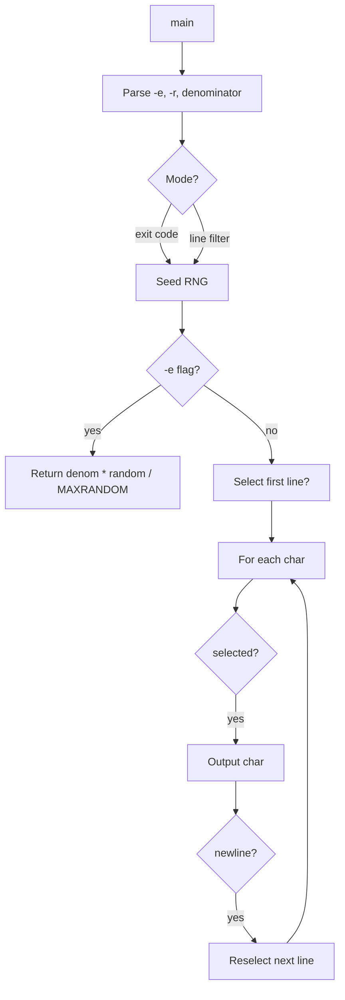
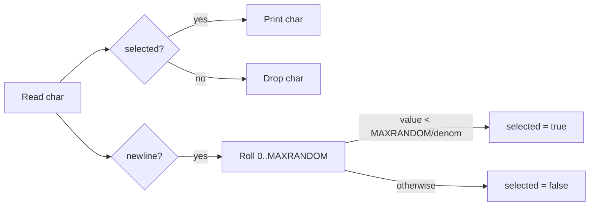

# `random` — Original Architecture

> Deep analysis of the original C source. What did the programmer build, and how?

Cite upstream file:line references only (never local paths). Upstream tree: <https://github.com/vattam/BSDGames/tree/master/random>.

---

## Files & Roles

| File | Purpose | Approx. LoC |
|---|---|---:|
| `random.c` | Argument parsing, RNG seeding, line filter / exit-code logic | 158 |
| `random.6` | Man page | — |

## High-Level Flow

## Game Loop Detail

The line-filter loop (`random.c:134-146`) reads one character at a time. A boolean `selected` decides whether the current line is being copied. On every newline, a new `selected` value is drawn.

## Data Structures

Only local scalar variables:

- `denom` — the user-supplied denominator.
- `random_exit` — flag for exit-code mode.
- `unbuffer_output` — flag for unbuffered stdout.
- `selected` — whether the current line is being output.

## AI Logic

Not applicable — `random` is a probabilistic filter, not a game.

## Random Events

RNG source: `random()` from the C library, seeded once with high-entropy time and PID.

| Trigger site | Distribution | Outcome |
|---|---|---|
| `main:115` | `gettimeofday()` + `getpid()` | Seed value |
| `main:119` | `denom * random() / MAXRANDOM` | Exit code `0..denom-1` |
| `main:134` | `denom * random() / MAXRANDOM == 0` | First line selected? |
| `main:144` | Same formula | Next line selected? |

### Consequence Flow

## Difficulty Progression Logic

There is no difficulty system. The only runtime variable is `denom`, which controls selection probability.

## What Was Clever for Its Era

- **Single-pass streaming:** `random` never stores the input; it decides per character in one pass.
- **Character-level copying:** Even though selection is per-line, the program copies characters individually, avoiding any line buffer.
- **Dual-mode binary:** One tiny program serves two unrelated use cases (filter + exit code).

## Constraints the Original Had To Handle

- **Memory:** O(1) — no input buffering beyond libc.
- **Terminal size:** No screen manipulation; pure stdin/stdout.
- **CPU:** One random draw per line, negligible.
- **Persistence:** None.

## What This Code Would Look Like Today

A modern port might add reservoir sampling, weighted sampling, or a web API that returns random subsets. See [`port-ideas.md`](./port-ideas.md) for more.

## See Also

- [`lessons.md`](./lessons.md) — beginner-friendly extraction of techniques.
- [`spec.md`](./spec.md) — implementation-independent specification.
- [`references.md`](./references.md) — sources & citations.
