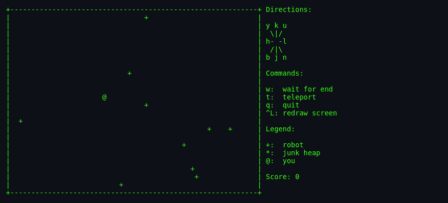
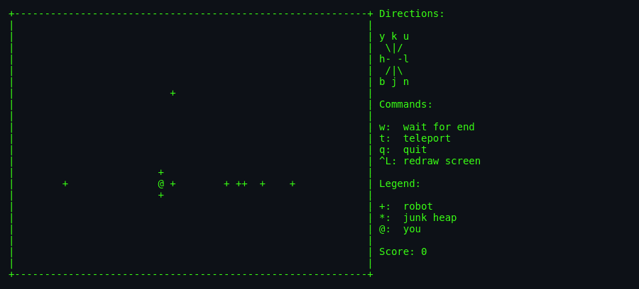
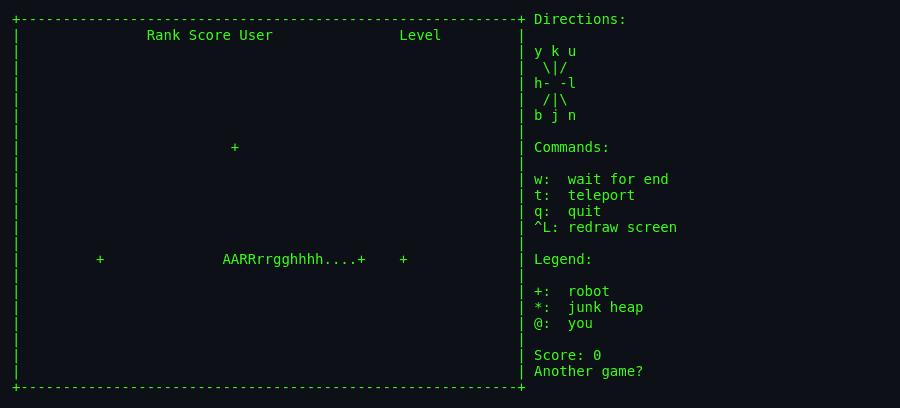

# About `robots`

> A defenceless human, a horde of dumb-but-deadly robots, and a
> teleporter with unreliable aim. Your only weapon is the robots'
> own stupidity. Turn them against each other. Then do it again on
> a harder level. Forever.

---

## What Is `robots`?

`robots` is a turn-based survival game. You (`@`) share a 60×23 grid
with a swarm of villainous robots (`+`) who march toward you every
turn — one square, straight-line, with no thought or coordination.
They cannot shoot, but if they touch you, you die.

Fortunately for you, they are so single-minded that when two of them
happen to occupy the same square, they smash into a scrap heap (`*`),
harmless. Even better, if a robot walks into an existing scrap heap,
it also dies.

Your job: manipulate the geometry so all the robots kill each other,
one by one, without ever touching you. When they are all dead, a
larger swarm awaits on the next level. This continues until you
finally miscalculate — at which point the game gives you the
memorable epitaph:

> `AARRrrgghhhh....`

## Screenshots

*Level 1 begins — ten robots (`+`) surround the player (`@`), with the
command / legend panel on the right.*

*A few moves in — the robots have converged around the player, one
step from disaster.*

*`AARRrrgghhhh....` — the player was touched. Score prompts for another
game.*

## Authors & Publisher

- **Author:** **Ken Arnold** — legendary UC Berkeley programmer,
  author of `curses`, co-author of `rogue`, co-designer of the
  screen-oriented Unix game family. Co-author of the seminal Java
  book *The Java Programming Language* years later.
- **Autobot mode contributor:** **Christos Zoulas** — long-time
  NetBSD hacker, `file(1)` maintainer.
- **Publisher / distributor:** BSD (later NetBSD, then Joseph S.
  Myers' Linux port).
- **First release:** 1984 in 4.2BSD-era games; the SCCS tag reads
  `@(#)main.c 8.1 (Berkeley) 5/31/93` for the last significant
  Berkeley revision.
- **Language:** C using `curses`.

## The Era

`robots` was written when a "computer" for most students was a VT100
terminal wired to a shared VAX. Random-access joysticks did not exist
in that world. Every character on the screen mattered. Ken Arnold's
approach was characteristic of the era: build a tiny, elegant game
loop, use `curses` to paint the screen efficiently, let *emergence*
provide the fun.

## Why It's Fun

- **It's a chase puzzle disguised as an arcade game.** Every turn is
  a calculation: if I move here, does the diagonal robot pile into
  the vertical one? Can I trick that lone robot at the corner into
  chasing me across a scrap heap?
- **Zero-friction start.** No tutorial, no story, no cutscene. Type
  `robots`, press keys, learn by dying.
- **Escalating tension.** Level 1 has 10 robots. Level 4 already
  has 40 — the maximum the field can even hold. You *will* run out
  of room to manoeuvre.
- **Teleporter roulette.** When cornered, press `t`. You might land
  safely on the far side. You might land right next to three robots.
  The RNG is your last resort.
- **The `w` gamble.** "Wait until you die or they all do." Push it,
  and you get 10% bonus per robot that dies during your wait. Push
  it wrong and you get zero and the epitaph.

## Difficulty & Progression

The game has **infinite levels** but bounded difficulty. The
progression rule is straightforward:

- **Level N spawns `min(N × 10, 40)` robots** on the same fixed 60×23 field.
- Level 1 = 10 robots. Level 2 = 20. Level 3 = 30. Level 4 = 40.
- **After level 4, difficulty plateaus** — every subsequent level
  has the same 40 robots (`MAXROBOTS`), because that is the cap.

What actually gets harder:

- **Density.** More robots per unit of field area = less space to
  manoeuvre, more collision-choreography opportunities, but also
  more turns before all robots are dead.
- Nothing else changes. Robot AI stays trivial (see
  [`architecture.md`](./architecture.md)). Robot speed stays the
  same. There is no timer, no fatigue, no new enemy type.

So the game's "difficulty" is really an increasing *stamina* test
capped at level 4. Levels 5 and beyond are not objectively harder
than level 4 — they just extend the survival window, and eventually
the RNG of initial placement will corner you.

**Advance mode (`-a`)** starts you directly at level 4 (skipping the
easy ramp) and awards a 600-point bonus for the confidence. If you
can't survive level 4, you certainly won't survive level 5 either,
so the "skip" is honest.

## Making-Of Notes

The game has always been a *simple demo* of what `curses` can do,
and of Ken Arnold's design philosophy: complex behaviour emerging
from trivial rules. Compare the robot AI in
[`architecture.md`](./architecture.md) — it is genuinely two lines
of C, and yet the game is genuinely difficult.

Christos Zoulas added the auto-bot mode later — a mode where the
computer plays itself. It exists mostly for testing but it is
weirdly compelling to watch, and functions as a kind of screensaver.

## Cultural Impact

`robots` is an early representative of the *chase puzzle* genre,
distant cousin of Namco's *Pac-Man* (though `robots` predates
Pac-Man's home console ports of the same era). It has been re-cloned
many times: as `xrobots` (X11), as web-based Flash and JS versions,
and as mobile puzzle apps. It sits comfortably in the same corner of
game design as *Sokoban*: no reflexes required, just planning.

See [`lineage.md`](./lineage.md) for the full genealogy.

## Known Bugs (Historical)

The man page's `BUGS` section reads, in full:

> Bugs?
> You *crazy*, man?!?

Interpretation: the code is small enough and the mechanics are pure
enough that meaningful bugs are rare. There are minor terminal-quirk
issues on unusual `curses` implementations and one specific issue:
the `FANCY` compile-time option adds *stand-still* and *pattern-roll*
score-file modes which are barely documented and rarely used. But
Ken's man-page bravado is well-earned.

## See Also

- [`how-to-play.md`](./how-to-play.md) — actually playing.
- [`architecture.md`](./architecture.md) — the code side.
- [`lineage.md`](./lineage.md) — descendants.
- [`references.md`](./references.md) — source citations.
