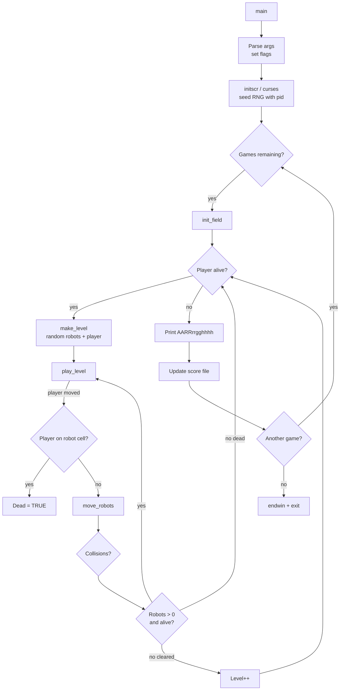
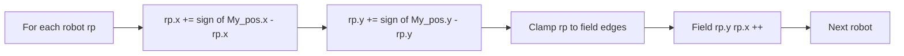
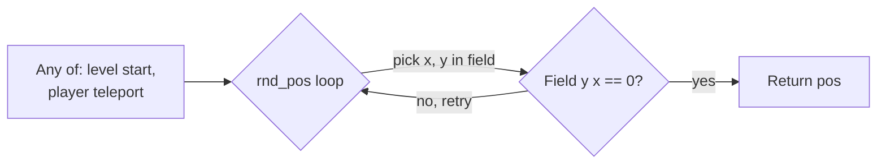
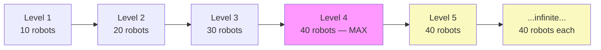

# `robots` — Original Architecture

> Deep analysis of the original C source. Focus on the AI (which is
> famously trivial) and the RNG system (which is where all
> game-affecting randomness lives).

Upstream source (not redistributed in this repo):
<https://github.com/vattam/BSDGames/tree/master/robots>

---

## Files & Roles

| File | Purpose | Approx. LoC |
|---|---|---:|
| `main.c` | Entry point, CLI parsing, top-level loop, another game prompt | 233 |
| `robots.h` | All constants, types, globals, function prototypes | 147 |
| `make_level.c` | Level generation: place robots & player | 94 |
| `play_level.c` | Per-level loop until player or all robots dead | 118 |
| `move_robs.c` | **Robot AI** and per-turn robot movement | 154 |
| `move.c` | Player movement handling | ~200 |
| `get_move.c` (in `move.c`) | Input parsing | — |
| `rnd_pos.c` | Random empty-square picker | 70 |
| `auto.c` | Auto-bot mode (Zoulas) | ~200 |
| `init_field.c` | Reset field between games | ~50 |
| `flush_in.c` | Flush stdin buffer | ~40 |
| `query.c` | Yes/no prompts | ~60 |
| `score.c` | Score file read/write | ~200 |
| `extern.c` | Global variable definitions | ~40 |
| `robots.6.in` | Man page | — |

Total: ~1500 LoC. The entire game fits in a small folder.

## High-Level Flow



Reference: `main.c:168-190`.

## Data Structures

The state is remarkably compact.

```c
// robots.h:82-92
typedef struct {
    int y, x;
} COORD;

typedef struct {
    u_int32_t s_uid;
    u_int32_t s_score;
    u_int32_t s_auto;
    u_int32_t s_level;
    char s_name[MAXNAME];  // 16 bytes
} SCORE;
```

Global state (declarations in `robots.h:100-115`):

```c
extern bool Dead, ..., Real_time, Running, Teleport, Waiting, Was_bonus, Auto_bot;
extern char Field[Y_FIELDSIZE][X_FIELDSIZE];   // 23×60 occupancy count
extern COORD My_pos, Robots[], Scrap[];         // player + robot list
extern int Level, Num_robots, Num_scrap, ..., Wait_bonus, Num_games;
extern u_int32_t Score;
```

The `Field[y][x]` array does not store *what* occupies each cell — it
stores a **count**. If two robots try to move to the same cell, both
end up there and `Field[y][x] == 2`. This is how collision detection
becomes an `> 1` check. Very clever, very compact.

## Game Loop Detail

The per-level loop lives in `play_level.c:47-118`.

```c
// play_level.c:72-90 (excerpt)
while (!Dead && Num_robots > 0) {
    move(My_pos.y, My_pos.x);
    if (!jumping())
        refresh();
    get_move();
    if (Real_time)
        alarm(0);
    if (Field[My_pos.y][My_pos.x] != 0)
        Dead = TRUE;
    if (!Dead)
        move_robots(FALSE);
    ...
}
```

- **Turn-based.** `get_move()` blocks on player input.
- **Real-time optional.** With `-r`, `SIGALRM` on a 3-second timer
  triggers robot movement even without player input
  (`move_robs.c:53-54, 124`).
- **Player-move-then-robots.** The player moves first each turn; if
  they walked *into* a robot, they die immediately. Otherwise robots
  respond.

## AI Logic — Robot Movement

**This is the entire AI. Two lines.**

```c
// move_robs.c:66-67
rp->y += sign(My_pos.y - rp->y);
rp->x += sign(My_pos.x - rp->x);
```

Where `sign()` (`move_robs.c:145-153`) returns `-1`, `0`, or `+1`.

That is it. Each robot advances one square, independently in x and
y, toward the player. No pathfinding. No lookahead. No coordination.
No memory. No attempt to avoid scrap heaps or other robots. The
robots are perfect greedy chasers of a single moving target.



### The "Zero-IQ" Trick

The genius of `robots` is that it makes stupidity the game mechanic.
Because robots are dumb, the player has full agency to *exploit*
that stupidity. If robots were smarter — pathfinding around scrap
heaps, avoiding each other — the game would collapse into
un-winnable chase. Trivial AI is not a limitation here; it *is* the
design.

### Collision Resolution

After all robots have moved, a second pass resolves collisions
(`move_robs.c:83-107`):

```c
for (rp = Robots; rp < &Robots[MAXROBOTS]; rp++)
    if (rp->y < 0)
        continue;                          // already dead
    else if (rp->y == My_pos.y && rp->x == My_pos.x)
        Dead = TRUE;                       // robot reached player
    else if (Field[rp->y][rp->x] > 1) {    // multiple entities here
        mvaddch(rp->y, rp->x, HEAP);
        Scrap[Num_scrap++] = *rp;
        rp->y = -1;                        // mark robot dead
        Num_robots--;
        if (Waiting) Wait_bonus++;
        add_score(ROB_SCORE);              // +10 points
    }
    else
        mvaddch(rp->y, rp->x, ROBOT);
```

Cells with `Field[y][x] > 1` after movement → **all** occupants
become scrap. Simple, elegant.

## Random Events

Randomness in `robots` is concentrated in three places, all
delegating to the tiny `rnd_pos.c`.

### The RNG Primitive

```c
// rnd_pos.c:64-70
int
rnd(range)
    int range;
{
    return rand() % range;
}
```

Yes — the standard `rand() % N` (biased for small ranges of `RAND_MAX`
but irrelevant for a 60×23 grid).

### The Empty-Square Picker

```c
// rnd_pos.c:49-62
COORD *
rnd_pos()
{
    static COORD pos;
    do {
        pos.y = rnd(Y_FIELDSIZE - 1) + 1;
        pos.x = rnd(X_FIELDSIZE - 1) + 1;
        refresh();
    } while (Field[pos.y][pos.x] != 0);
    return &pos;
}
```

Rejection sampling: pick a random cell, retry until you find an empty
one. On a fresh level with 10 robots on a 60×23 board (~93% empty),
this converges in 1–2 iterations. On the hardest levels with 40
robots (~97% empty), still fine. A cleaner "reservoir" algorithm
would be measurably faster but the game doesn't need it.

### Seed

```c
// main.c:165
srand(getpid());
```

The seed is the process ID. Each invocation of `robots` will play a
different game — but if you know the PID, the game is reproducible.
No `srand(time(NULL))` or `/dev/urandom` (which didn't exist in
1984). PID-as-seed is a classic Unix-era pattern.

### Where Randomness Affects Gameplay

| Site | Distribution | Effect |
|---|---|---|
| `make_level.c:80` — robot placement | Uniform over empty cells | Each robot placed one at a time via `rnd_pos()` |
| `make_level.c:92` — player placement | Uniform over empty cells | Player spawns anywhere robots aren't |
| `move.c` — teleport (`t`) | Uniform over empty cells | Same `rnd_pos()` call. May land you *right next to* a robot. |

No random damage rolls, no random encounters mid-level, no dice.
Every death is deterministic *given* the initial placement.



## Difficulty Progression Logic

Level progression is one of the simplest possible ramps: **more
robots per level, same everything else, capped at `MAXROBOTS`.**

The entire ramp is these three lines in `make_level.c:74-76`:

```c
if ((i = Level * 10) > MAXROBOTS)
    i = MAXROBOTS;
Num_robots = i;
```

Where `MAXROBOTS = MAXLEVELS * 10 = 40` (`robots.h:57-58`).

### What Scales

- **Robot count** — `Level × 10`, hard-capped at 40.

### What Does Not Scale

- **Robot AI** — the two-line `sign()`-based chase is identical at
  every level (`move_robs.c:66-67`).
- **Robot speed** — one square per turn always.
- **Field size** — fixed at 60×23 (`robots.h:53-54`).
- **Score per robot** — 10 points, unchanged.
- **Scrap heap mechanics** — same collision rules.
- **Wait bonus rate** — same per-death increment.

### Post-Cap Plateau

From level 5 onward, `Level × 10 > 40` so `Num_robots` is clamped
to 40. **Every level from 5 to infinity is mechanically identical
to level 4.** The only difference is the score you accumulated on
the way there and the fresh random placement each time.

This is a design choice, not an oversight: the field simply cannot
hold more than ~40 robots without becoming an unwinnable soup.
Rather than shrink the field or speed up the AI, the game freezes
difficulty and turns the late game into a war of attrition.

### Advance Bonus

`main.c:112-114` and `robots.h:61`:

```c
# define S_BONUS  (60 * ROB_SCORE)  // = 600
...
case 'a':
    Start_level = 4;
    break;
```

Combined with `play_level.c:99-105`:

```c
if (Level == Start_level && Start_level > 1) {
    ...
    add_score(S_BONUS);
```

So `-a` starts you at level 4 and gives you 600 points as a
"you-earned-it-by-not-grinding" bonus.

### Diagram



Purple = last "real" difficulty step. Yellow = plateau.

## What Was Clever for Its Era

- **`Field[y][x]` as an occupancy count** rather than a symbol.
  Enables collision detection with `> 1`. Six-line collision
  resolution.
- **Two-line AI.** Any experienced game programmer would be tempted
  to add pathfinding, avoidance, look-ahead — and *destroy the
  game*. Restraint is a design skill.
- **Piggyback on `signal(SIGALRM)`** for real-time mode
  (`move_robs.c:53-54`). No thread, no timer library. Just Unix.
- **`setjmp`/`longjmp`** for end-of-move escape
  (`play_level.c:70`, `move_robs.c:112`) so the robot movement
  handler can bail out of the game loop without unwinding manually.
- **Field size baked in** (`robots.h:53-54`) — no dynamic screen
  handling. If your terminal is bigger than 80×24, the game gets a
  new window (`main.c:154-163`). Elegant sidestep.
- **PID as RNG seed.** Zero-cost, unique per invocation.

## Constraints the Original Had To Handle

- **Memory:** trivial by modern standards. `MAXROBOTS = 40`, one
  COORD each = 320 bytes. Field grid = 60 × 23 chars = 1380 bytes.
  A few dozen globals. Total footprint < 10 KB.
- **Terminal size:** the whole game assumes 80×24. If the terminal
  is smaller, the game exits (`main.c:155-160`). Larger terminals
  get a windowed 80×24 sub-region.
- **CPU:** budget was per-frame `curses` `refresh()` on a 9600-baud
  serial line. Everything is written to minimize screen re-paints.
- **Persistence:** high scores stored in a fixed binary file with
  5 entries per user. See `score.c`.

## What This Code Would Look Like Today

- The AI would be tempting to "improve" — please resist unless the
  design shifts. Two-line greedy is the game.
- The `Field` byte array becomes an entity-component storage.
- Real-time mode via `SIGALRM` becomes a proper game loop with
  `dt` interpolation.
- The score file becomes SQLite / a JSON file / a leaderboard API.
- The rendering pipeline could be `curses`-compatible (`ratatui`,
  `bubbletea`) or fully graphical.

For port design ideas, see [`port-ideas.md`](./port-ideas.md).

## See Also

- [`lessons.md`](./lessons.md) — techniques a beginner can learn
  from this code.
- [`spec.md`](./spec.md) — the mechanical contract independent of
  implementation.
- [`references.md`](./references.md) — sources.
