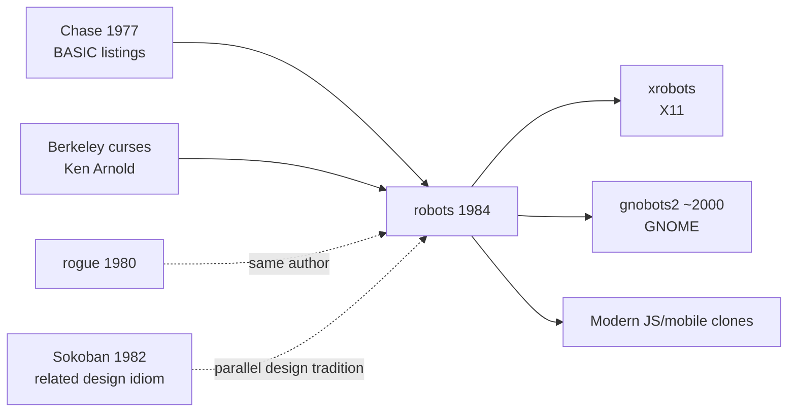

# `robots` — Lineage

> Where does `robots` sit in the wider history of chase-puzzle
> games? What did it descend from, and what did it inspire?

---

## Direct Ancestors

`robots` (1984) does not have a single clean ancestor, but the
following contributed to its DNA:

- **Chase games on early computers (1970s)** — a broad genre of
  turn-based-pursuit programs run on time-share systems. Titles
  like *Chase* (Creative Computing BASIC listings, 1977) had
  identical mechanics: player vs. dumb enemies that die by
  collision. `robots` is essentially a `curses` refinement.
- **Ken Arnold's own `rogue`-family work** — the design idiom
  "characters on a grid, `curses` for display, mechanics from
  emergence" transferred directly from `rogue` to `robots`.
- **Turn-based dungeon crawlers** — same spatial logic (grid,
  discrete moves, per-turn resolution), applied to a much smaller
  problem.

## Direct Descendants

- **`xrobots`** (X11 port, various dates) — a windowed version
  with mouse support and larger fields.
- **`gnobots2`** (GNOME Games, ~2000) — the GNOME desktop's take
  on `robots`, adding difficulty settings, sound effects, and
  scoring variations. One of the most popular modern clones.
- **KDE's `KBounce`, `Kigo`** — related chase-puzzle families in
  the KDE game suite; different mechanics but share the
  "manipulate dumb AI" design.
- **Countless web / mobile clones** — search "robots game" and
  you'll find dozens of JS and mobile app implementations, most
  either faithful ports or minor variations.

## Genre Family

## If You Like `robots`, Try…

**Faithful clones / spiritual successors:**

- **`gnobots2`** — the GNOME clone. Multiple difficulty modes,
  smoother visuals, familiar mechanics.
- **Various web JS versions** — search "robots game classic"; many
  free browser implementations exist.

**Same design idiom (dumb enemies, player agency, grid puzzle):**

- **Sokoban** — pure puzzle version of the same idea: things move
  predictably, you plan geometry.
- **Chip's Challenge** — variety of dumb-enemy patterns.
- **Baba Is You** (modern) — puzzle logic pushed further than
  `robots` ever went. Same "predict, plan, manipulate" DNA.

**Modern games with `robots`' spirit:**

- **Hoplite** (mobile roguelike-lite) — turn-based grid, enemies
  with predictable behaviour, manipulate their movement.
- **Into the Breach** — enemies telegraph their next move; player
  plans around it. Elevated `robots` to a design manifesto.
- **Vampire Survivors and its clones** — the "dumb enemies that
  swarm toward you" mechanic scaled to real-time and hundreds of
  enemies. Different pacing but same DNA.

## Communities

- **`gnobots2`** community discussions in the GNOME Games mailing
  list archives.
- **Roguelike temple** (rgrd on Usenet, historical) — occasional
  discussions of `robots` as a curses gem.
- **Retro / vintage gaming** subreddits for period preservation.

## References

See [`references.md`](./references.md) for citations to individual
clones, historical discussions, and academic writing on the chase
genre.
