# `robots` — `fancy-web-remastered` port

> The [`fancy-web`](../fancy-web/) game with a new presentation. Same
> rules, same engine, same keys — a different show. Somewhere in deep
> space there is a stadium. From far away it is one bright star; come
> closer and it is an arena, lit by floodlights and packed to the top
> row, where one human takes on the robots. The crowd cheers every
> crash, sets off fireworks when you clear a level, and pelts the arena
> with rubbish when you lose.

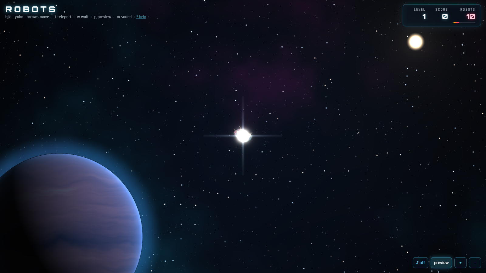
*The game opens far out: the stadium is a star. Then the camera falls toward it…*

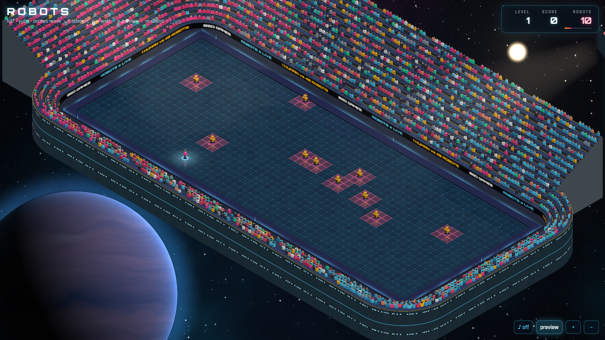
*…to the arena. The stands are cut low on the camera's side and rise fourteen rows behind; LED boards run round the front wall; three floodlight towers light the arena.*

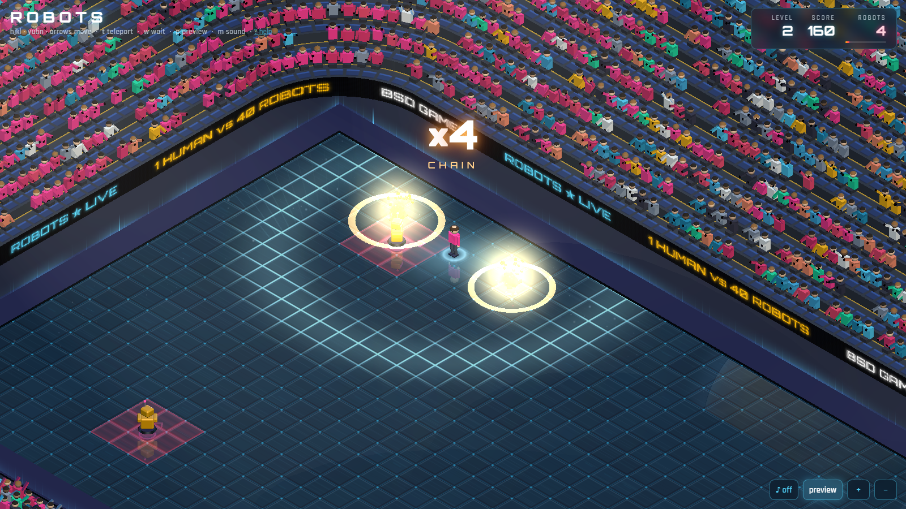
*Two thousand fans, each animated on the GPU: they sit, stand, jump, throw their arms up, and do a Mexican wave on a chain of four.*

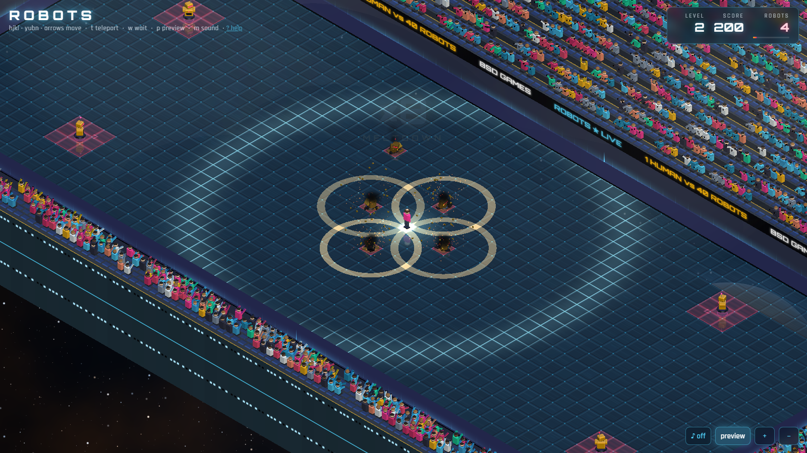
*A ×8 chain: the four crashes land together in slow motion, each with a flash, a shockwave and debris; the chain counter pops as they land.*

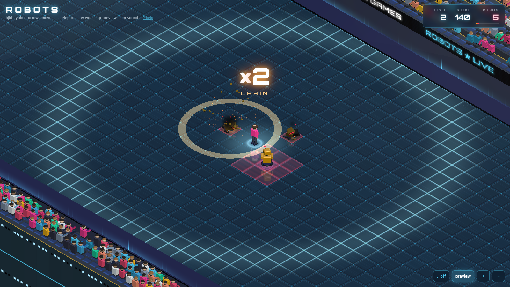
*Close up: the hover-bots watch you; a wreck is a heap of their own parts on a scorch mark that glows as it lands.*

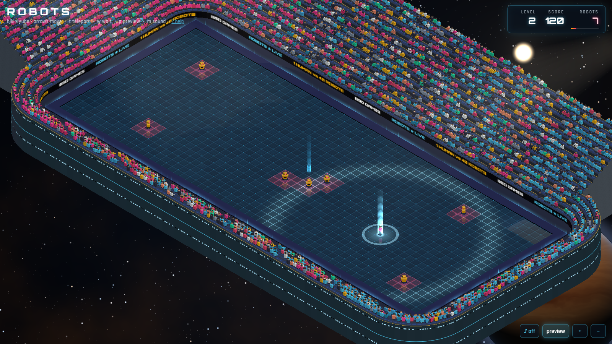
*Teleport: a column of light out, an arc across the deck, a column in.*

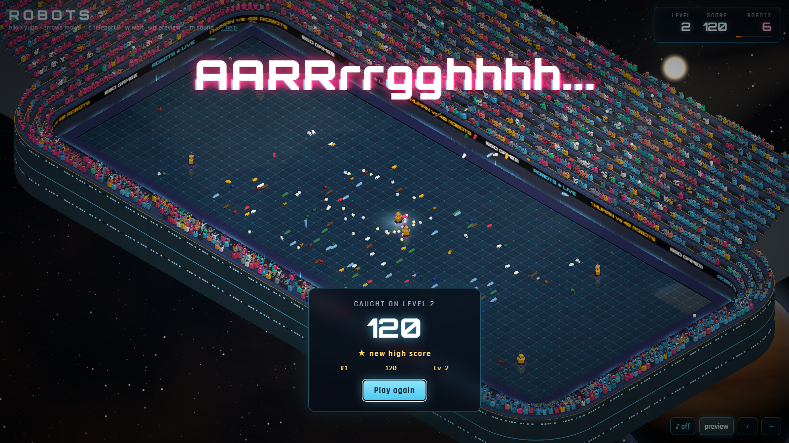
*Caught: the crowd boos, and some of them throw what they have — cans, cups, bottles, paper — which lands round where you fell and stays there.*

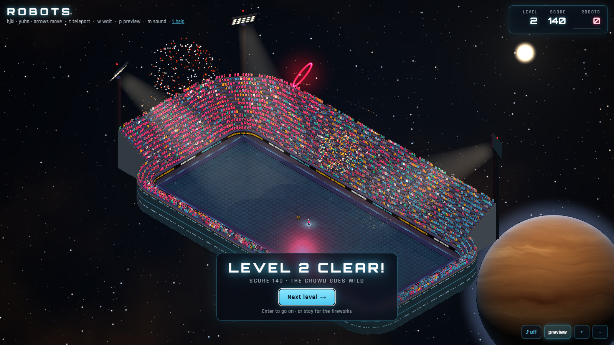
*Level clear: the camera pulls back, the crowd goes wild and the fireworks go up. Stay as long as you like; "Next level" (or Enter) goes on.*

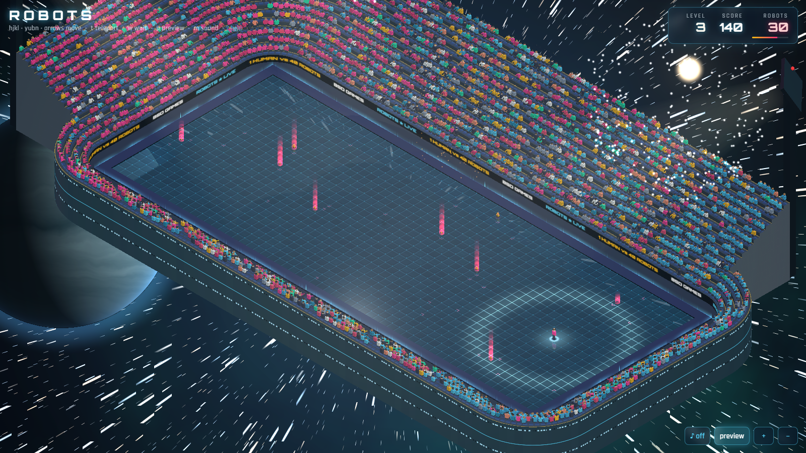
*Next level: the stadium jumps through hyperspace…*

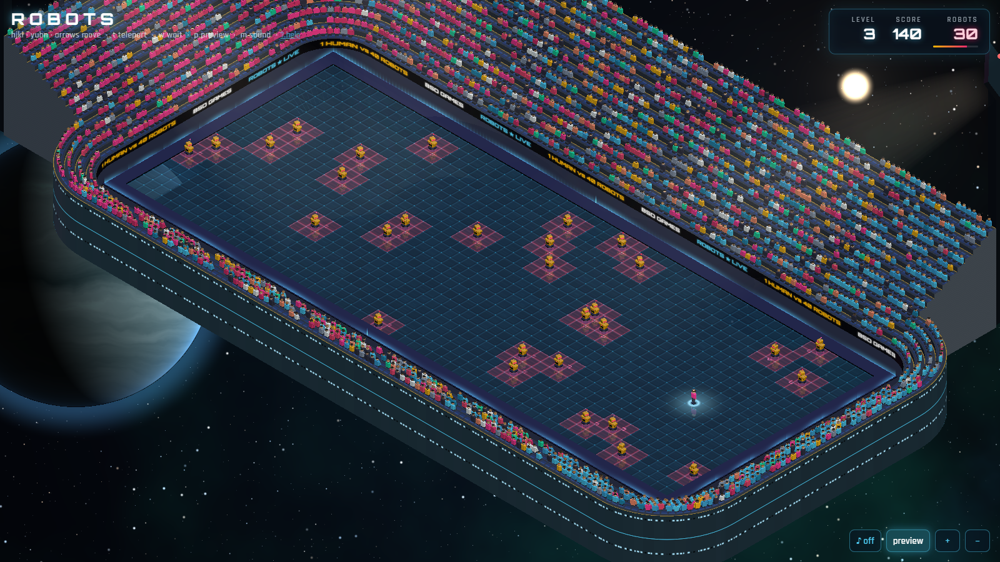
*…to a new stretch of space (every level has its own sky), and the robots beam down one by one.*

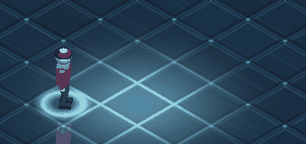
*The walk, seen from the side (a diagonal move runs straight across this camera), three moves at about real speed (30 ms a frame for ~27 ms of game time), camera held still: short planted steps, heel lift, arms against legs.*

## Status

- **Status:** 🟢 Released 2026-09-25.
- **Author:** Agun Wijaya (implementation: Claude)
- **License:** MIT (root default)
- **Live URL:** *(pending deploy — `dist/` is production-ready)*
- **Relation to `fancy-web`:** a copy of `fancy-web` taken on
  2026-09-25 and changed here. `fancy-web` itself is untouched and
  keeps its own look. Nothing is shared at run time; the two folders
  are independent.

## Pitch

`fancy-web` put `robots` on a luminous isometric platform in space. The
remaster keeps the whole game and redoes how it looks, moves and
sounds. The owner's picture for it: an arena somewhere out in space
that looks like a bright star from far away — zoom in and it is a
stadium, one human against many robots, with floodlights, full stands
and a crowd that celebrates and jeers. The rules code under `src/game/` is the same code
as fancy-web's. Every effect is read from the difference between two
game states, so the engine does not know the show exists.

Seven areas changed (the brief was ideas A–F, then the stadium, G):

| | What changed |
|---|---|
| **A — Light & materials** | A warm key light from the sun with real shadows, a cool rim and fill, and an environment map built from light panels at load (no image files) so paint, chrome and glass have something to reflect. The deck is one glass surface (it was 1,380 separate tile meshes) that shows the whole scene mirrored beneath it. |
| **B — Space** | A single shader draws the sky: a nebula, three layers of stars that twinkle and drift with the camera, a gas giant lit from the sun's side, and the sun. **Each level is a new sector** (new nebula colours, a new planet in a new place). |
| **C — Characters** | Robots: clear-coated paint, chrome trim, a visor that burns brighter the closer they are, heads that turn to watch you, a red pool of light under each (they hover, so the shadow is detached), an idle bob. You: a two-bone IK walk — a straight move is two short planted steps and a closing step, a diagonal three; the trailing heel lifts, the pelvis drops only as far as the legs need, and the arms swing against the legs. Wrecks: a heap of robot parts (a chassis on its side, a crumpled one, a toppled head with a guttering visor, a bent antenna, embers) on a scorch mark that glows and cools. |
| **D — Big moments** | Crashes land when the robots meet, not before: a flash, sparks, tumbling debris, a shockwave and smoke; chains get a pentatonic pitch step each, a slow-motion beat, and a CHAIN / CHAIN REACTION / MELTDOWN counter. Teleport: columns of light and an arc across the deck. Death: a red flash, slow motion, the body topples, the colour drains; the epitaph and the card leave the scene in view. Level clear: SECTOR CLEAR, then a hyperspace jump into the next sector, where the robots beam down one by one. |
| **E — Readability & UI** | Danger preview (`p`): red squares wherever a robot can step next turn (dimmer on wrecks), fading in once a level's robots have landed, and a chevron toward each robot's next step. A pulse runs out along the deck seams from you every turn. Glass HUD with rolling counters and a threat bar. |
| **F — Sound** | Synthesised with Web Audio (no audio files), off until you press `m`: a low hum that rises as robots close in, footsteps, servo whirrs, metallic crashes pitched up along a chain, a teleport sweep, beam-in chirps, a level-clear chord, a death sting — and the stadium: a murmur that swells with the game, a roar with claps and whistles on every crash, an "ooh" when a robot gets next to you, a long boo when you lose, fireworks that whistle, boom and crackle, rubbish clattering onto the deck. |
| **G — The stadium** | **Stands** round the arena: solid stepped rows with seats, cut low (four rows) on the two sides facing the camera and rising fourteen rows behind, ending in clean cut sections — a cutaway, so the arena is never hidden. LED advertising boards scroll round the front wall; the outside is plated with lit ports. **Floodlights**: three towers behind the tall stand with lamp banks and visible beams. **Crowd**: about 2,000 fans, one instanced mesh animated in a shader — seated and swaying, on their feet with arms up when robots crash (harder along a chain), a Mexican wave at ×4, phone flashes. **Level clear**: everyone up, the camera pulls back and tilts to the sky, fireworks (peonies, two-colour, rings, gold willows, salvos) until you press "Next level" or Enter; then the hyperspace jump. **You lose**: boos and fists, and about one fan in eleven throws a can, cup, bottle or balled-up paper, which arcs from their hand, bounces and stays on the deck until the next game. **From far away** the whole stadium is one bright star with spikes; the game opens there and falls in. |

## What works

Everything fancy-web does (full spec: 60 × 23 grid, `min(level × 10,
40)` robots, Chebyshev robot steps, crashes into scrap, teleport,
safe-wait, wait bonus, level progression, high scores in
`localStorage`), plus everything in the table above.

### Controls

| Key(s) | Action |
|---|---|
| `h` `j` `k` `l` / `y` `u` `b` `n` | Move one step (vi-style, 8 directions) |
| `↑` `↓` `←` `→` | Move one step (cardinal) |
| Numpad / number row `1`–`9` | Move (roguelike layout); `5` = skip turn |
| `.` / space | Skip a turn |
| `t` | Teleport |
| `w` / `>` | Safe-wait: play turns until the level clears or a robot would reach you; any key interrupts |
| `p` | Danger preview on / off |
| `m` | Sound on / off (off at start) |
| `+` / `−` / `=` / mouse wheel | Zoom (out as far as the star); zoomed in, the camera follows you |
| Enter (level clear) | Next level (or stay and watch the fireworks) |
| `?` | Help |

`w` is the safe wait, as in fancy-web
([ADR-002](docs/decisions/002-safe-wait-deviation.md)).

## Requirements and fallbacks

- **A GPU is recommended.** Measured with `scripts/perf.mjs` on a
  crowded board (level 4: 40 robots, 12 wrecks, the full stadium and
  crowd, 1600 × 900) on an RTX 4060 laptop GPU: 60 fps (vsync-bound)
  idle; 54 fps average while teleporting every 0.4 s.
- **No GPU (software WebGL).** When the browser reports a software
  renderer (SwiftShader, llvmpipe) the page switches itself to low
  quality: no reflection pass, no shadows, no floodlight beams, simpler
  materials on the stands and the crowd, a third of the crowd, fewer
  particles, fewer noise octaves in the sky, 0.6 render scale. Same
  board: **8 fps** (for comparison, fancy-web on the same software
  renderer runs **5 fps with 10 robots** and no stadium). Playable,
  since the game is turn-based, but not smooth. `?quality=low` or
  `?quality=high` overrides the choice.
- **No WebGL at all.** The page says so and explains how to turn on
  hardware acceleration, instead of staying blank (fancy-web shows a
  blank page).
- **Reduced motion.** With the system setting on: no camera shake, no
  slow motion, no full-screen flashes, shorter intro and jump, and
  the HUD animations stop.
- **Fonts** (Orbitron, Rajdhani) load from Google Fonts. Offline, the
  HUD falls back to system fonts and everything still works.

## Install & build

```bash
npm install
npm run dev          # http://localhost:5173
npm run build        # typecheck + production bundle → dist/
npm run preview      # serve dist/
npm run test:once    # vitest, single run
npm run typecheck
```

### Scripts (Playwright, against a running dev server or preview)

Each takes `APP_URL` (default `http://localhost:5173/`); `GPU=cpu`
uses the software renderer.

| Script | What it does |
|---|---|
| `node scripts/shot.mjs <dir> <name> [ms] [query] [js]` | One screenshot after a delay, optional URL query and script to run first |
| `node scripts/moments.mjs <dir> [names]` | Stages the big moments on hand-made boards (chain, close, wreck, teleport, teleportClose, death, booed, fans, clear + fireworks + jump) and shoots each at fixed delays |
| `node scripts/gait.mjs <dir> [direction] [frames]` | Freezes the visual clock and steps one move frame by frame with a still camera (`MOVES=3` for three in a row) |
| `node scripts/perf.mjs [label]` | Frame times on the crowded level-4 board, idle and while teleporting |

`media/`:

- 01 is `shot.mjs star 600` and 02 is `shot.mjs overview 7000`.
- 03–10 come from `moments.mjs`:
  - 03 `fans-0900`
  - 04 `chain-0420`
  - 05 `wreck-0500`
  - 06 `teleport-0150`
  - 07 `booed-5000`
  - 08 `clear-5200`
  - 09 `clear-warp0650`
  - 10 `clear-warp1600`
- 11 is `gait.mjs upRight` with `MOVES=3`.

Debug URL parameters:

- `post=0` — no post-processing.
- `fx=bloom,ca,hue,vig,noise` — pick the post effects.
- `quality=low|high` — force a quality tier.
- `hide=sky,stadium,crowd` — leave parts out, for measuring.

## Tests

`npm run test:once` runs **72 tests**:

- **33 from fancy-web**, unchanged: engine 27, grid 6.
- **6 for the turn reader** (`turnDiff`).
- **20 for the walk** — the feet:
  - start and end together;
  - only go forward;
  - swing one at a time;
  - never slide while planted;
  - are never further apart than a stride.
- **4 for the visual clock** — moments land on visual time, keep time
  in slow motion, run in order, and are cleared on a new game.
- **9 for the stadium and crowd**:
  - the ring closes outside the arena;
  - no seat is inside the arena, and everyone faces it;
  - the camera-side stands are low and the back stand is tall;
  - about the intended share of fans throw, within the throwing
    window;
  - the layout is the same every time;
  - the crowd cheers crashes and starts a wave at four;
  - it celebrates until the next level;
  - it boos and throws when you lose.

`npm run typecheck` is clean (strict). `npm run build` is clean:
1,191 KB JS, 338 KB gzipped.

## Architecture

```
src/
├── game/          fancy-web's engine, unchanged (rules, RNG, grid, high scores)
├── fx/
│   ├── turnDiff.ts   reads a turn from two states: moved, teleported,
│   │                 which robots died where, crashes, death, clear
│   ├── bus.ts        one event bus: scene, camera, HUD and sound listen
│   ├── clock.ts      the visual clock (slow motion) and `after()`
│   ├── Effects.tsx   particles, debris, rings, beams, ghosts, smoke
│   ├── crowd.ts      the crowd's mood (excite, wave, celebrate, boo)
│   ├── Fireworks.tsx shells, bursts, the flash on the arena
│   ├── Trash.tsx     rubbish thrown by the crowd when you lose
│   └── store.ts      per-frame shared values, quality detection
├── scene/         Background (sky shader), Platform (arena deck),
│                  Stadium (stands, boards, floodlights, the far star),
│                  stadiumLayout.ts + standsGeometry.ts (the numbers and
│                  the mesh), Crowd (instanced fans, shader-animated),
│                  Lighting, Preview (next-step chevrons)
├── entities/      Robot, Player (+ gait.ts), Pile, AnimatedGroup
├── audio/sfx.ts   Web Audio synthesis
├── ui/            Hud, HelpPanel, remaster.css
├── input/         keyboard (adds `m`, `p`)
└── Game.tsx       composition: state, turn → events, camera, post
```

The flow of one turn: a key → the engine returns the next state →
`diffTurn(prev, next)` → events on `fxBus` (some scheduled on the
visual clock, e.g. a crash lands when the robots meet) → the scene,
camera, HUD and sound react. See
[ADR-003](docs/decisions/003-remaster-scope.md) and the
[diff log](docs/diff-log.md).

## Spec compliance

The rules are fancy-web's, which implement
[`../../docs/spec.md`](../../docs/spec.md), with fancy-web's
documented deviations ([ADR-002](docs/decisions/002-safe-wait-deviation.md):
`w` is the safe wait). The remaster adds no rule changes
([ADR-003](docs/decisions/003-remaster-scope.md)).

## Documentation

- [`docs/architecture.md`](docs/architecture.md) — how a turn becomes a
  show: turn reader, event bus, visual clock, scene, stadium, crowd,
  sound, quality tiers (with diagrams).
- [`docs/diff-log.md`](docs/diff-log.md) — feature by feature, versus
  the original and versus fancy-web.
- [`docs/comparison.md`](docs/comparison.md) — `fancy-web` and this
  remaster side by side.
- [`docs/test-scenarios.md`](docs/test-scenarios.md) — the canonical
  scenarios and the remaster's own.
- [`docs/notes.md`](docs/notes.md) — how it came about, lessons, open
  items.
- [`docs/decisions/`](docs/decisions/) — ADRs (001–002 inherited from
  fancy-web; 003 the remaster's scope, with the stadium amendment).
- Canonical, game-level: [`../../docs/`](../../docs/).

## Attribution

- Original BSDGames authors — see root
  [`ATTRIBUTION.md`](../../../../ATTRIBUTION.md).
- Upstream source: <https://github.com/vattam/BSDGames/tree/master/robots>.
- Based on the `fancy-web` port (same repository, same author).
- This port © 2026 Agun Wijaya, MIT.
