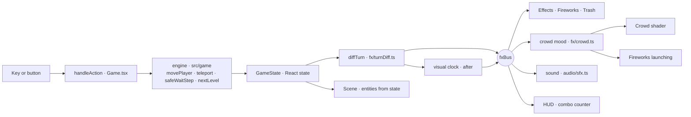
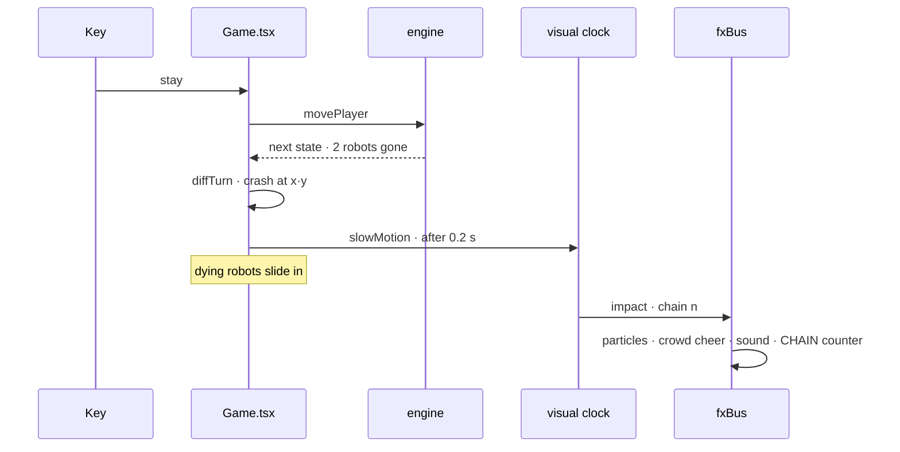
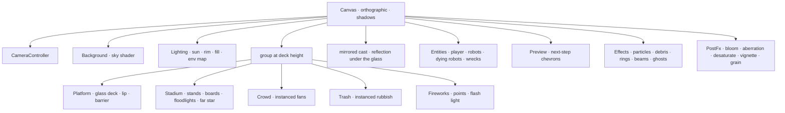

# `robots` `fancy-web-remastered` — Architecture

How the port is put together. The rules are `fancy-web`'s engine,
unchanged ([ADR-003](decisions/003-remaster-scope.md)). Everything else
is presentation that **reads** the game and never writes to it.

## 1. The big picture

1. A key or a button becomes an action (`input/keyboard.ts`).
2. `Game.tsx` calls the engine. The engine returns the **next state**
   at once: nothing waits for an animation.
3. The state goes to React, and the scene draws the player, robots and
   wrecks from it.
4. A `useEffect` compares the previous state with the new one
   (`diffTurn`). The result is what happened in that turn:
   - whether you moved or jumped;
   - which robots died, where they came from, and where they were
     heading;
   - each crash, with its count and whether it held scrap;
   - whether you died, cleared the level, or started a new one.
5. Those facts go out as events on `fxBus`. Some are held back on the
   **visual clock** so they land with the animation. For example, a
   crash lands `IMPACT_DELAY` (0.2 s of visual time) later, when the
   two robots meet.
6. Everything that reacts listens to the bus:
   - particles, fireworks and rubbish;
   - the crowd's mood;
   - the sound;
   - the HUD's chain counter.

## 2. Time

There are two clocks:

- **Real time** (`setTimeout`, `setInterval`, rAF) is used for UI:
  - the death card appears after 2 s;
  - safe-wait steps every 190 ms;
  - the level jump lasts 1.3 s.
- **Visual time** (`fx/clock.ts`, `vclock.t`) is used for everything
  in the scene: walking, bobbing, particles, crowd, fireworks and
  moments scheduled with `after()`. It advances with the frame time
  × `vclock.scale`.
  - `slowMotion(scale, seconds)` slows it for a chain or a death. It
    brakes hard and recovers gently.
  - Screenshot scripts set `vclock.manual` and step it by hand
    (`scripts/gait.mjs`).

Safe-wait pauses while the clock is slowed, so a slow-motion chain
plays out before the next wait turn.

## 3. The scene

- **Camera.** It is orthographic, looking from `(40, 40, 40)`.
  - Zoom runs from 0.6 (the stadium is a star) to 55, and eases in log
    space. A long zoom starts slowly, so the opening fall reads as
    distance.
  - Above zoom 30 the camera starts following you, and above 40 it
    follows fully.
  - While the crowd celebrates, it pulls back and tilts up to the sky.
  - Shake is disabled by reduced motion.
- **Reflection.** drei's reflector needs a perspective camera, so it
  is not used. The cast is drawn a second time mirrored below the
  deck (`scale(1, −1, 1)`), and the deck is 80 % opaque glass. The
  mirrored copy has no shadows, pools or embers.
- **Deck** (`scene/Platform.tsx`) is one plane. Its standard material
  gets extra shader code (`onBeforeCompile`):
  - the turn pulse along the seams;
  - the glow on your square;
  - the danger squares, read from a 60 × 23 `DataTexture` that is
    rewritten every turn.

  The glass does not write depth, so particles and rings drawn on it
  are not cut.
- **Stadium** (`scene/stadiumLayout.ts` → `standsGeometry.ts` →
  `Stadium.tsx`):
  - The layout is pure numbers and is tested: a rounded-rectangle ring
    outside the arena, row depth and rise, and the seats.
  - The camera-side stands have 4 rows (`FRONT_ROWS`). The back stand
    rises to 14 (`BACK_ROWS`) and ends in two flat cuts.
  - The stands are one `BufferGeometry` with five material groups:
    treads, risers, facade, section and boards.
  - Floodlight beams are additive open cones. The far star is a
    billboard glare that holds a fixed size on screen and fades as you
    zoom in.
- **Crowd** (`scene/Crowd.tsx`) is one `InstancedMesh`, one fan per
  seat — about 2,000.
  - The geometry is merged boxes and an icosahedron, tagged with a
    `part` attribute: torso, head, left arm, right arm, lap.
  - The vertex shader moves each fan from a few uniforms (excite,
    celebrate, boo, wave position, throw time) and their seed.
  - The fragment shader colours faces and hair, and pops phone
    flashes.
  - The CPU does no per-fan work per frame.
- **Rubbish** (`fx/Trash.tsx`) uses four `InstancedMesh`es: cans, cups,
  bottles and paper.
  - The throwers are the fans `isThrower(seed)` picks. The crowd
    shader uses the same rule, so an arm comes over just as a piece
    leaves that hand.
  - Pieces fly ballistic arcs, bounce and stay until a level starts.
- **Fireworks** (`fx/Fireworks.tsx`):
  - shells launched from the top of the tall stand;
  - bursts shaped as peony, two-colour, ring or willow, drawn as
    points (`PointPool` from `Effects.tsx`);
  - a point light that flashes the burst colour on the arena.

## 4. Sound

`audio/sfx.ts` is one Web Audio graph built on the first `m`. Nothing
is loaded from files. The master bus runs through a compressor. On it:

- a hum made of three oscillators through a low-pass filter;
- the crowd murmur: looped noise through a band-pass filter, with a
  slow flutter on its gain.

Everything else is scheduled per event:

- tones and filtered noise bursts;
- crowd voices: ten detuned sawtooths through two vowel formants, for
  "ooh" and "boo".

It listens to `fxBus` like the scene does.

## 5. Quality tiers

`fx/store.ts` decides before the first frame. The low tier applies to
a software renderer (SwiftShader, llvmpipe) or `?quality=low`:

| | High | Low |
|---|---|---|
| Render scale | device, up to 2× | 0.6 |
| Shadows, reflection pass | yes | no |
| MSAA in post | 4× | none |
| Stands and crowd material | standard (PBR) | Lambert |
| Crowd | every seat | a third |
| Floodlight beams | yes | no |
| Particles | all | ~45 % |
| Sky noise octaves | 6 | 3 |

Without WebGL, `App.tsx` shows a message instead of the game.
Reduced motion turns off shake, slow motion, the full-screen flashes
and the HUD animations, and shortens the opening and the jump.

## 6. Where to change things

| To change… | Look in |
|---|---|
| A rule | Nowhere here — the rules are fancy-web's (ADR-003) |
| What a turn "means" | `fx/turnDiff.ts` (tested) |
| When a moment lands | `Game.tsx` diff effect, `fx/clock.ts` |
| The stands' shape or size | `scene/stadiumLayout.ts` (tested) |
| The crowd's motion | `scene/Crowd.tsx` shaders, `fx/crowd.ts` mood |
| Who throws, and when | `isThrower` / `throwDelay` in `stadiumLayout.ts` (both the shader and `Trash.tsx` use them) |
| The walk | `entities/gait.ts` (tested), `entities/Player.tsx` |
| A sound | `audio/sfx.ts` |
| The sky of a level | `SECTORS` in `scene/Background.tsx` |
| The LED adverts | `boardTexture` in `scene/Stadium.tsx` |
