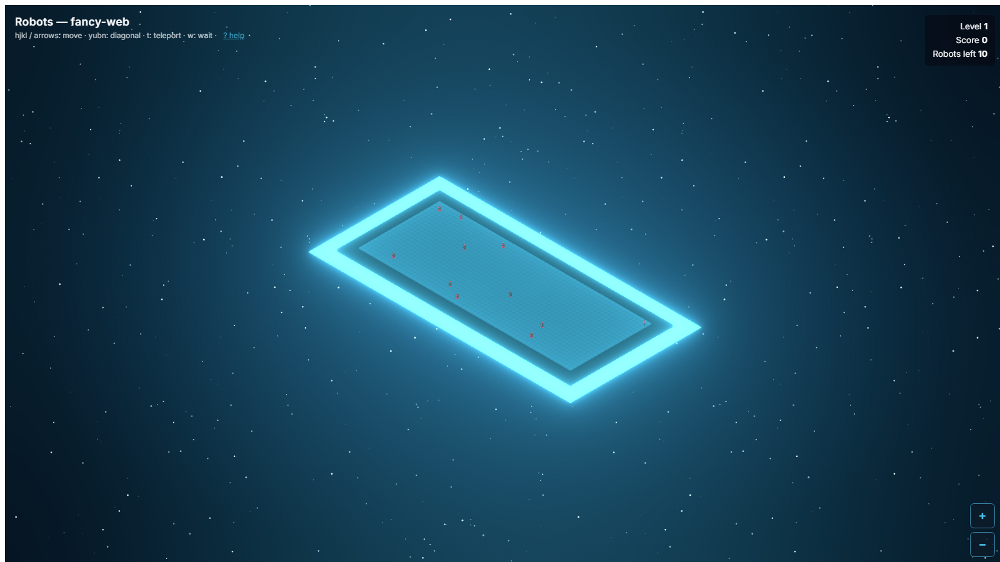
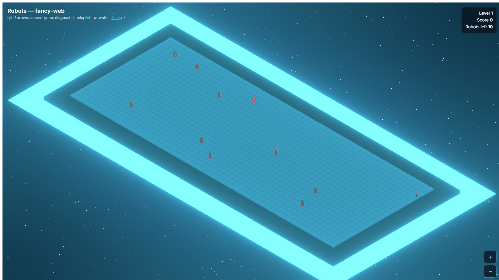
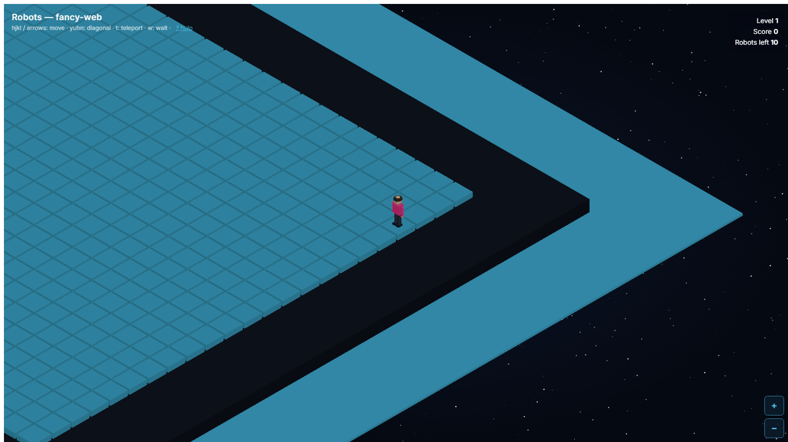
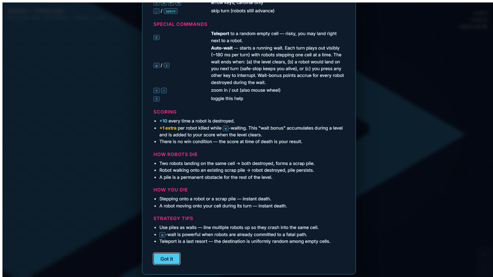

# `robots` — `fancy-web` port

> A modern, animated web reimplementation of BSDGames `robots`.
> Faithful mechanics, planet-in-space presentation — isometric 3D
> platform, walking human character, hover-bot enemies, bloom halo,
> zoom-adaptive atmosphere.


*Spawn view — max zoom out. The platform reads like a distant planet, ringed by its aura halo.*


*Mid-zoom gameplay — robots (yellow with red LEDs) closing in on the human player (magenta).*


*High zoom + follow-player — camera centers on the player and the halo silently fades out so the tiles read cleanly at close range.*


*The `?` help panel — every keybinding, scoring rule, and strategy tip in one place.*

## Status

- **Status:** 🟢 Released 2026-09-17 (all Universal Port
  Contract baseline items satisfied; ✨ Complete pending
  deploy + sound).
- **Author:** Agun Wijaya
- **License:** MIT (root default)
- **Live URL:** *(pending deploy — `dist/` is production-ready)*

**What works today**

- Full canonical spec: 60 × 23 grid, level init (`min(level×10, 40)`
  robots), Chebyshev robot AI, collision → scrap piles, teleport,
  safe-wait, level progression, cumulative score, wait bonus.
- Isometric 3D rendering via WebGL. Voxel human player, hover-bot
  enemies, scrap piles, luminous cyan platform floating in
  starfield space with a wide zoom-adaptive halo.
- Smooth movement: player and robots animate step-by-step with
  parabolic hop and rotating facing direction. Player has a full
  walk cycle (legs and arms swing counter-phase).
- Auto-wait mode (`w`) plays each turn out visibly; any keypress
  interrupts.
- Camera: 8-to-55 zoom range, follow-player at high zoom.
- HUD: level, score, robots left, wait bonus, help panel (`?`),
  zoom controls, game-over / level-clear modals.
- **High-score leaderboard** (`localStorage`, top 10) with new-best
  banner + current-run highlight.

**Verified (2026-09-17)**

- ✅ `npm run test:once` — 33/33 tests pass (6 grid + 27 engine).
- ✅ `npm run typecheck` — TypeScript strict mode, zero errors.
- ✅ `npm run build` — production bundle is **289 KB gzipped**
  (well under the ADR-005 500 KB Forward-Compatibility budget).

**Universal Port Contract items — all satisfied**

- ✅ `README.md`, `AGENTS.md`, `CLAUDE.md` present.
- ✅ `docs/diff-log.md` complete (every design decision logged).
- ✅ `docs/decisions/` — two port ADRs (tech stack + safe-wait
  deviation).
- ✅ `src/`, `tests/` — 33/33 tests pass, TypeScript strict
  clean, production build 289 KB gzipped.
- ✅ `media/` — 4 port-specific screenshots (spawn, mid-game,
  follow-player, help) captured via Playwright and embedded
  above.
- ✅ Attribution — original BSDGames authors credited above and
  linked from root `ATTRIBUTION.md`.

**Remaining for ✨ Complete**

- Deploy `dist/` to a live URL (Vercel / Cloudflare Pages / GitHub
  Pages) and record it in this README + `progress.md`.
- Sound effects (planned as an additive feature; requires a new
  port-level ADR).
- Optional polish: mobile touch controls, `asciinema` demo,
  i18n.

## Pitch

BSDGames `robots`, reimagined as a scene from a hand-crafted
isometric puzzle game. Game mechanics are preserved verbatim from
the canonical [`../../docs/spec.md`](../../docs/spec.md), but the
presentation layer is a complete reinterpretation for the modern
web:

- Where the classic port renders `@`, `+`, `*` in monospace green,
  this port renders a walking human on a cyan luminous platform
  floating in a starfield, chased by menacing red-eyed hover-bots.
- Where the classic port is a terminal window, this port is a
  browser scene with adaptive zoom — pull out and the platform
  reads like a planet ringed by a halo; zoom in and you play the
  turn-by-turn game close-up.

For the game's history and canonical mechanics see
[`../../docs/about.md`](../../docs/about.md).

## Tech Stack

- **Language:** TypeScript 5.6
- **UI framework:** React 18 (functional components + hooks)
- **Rendering:** [`@react-three/fiber`](https://docs.pmnd.rs/react-three-fiber) 8 + Three.js 0.169 (WebGL)
- **Post-processing:** `@react-three/postprocessing` (bloom for
  planet halo + entity glow)
- **Camera:** orthographic at ~30° tilt for isometric look; zoom
  and player-follow driven by `useFrame` lerps
- **Visual reference:** Monument Valley, Into the Breach, Mini
  Metro
- **Build:** Vite 5
- **Tests:** Vitest 2 + Testing Library
- **Target platform:** Web (browser). Mobile via responsive
  layout + touch controls. Capacitor Android path stays open per
  root [ADR-005 Forward-Compatibility Rules](../../../../docs/decisions/005-target-language-and-ui-stack.md).
- **Multiplayer:** N/A — `robots` is single-player.
- **Persistence:** `localStorage` (planned, for high scores).

Full stack rationale (including the initial react-konva → R3F
pivot): see
[`docs/decisions/001-tech-stack.md`](docs/decisions/001-tech-stack.md).

## Install & Build

```bash
# From this port folder:
npm install
npm run dev         # dev server (http://localhost:5173)
npm run build       # production build → dist/
npm run preview     # preview production build
npm test            # watch-mode tests
npm run test:once   # single-run tests
npm run typecheck   # tsc -b
```

## Play

*(Live URL pending. Once built locally: `npm run preview` and open
the printed URL.)*

### Controls

| Key(s) | Action |
|---|---|
| `h` `j` `k` `l` | Move one step — west / south / north / east (vi-style) |
| `y` `u` `b` `n` | Move one step (diagonals) |
| `↑` `↓` `←` `→` | Move one step (cardinal only) |
| Numpad / number row `1`–`9` | 8-direction movement (roguelike convention) |
| `.` / space / `5` | Skip turn (robots still advance) |
| `t` | Teleport to a random empty cell |
| `w` / `>` | Safe-wait — plays turns until level clears or a robot would land on you |
| `+` / `−` / `=` / mouse wheel | Zoom in / out |
| `?` | Toggle in-game help panel |

Rules and strategy: see canonical
[`../../docs/how-to-play.md`](../../docs/how-to-play.md).
In-game help (`?`) has the full keybinding + scoring reference.

## What makes this port different

- vs. `../classic-web/` *(pending, delegated to another agent)*:
  this port uses full 3D isometric rendering, animated walking,
  bloom halo. Classic-web will be a faithful ASCII terminal-in-
  browser reproduction (per [ADR-005](../../../../docs/decisions/005-target-language-and-ui-stack.md)).
- vs. `../classic-terminal/` *(pending)*: classic-terminal targets
  native TUI; this port targets the browser and prioritizes visual
  polish over minimalism.

## Spec compliance

This port implements the mechanics in canonical
[`../../docs/spec.md`](../../docs/spec.md) faithfully. Deliberate
deviations are documented as port-level ADRs:

- [ADR-001](docs/decisions/001-tech-stack.md) — Tech stack
  (TypeScript + React + @react-three/fiber).
- [ADR-002](docs/decisions/002-safe-wait-deviation.md) — `w` binds
  to safe-wait instead of the spec's risky wait.

The full narrative of what was kept, modernized, added, or
removed lives in [`docs/diff-log.md`](docs/diff-log.md).

## Architecture summary

Directory layout (source):

```
src/
├── main.tsx          React root
├── App.tsx           Trivial shell
├── Game.tsx          Scene composition, camera, HUD, wait state machine
├── game/
│   ├── engine.ts     Pure logic — spec-conformant. Exports
│   │                 initGame, movePlayer, teleport, safeWait,
│   │                 safeWaitStep, waitUntilResolved, nextLevel.
│   ├── grid.ts       Generic 2D grid primitive
│   ├── rng.ts        Mulberry32 seedable PRNG
│   └── state.ts      GameState / Robot / Position types + constants
├── input/
│   └── keyboard.ts   Key → action mapping (with numpad support)
├── entities/
│   ├── AnimatedGroup.tsx   Position lerp + facing rotation + step
│   │                       arc + StepAnimationContext
│   ├── Player.tsx    Voxel human with walk-cycle sub-animation
│   ├── Robot.tsx     Hover-bot mesh
│   └── Pile.tsx      Scrap pile mesh (deterministic per-position tumble)
└── ui/
    └── HelpPanel.tsx Modal keybinding + scoring reference

tests/
├── grid.test.ts
└── engine.test.ts    20+ scenarios exercising spec mechanics
```

Rendering pipeline:

1. Root `div` has an SVG-data-URL starfield as CSS background.
2. Transparent R3F Canvas overlays on top (`gl: { alpha: true }`).
3. Scene renders: aura plate (wide emissive slab), backing plate
   (opaque dark buffer), tile grid, player + robots via
   AnimatedGroup wrappers, scrap piles.
4. `EffectComposer` + `Bloom` post-pass adds the planet halo. Aura
   emissive intensity attenuates with zoom, so bloom bleed onto
   tiles vanishes at close range.
5. `CameraController` (child of Scene) reads state zoom + player
   position each frame and lerps `camera.zoom` + `camera.position`
   accordingly.

## Attribution

- Original BSDGames authors — see root
  [`ATTRIBUTION.md`](../../../../ATTRIBUTION.md).
- Upstream source:
  <https://github.com/vattam/BSDGames/tree/master/robots>.
- This port © 2026 Agun Wijaya, MIT.

## Documentation

- Canonical (game-level):
  [`../../docs/`](../../docs/) — spec, architecture, about,
  how-to-play, lessons, references.
- This port's diff log:
  [`docs/diff-log.md`](docs/diff-log.md) — the running story of
  what was kept, modernized, added, or removed.
- This port's decisions:
  [`docs/decisions/`](docs/decisions/).
