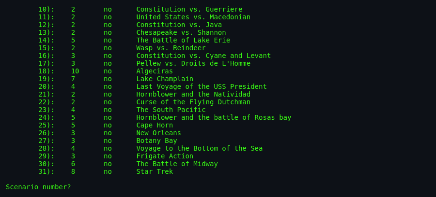
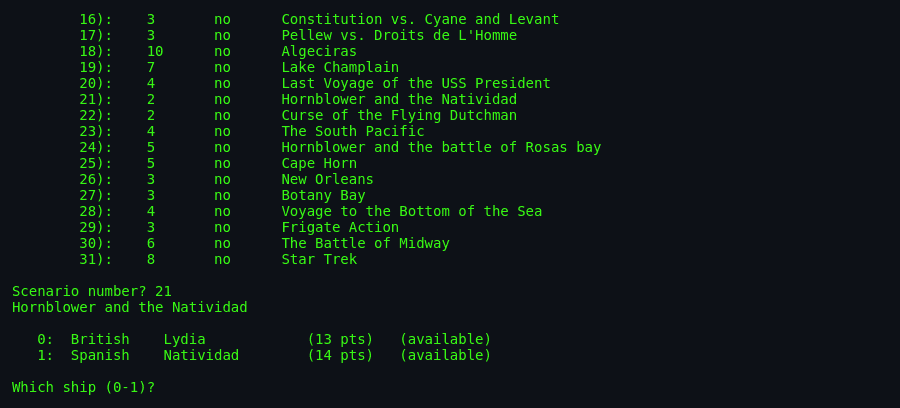
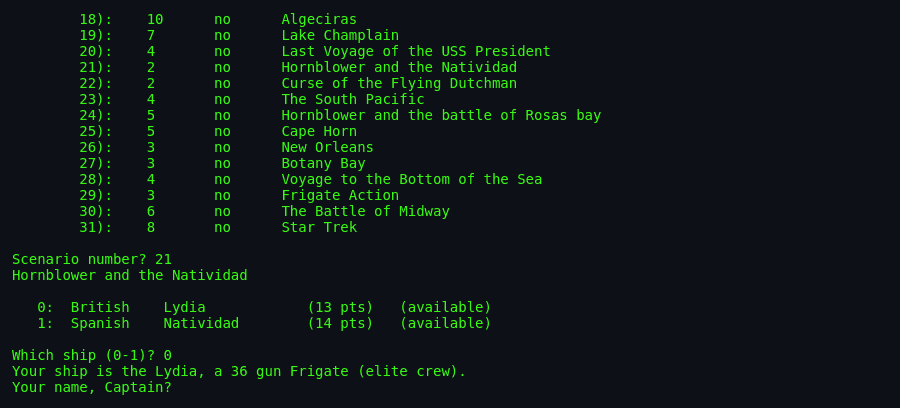

# About `sail`

> The year is 1812. You are the captain of HMS *Lydia*, a British
> 36-gun frigate. Somewhere off the coast of South America, a
> Spanish two-decker, the *Natividad*, blocks your path. Your
> crew is Elite; theirs is Mundane. The wind is off your beam,
> speed 3. You have 30 hull points, 4 sections of guns per side,
> and 5 rigging points on each of 3 masts. Your broadsides are
> loaded with **initial** double shot — the extra-lethal opening
> volley. It is your move. `move (7, 4): `

---

## What Is `sail`?

`sail` is a **multi-user Napoleonic-era wooden-ship combat
simulator**. Written by **Dave Riggle** on a PDP-11/70 in the
fall of 1980, based on Avalon Hill's boardgame *Wooden Ships and
Iron Men* by **S. Craig Taylor**. The BSD `sail` shipped with 4BSD
and every BSD/NetBSD/Debian since.

Ships are represented by 2 characters (bow letter, stern number).
British `b0`, French `f2`, Spanish `s4`, American `a1`. The ships
sail on a scrolling ASCII sea, obeying real Napoleonic-era physics:

- **Wind speed 0-7** (becalmed to hurricane).
- **Wind direction** relative to your ship's bow determines your
  speed.
- **8 compass headings** for ship facing.
- **Turning stern-first** — bow stays stationary as ship pivots.
- **Full sails vs Battle sails** — 2x speed but 2x rigging damage.
- **Broadsides** with 4 shot types: round, double, chain, grape.
- **Raking** — devastating fire down the length of an enemy ship.
- **Fouling / Grappling** — collisions that tangle ships together.
- **Boarding** — send crew to fight on the enemy deck.

The player can pick from **32 historical scenarios** — from
Constitution vs. Guerriere (War of 1812) to Trafalgar to lesser-
known frigate actions. Or the fictional *"Star Trek"* scenario 31,
because why not.

## Screenshots


*The scenario selector: 32 historical (and one fictional Star
Trek) naval battles, from the 1770s through the end of the
Napoleonic Wars in 1815.*


*Scenario 21 selected — the fictional battle from C.S.
Forester's Hornblower series. British HMS *Lydia* (13 pts) vs.
Spanish *Natividad* (14 pts).*


*The game prompts for which ship the human captain will command.
Choosing 0 means playing the British *Lydia*; the Spanish
*Natividad* will be driven by the computer's driver process.*

---

## Authors & Publisher

- **Original Author (1980):** **Dave Riggle**, on a PDP-11/70.
  Self-deprecatingly writes in `sail.6`: *"Needless to say, the
  code was horrendous, not portable in any sense of the word, and
  didn't work."*
- **1981 Rewrite:** Dave Riggle got the first working version up
  by 1981. He also famously used **"Riggle Memorial Structures"**
  — deeply nested struct references that ran off line printer
  pages. Example preserved in the man page:
  ```
  specs[scene[flog.fgamenum].ship[flog.fshipnum].shipnum].pts
  ```
- **Ed Wang (1981):** Rewrote the `angle()` routine for accuracy
  (*"although it still doesn't work perfectly"*). Added
  ship-selection at start.
- **Craig Leres ("Captain Happy"):** Made `sail` portable for the
  first time. *"This was no easy task, by the way. Constants like
  2 and 10 were very frequent in the code."*
- **Ed Wang (1983):** Fourth and most thorough rewrite —
  modularized code almost from scratch. Added window movement and
  find ship commands.
- **Game concept:** **S. Craig Taylor** for Avalon Hill's
  *Wooden Ships and Iron Men* boardgame.
- **Publisher / distributor:** BSD Unix from ~1988 onwards; then
  NetBSD, BSDGames, Debian.
- **Language:** C, using `curses`.

## The Era

Dave Riggle wrote `sail` at Berkeley in 1980 — the same era that
produced Rogue, Adventure, and the first versions of most BSD
Unix. Riggle was clearly deep in Napoleonic-naval fiction (his
`sail.6` recommends C.S. Forester and Alexander Kent). The game
is a **love letter to Marryat, Forester, and O'Brian** in C.

The multi-user architecture — separate player processes and a
driver process, communicating via a shared tempfile with `link()`-
based locking — was Riggle's response to the constraints of
Version 7 Unix. No sockets. No shared memory. Just files and a
technique *"stolen from an old game called 'pubcaves' by Jeff
Cohen."*

## Why It's Fun

- **Genuine period simulation.** The wind is real. Your position
  relative to it matters. *Holding the weather gage* is a phrase
  from real naval history and it's how you win in `sail`.
- **Command grammar as ritual.** Typing `l1r1r2` is learning to
  speak the language of the quarterdeck.
- **The 32 scenarios.** From famous frigate duels to the fantasy
  *Voyage to the Bottom of the Sea*.
- **Crew quality matters.** An Elite crew hits harder than a
  Mundane one. American vs. British has flavour.
- **Boarding actions.** Grapple, board, fight for the ship.
  Casualties are grim.
- **Raking.** When you fire a full broadside down the length of
  an enemy ship, damage is multiplied. The stern rake is the
  most beautiful thing in the game.
- **Multi-user.** In 1980, three captains on three terminals
  could sail the same sea. Radical.

## Difficulty & Progression

### No Explicit Difficulty

There is no skill slider. Difficulty comes from:

1. **Scenario choice** — Constitution vs. Guerriere (2 ships) is
   very different from Algeciras (10 ships).
2. **Ship choice** — take the first available or pick a stronger
   ship.
3. **Human vs. AI mix** — computer ships are simpler
   opponents than skilled human captains.
4. **Crew quality of your ship** — historically accurate; some
   scenarios give you a Mundane crew against Elite opponents.

### Scenario Progression

The 32 scenarios span 1770s–1815:

- **War of 1812:** Constitution vs. Guerriere, United States vs.
  Macedonian, Constitution vs. Java, Chesapeake vs. Shannon.
- **Battle of Lake Erie** (5 ships).
- **Napoleonic French engagements:** Pellew vs. Droits de
  L'Homme, Algeciras (10 ships), New Orleans, Trafalgar (in
  spirit).
- **Frigate duels:** Wasp vs. Reindeer, Frigate Action, Cape
  Horn.
- **Hornblower fiction:** Hornblower and the Natividad,
  Hornblower and the battle of Rosas bay, Last Voyage of the USS
  President.
- **Fictional / joke:** Curse of the Flying Dutchman, Voyage to
  the Bottom of the Sea, Star Trek (scenario 31).

### Turn-Based Time Compression

Each turn = "several minutes" of real 1800s battle time.

### Repairs

Hull/Guns/Rigging repair at 2 points per 3 turns. Slow. Cannot
repair below 0. Once repairs complete: *"Repairs Completed"*
message.

## Making-Of Anecdotes

- **The `link()`-lock racy bug**: Riggle admits in the man page
  that when a crashed machine (`ucbmiro`) was rebooted, `fsck`
  found *3 links* between the tempfile and lock file. The lock
  was demonstrably broken. Yet the game worked in practice.
- **"Riggle Memorial Structures"**: Riggle's tendency to
  deeply-nested struct chains is preserved in the code and joked
  about in the man page.
- **Constants** everywhere: pre-Craig Leres, magic numbers like
  `2` and `10` filled the code. Portability was murder.
- **Ed Wang's angle() routine** — *"still doesn't work
  perfectly"*, per the man page. Naval-simulation math on
  integer-only hardware is hard.

## Cultural Impact

- One of the earliest multi-user real-time games in Unix.
- Direct precursor of MUDs (persistent multi-user text
  worlds) via its multi-process communication pattern.
- Inspired later BSD games (`hunt`'s UDP daemon draws on similar
  concepts scaled up).
- Modern naval sims (**Age of Sail**, **Naval Action**,
  **Sea of Thieves** for the atmosphere) inherit the sail-driven
  physics that `sail` tried to simulate.

See [`lineage.md`](./lineage.md).

## Known Bugs (Historical)

- **`link()`-lock race** — as noted, sometimes multiple processes
  believed they held the lock.
- **`angle()` still imperfect** — Ed Wang admitted this in 1981.
- **7-second poll granularity** — commands take 7–21 seconds to
  execute. Modern port must fix.
- **Multiple commands within a poll interval** — only the last
  is seen by the driver.
- **Repairs never happen for computer ships** — per man page
  "peculiarities of computer ships."

## See Also

- [`how-to-play.md`](./how-to-play.md).
- [`architecture.md`](./architecture.md).
- [`lineage.md`](./lineage.md).
- [`references.md`](./references.md).
