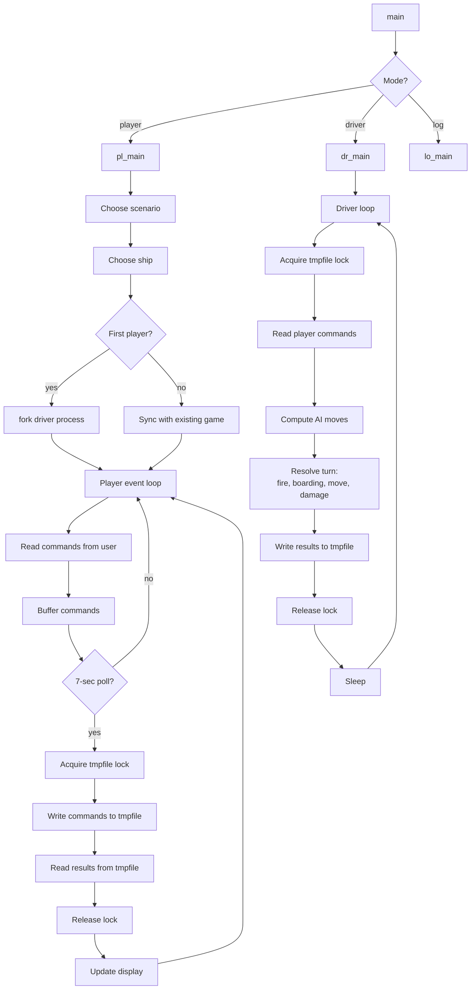
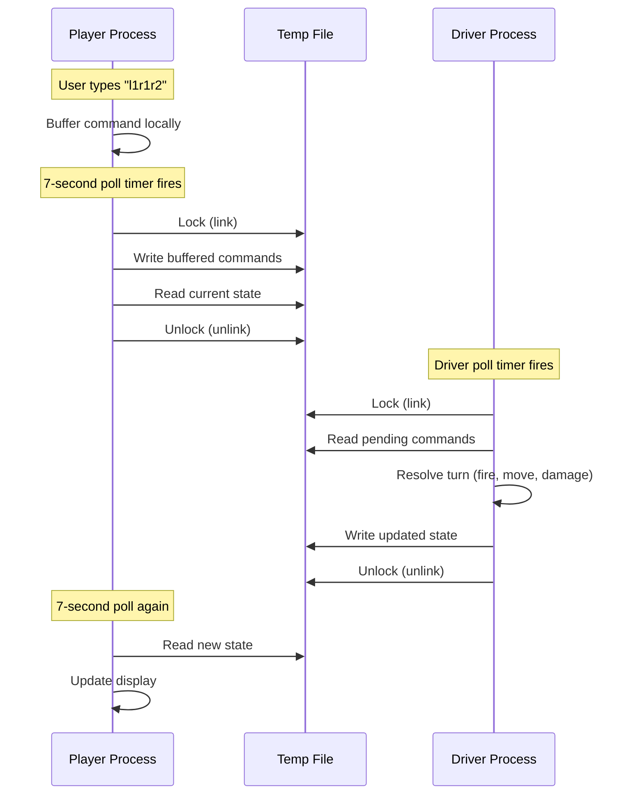

# `sail` — Original Architecture

> Two programs in one. Multi-user via shared tempfile with a
> `link()`-based lock stolen from "pubcaves" by Jeff Cohen. In
> 1980, this was **radical**.

Upstream source (not redistributed):
<https://github.com/vattam/BSDGames/tree/master/sail>

---

## Files & Roles

**~30 source files**, split into two logical programs sharing a
tempfile.

### Common / Shared

| File | Purpose |
|---|---|
| `main.c` | Entry, dispatch to player or driver |
| `machdep.h` | Compile-time definitions |
| `game.c`, `parties.c`, `globals.c` | Game data (32 scenarios, ships, crews) |
| `sync.c` | **The lock magic** — `link()`-based lock + tempfile IPC |
| `assorted.c`, `misc.c` | Utilities |
| `display.h`, `driver.h`, `player.h`, `restart.h`, `extern.h` | Headers |
| `pathnames.h.in` | Path definitions |
| `sail.6` | Man page (unusually long, essay-like) |
| `version.c` | Version string |

### Player Process (`pl_*.c`)

| File | Purpose |
|---|---|
| `pl_main.c` | Player process entry |
| `pl_1.c` — `pl_7.c` | Player subsystems (commands, display, input) |

### Driver Process (`dr_*.c`)

| File | Purpose |
|---|---|
| `dr_main.c` | Driver process entry |
| `dr_1.c` — `dr_5.c` | Driver subsystems (turn resolution, AI, fire calc) |

### Logger / Score

| File | Purpose |
|---|---|
| `lo_main.c` | Logger (probably scoreboard) |

## High-Level Architecture



## The `link()`-Based Locking Trick

From `sync.c`, described in the man page:

```c
// Approximate:
for (n = 0; link(sync_file, sync_lock) < 0 && n < 30; n++)
    sleep(2);
```

The technique: `link()` fails (returns -1) if `sync_lock` already
exists. Because Unix guarantees a hard link points to only one
underlying file, the process that succeeds in creating the link
knows it has exclusive access. Release = `unlink(sync_lock)`.

**Origin**: Jeff Cohen's game "pubcaves". Man page credits him.

**Reliability**: honestly stated in the man page — *"Whether or
not this really works is open to speculation. When ucbmiro was
rebooted after a crash, the file system check program found 3
links between the Sail temporary file and its link file."*

Modern equivalents: `flock(2)`, `fcntl(F_SETLK)`, database
transactions, distributed locks (Redis, ZooKeeper).

## The Shared Tempfile

Named `/tmp/#sailsink.NN` where `NN` is scenario number (e.g.,
`/tmp/#sailsink.21` for scenario 21).

Structure (paraphrased):

```
| Global state header       |
| Per-ship record 0         |
| Per-ship record 1         |
| Per-ship record N         |
| Pending message queue     |
```

Each per-ship record holds hull, guns, crew, position, sail
state, load-shot, and pending movement command.

**Message queue** is how player processes ask the driver to fire,
board, or execute unusual actions.

## Timing Model



**End-to-end command latency**: 7-21 seconds depending on where
in the poll cycle the driver runs. Man page describes this as
*"pipelining"* — type ahead to survive.

## Command Grammar

Movement commands parsed by `pl_*` files. Grammar (informal):

```
move       := (forward | turn)*
forward    := digit
turn       := 'l' | 'r'
digit      := '0' | '1' | ... | '9'
```

Additional actions:

- `d` = drift (no move)
- Special commands for combat, boarding, load, fire — handled
  outside the movement grammar.

Turning into the wind aborts the movement string with:

```
Movement Error; Helm: <partial>
```

## Wind and Movement Model

Each ship has:

- **Position** (x, y).
- **Facing** — one of 8 directions.
- **Wind attitude** — angle between wind and ship bow.

Speed table (approximate):

| Attitude | Battle Sails | Full Sails |
|---|---|---|
| Wind off quarter | 4 | 7 |
| Wind off beam | 3 | 6 |
| Wind off bow | 1 | 2 |
| Wind on bow (into wind) | 0 | 0 |

**Turning cost**: each turn reduces remaining move allowance,
sometimes disproportionately if turning closer to wind.

## Combat Resolution

Reference: `dr_*.c`.

Fire resolution factors:

1. **Distance** to target.
2. **Rake** (bow-to-stern axis fire).
3. **Crew size and quality**.
4. **Number of functional guns**.
5. **Weather** (sea state affects lower gun ports).
6. **Shot type**.

Damage distribution:

- Hull damage → reduces hull points → sinking risk.
- Rigging damage → reduces max speed.
- Crew damage → reduces fire and boarding effectiveness.
- Gun damage → reduces broadside strength.

## Random Event System

Per-turn RNG uses:

- **Damage roll** — random within calculated range.
- **Fire spread** — random chance ship catches fire.
- **Sinking probability** at listing hulk stage.
- **Weather change** — wind speed and direction can shift.
- **AI captain decisions** — some randomness for computer ships.

Seeded from `time(NULL)` at startup.

## Difficulty Progression Logic

**No explicit difficulty setting** — same reason as `phantasia`
and `trek`. Difficulty from:

1. **Scenario ship count** — 2 (frigate duel) to 10 (Algeciras).
2. **Scenario ship type mix** — First-rates vs. sloops.
3. **Human vs. AI count** — computers are simpler opponents.
4. **Crew quality assignment** — historically accurate; some
   scenarios stack the deck.
5. **Starting positions** — some scenarios give one side the
   weather gage.
6. **Weather** — random per-turn changes.

**Historical scenarios preserve real-world outcomes**: playing
Guerriere against Constitution with Mundane crew is a losing
proposition, just as it was in 1812.

## Clever Era Techniques

1. **Two-program architecture** with `fork()` — clean separation
   of player concerns and world simulation.
2. **`link()`-based lock** — creative use of Unix hard-link
   semantics for mutual exclusion.
3. **Shared tempfile** as an ad-hoc database.
4. **Poll-cycle pipelining** — accept the latency, provide
   type-ahead.
5. **32 scenarios in a data table** — content decoupled from
   engine.
6. **Ship glyph encoding** — 2 characters carry nation + number +
   sail state (via case). Impressive information density.
7. **Historical crew-quality tiers** — enforces character.
8. **`Riggle Memorial Structures`** — deeply-nested access, joked
   about but functional.
9. **`sail.6` as essay** — the man page is a *narrative* about
   the code's evolution and Napoleonic-era naval history.

## Constraints Handled

- **Version 7 Unix** — no sockets, no shared memory, minimal
  IPC. Solved with files.
- **PDP-11 memory** — fixed-size records.
- **No FP hardware in some deployments** — integer-only math.
- **Terminal I/O** via `curses`.
- **Multi-user coordination** without OS-level lock APIs.

## What This Code Would Look Like Today

- **Networking** — WebSocket server + clients.
- **Locking** — proper database transactions.
- **State** — SQLite / Postgres with proper schema.
- **Timing** — real-time via server tick + client interpolation.
- **UI** — modern TUI or 2D top-down graphics.
- **AI** — behaviour trees per crew quality tier.
- **Scenario editor** — GUI or DSL for community-authored
  scenarios.
- **Replay** — server records everything, client replays.

See [`port-ideas.md`](./port-ideas.md).

## See Also

- [`lessons.md`](./lessons.md).
- [`spec.md`](./spec.md).
- [`references.md`](./references.md).
