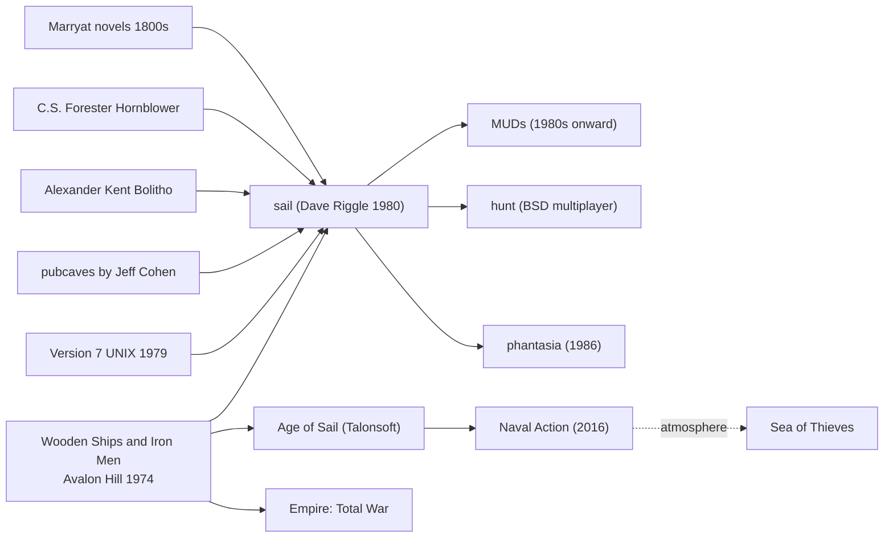

# `sail` — Lineage

> Where `sail` sits in the multi-user gaming + naval simulation
> family tree.

---

## Direct Ancestors

- **Avalon Hill's *Wooden Ships and Iron Men*** (1974/1976) by
  **S. Craig Taylor** — the direct board-game inspiration. Turn-
  based naval combat with all the mechanics `sail` inherits.
- **Napoleonic-era naval history** — books by Marryat, Forester,
  Kent recommended in the man page.
- **PDP-11 games of 1980** — Star Trek variants (`trek`
  ancestor), Adventure, Rogue. Same environment.
- **Jeff Cohen's "pubcaves"** — origin of the `link()`-lock
  technique.
- **Version 7 UNIX** file-based IPC primitives.

## Direct Descendants

- **MUDs** (1980s onwards) — multi-user text worlds. `sail`'s
  fork-based multi-process was proto-MUD architecture.
- **`hunt`** (later BSD game) — multi-user via UDP daemon;
  scaled-up cousin of `sail`.
- **`phantasia`** (1986) — proto-MMO in the same era.
- **Later naval sims**:
  - **Age of Sail** series (Talonsoft).
  - **Naval Action** (2016) — modern take.
  - **Ultimate Admiral: Age of Sail**.
  - **Empire: Total War** naval battles.
  - **Sea of Thieves** (atmosphere, if not mechanics).

## Genre Family

## If You Like `sail`, Try…

**Direct spiritual descendants:**

- **Naval Action** — modern MMO naval sim; the closest thing to
  `sail` scaled up.
- **Ultimate Admiral: Age of Sail** — recent single-player.
- **Sea Legends** and other Steam naval sims.

**Table-top:**

- **Wooden Ships and Iron Men** (Avalon Hill) — the original,
  still playable.
- **Flying Colors** by GMT Games.
- **Close Action** — hardcore hex-based naval sim.

**Multi-user gaming heirs:**

- **MUDs / MUSHes** — text-based persistent worlds.
- **EVE Online** — massive-scale multi-player from same DNA.

**Modern real-time strategy naval:**

- **Empire: Total War** — Napoleonic-era naval battles in an RTS.
- **World of Warships** — MMO-scale naval action (WWI-WWII era).
- **Sea of Thieves** — atmosphere and pirate feel.

**Naval fiction (as reading list):**

- **C.S. Forester** — Hornblower series (recommended in `sail.6`).
- **Alexander Kent** (a.k.a. Douglas Reeman) — Bolitho series.
- **Patrick O'Brian** — Aubrey-Maturin series.
- **Bernard Cornwell** — Sharpe series (Napoleonic land + some
  sea).

## Communities

- **`comp.games.tactic` and older Usenet archives**.
- **BoardGameGeek** for Wooden Ships and Iron Men.
- **Age of Sail community forums** (various).
- **Twitch/YouTube** for naval sim playthroughs.

## References

See [`references.md`](./references.md).
