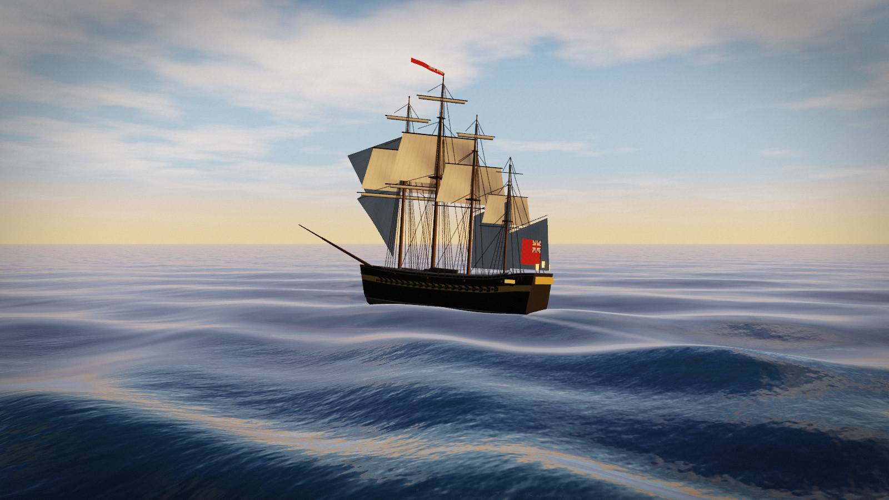
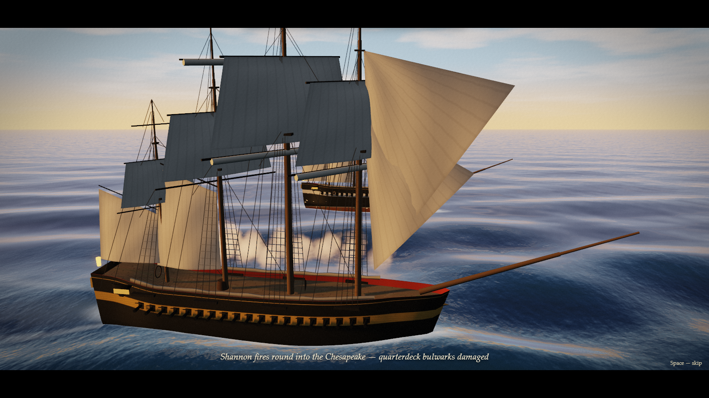
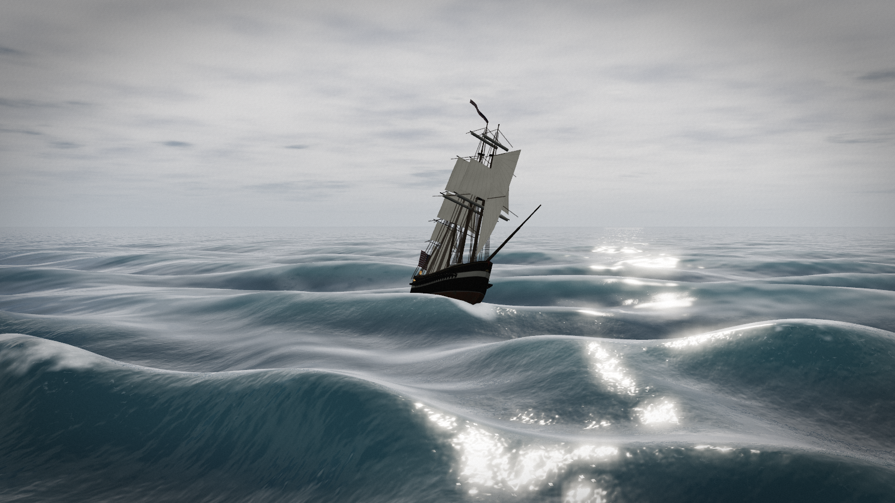
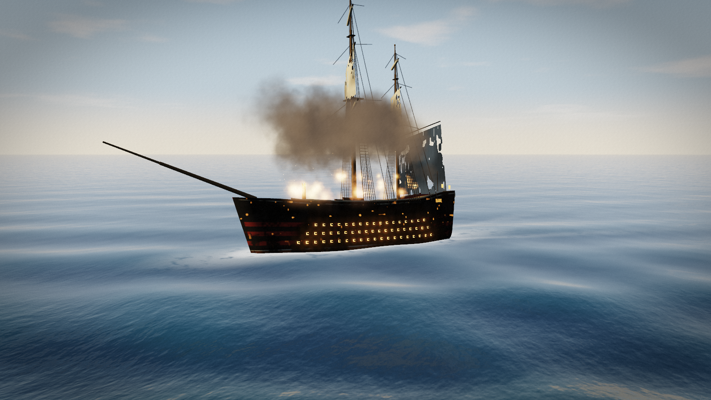
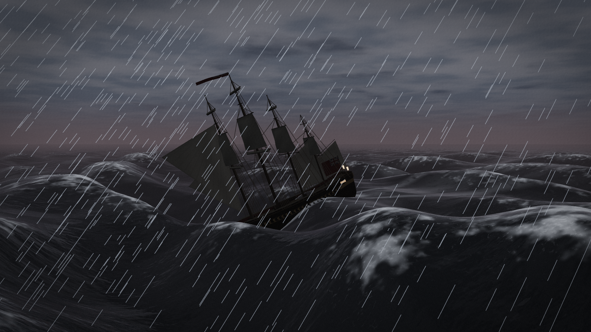
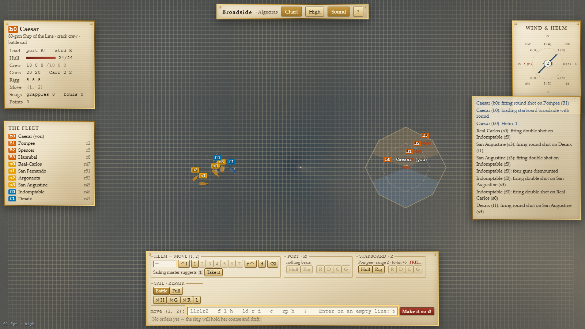
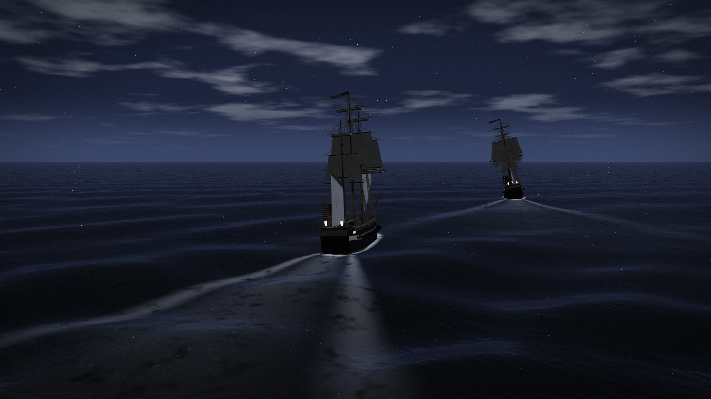
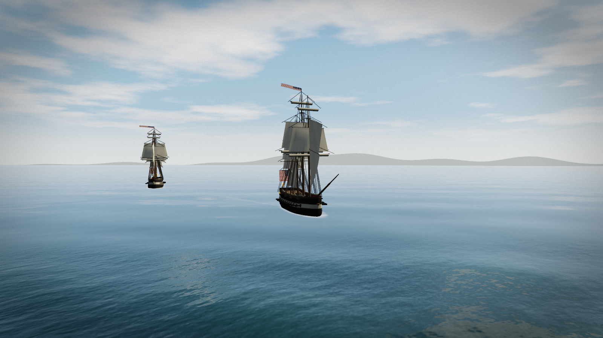
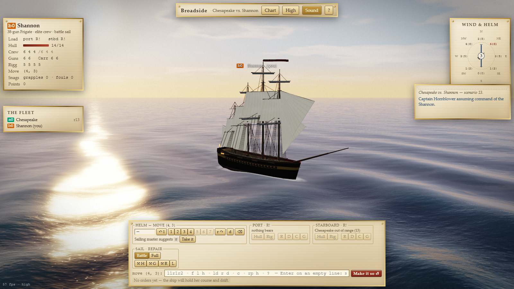

# `sail` — `fancy-web` port: *Broadside — Wooden Walls*

> Dave Riggle's 1980 Napoleonic naval battles as cinematic 3D — a
> Gerstner-wave ocean, procedural ships, powder smoke and storms — with
> **zero raster assets**: every sea, sky, hull, sail and flag is drawn by code.


*Chesapeake vs. Shannon (scenario 13): the Shannon in a fresh breeze, wind 3. Sea, sky, clouds, ship and ensign are all generated at run time.*


*Mid-broadside: the Shannon's guns ripple fore to aft; round shot splinters the Chesapeake's quarterdeck (the engine's roll-6 hull damage message becomes the caption).*

| | |
|---|---|
|  *Constitution vs. Guerriere in a gale (wind 5): whitecaps, spindrift, heel.* |  *The 112-gun Real-Carlos struck, burning and dismasted: firelight through three tiers of ports, the foremast gone, sails shot through.* |
|  *Wind 7: the storm that ends the battle — dark sky, rain, lightning.* |  *The chart: one square per original grid cell, range contours, firing arcs, chart pieces in colour-blind-safe nation colours.* |
|  *Flamborough Head (1779), fought into the night: moon, stars, lantern light.* |  *Lake Erie (1813): fresh water, light airs, a distant wooded shore.* |


*Orders: the original helm grammar at the command line (`l1r1r2`), or point-and-click. The wind rose shows your allowance at every heading, as the original's direction rose did.*

## Status

- **Status:** Active (v1)
- **Author:** Agun Wijaya (<https://github.com/agunawijaya>), implemented with Claude
- **License:** MIT (repository default); vendored Three.js r186 is MIT (`src/vendor/THREE-LICENSE`)
- **Live URL:** *(not deployed yet)*

## Pitch

Take command in any of the original's 22 historical actions — the
Shannon, the Constitution, John Paul Jones's Bonhomme Richard by
moonlight, Perry's brigs on Lake Erie, a British 74 at Algeciras. Give orders as the 1980 captains did — `r1r1r2`,
fire the port battery at the hull, load double shot — then watch the turn
play out: guns rippling down the side, smoke rolling away on the wind,
masts going by the board. The rules are Riggle and Wang's own tables,
ported from the C and tested; the pictures are the rules made visible.

## Tech Stack

- **Language:** JavaScript (ES modules), GLSL
- **Framework:** none — vanilla ES modules, zero build ([ADR 001](./docs/decisions/001-tech-stack.md))
- **Rendering:** WebGL 2 via vendored Three.js r186; custom shaders for ocean, sky, sails, hulls, particles, post
- **Audio:** Web Audio API, synthesised (no samples)
- **Target:** desktop browsers with WebGL 2 and import maps (Chrome/Edge 89+, Firefox 108+, Safari 16.4+); keyboard or mouse
- **Multiplayer:** not in v1 — the engine is pure and serialisable, ready for a server ([ADR 003](./docs/decisions/003-v1-scope.md))
- **Persistence:** `sessionStorage` (resume after reload), `localStorage` (top ten sailors, settings)

## Run

No build step. Serve the folder with any static server:

```bash
cd bsdgames/sail/ports/fancy-web
node scripts/serve.mjs          # http://localhost:8765/
```

(Opening `index.html` from `file://` does not work: browsers block ES
module imports from disk.)

## Test

```bash
npm test                        # 44 engine tests, Node 18+, no install needed
npm install                     # only for the browser tools below
node scripts/ui-smoke.mjs       # browser: layout + a keyboard-only turn
node scripts/ui-flows.mjs       # browser: boarding, capture, repair, unfoul, defeat, quit
npm run check:raster            # ADR-002: src/ contains no raster images
npm run shots                   # regenerate media/
```

## Controls

| Do | Keyboard | Mouse |
|---|---|---|
| Helm order | type `l1r1r2`, `3`, `d` … | helm buttons (↶ l, 1–7, r ↷, d, ⌫) |
| Fire | `f l h` (port, hull) · `f r r` (starboard, rigging) · `f` both | Hull / Rig buttons |
| Load | `ld l d` (port, double) · `ld b r` both round · `L` unload | R D C G buttons |
| Sails | `c`, `c full`, `c battle` | Battle / Full |
| Repair | `rp h` / `rp g` / `rp r` | ⚒ H / G / R |
| Close action | `g b0`, `g b0 u`, `u b0`, `b b0 2`, `b repel 1`, `B` | Close action panel |
| Identify | `i`, `I`, `F f?` | click a ship or roster entry |
| Make it so | Enter on an empty command line | Make it so ⏎ |
| Skip cinematic | Space / Esc / Enter | — |
| Chart view | `T` | Chart |
| Camera | arrows orbit (pan on the chart), `+`/`−` zoom, `0` your ship, `1`–`9` others | drag, wheel |
| Quality / sound / help | `Q` / `M` / `?` | top bar |

Full rules: canonical [`how-to-play.md`](../../docs/how-to-play.md).

## What makes this port different

It is the first port of `sail`, and a showcase of procedural graphics:
nothing on screen is a picture. It keeps the original's command grammar,
tables, computer captains, 32 scenarios and scoring, and turns the
7-second multi-user poll into a turn-based single-player battle that plays
back as a short film.

## Spec compliance

Mechanics follow [`spec.md`](../../docs/spec.md), ported from the C where
the spec is ambiguous. Deliberate deviations are ADRs:

- [001 Tech stack](./docs/decisions/001-tech-stack.md)
- [002 Zero raster assets](./docs/decisions/002-zero-raster-assets.md)
- [003 v1 scope](./docs/decisions/003-v1-scope.md) — single player, end-of-battle rules; amended: all 22 historical scenarios staged
- [004 Rules fidelity](./docs/decisions/004-rules-fidelity.md) — eight C bugs fixed, `angle()` formalised
- [005 Ship generator](./docs/decisions/005-ship-rigging-and-masts.md) — masts from rigging data

Canonical [`test-scenarios.md`](../../docs/test-scenarios.md): all pass
except T-23 (multi-player join), satisfied at engine level only — see
[`docs/test-scenarios.md`](./docs/test-scenarios.md).

## Docs

[Diff log](./docs/diff-log.md) · [Architecture](./docs/architecture.md) ·
[Test scenarios](./docs/test-scenarios.md) · [Notes](./docs/notes.md) ·
[Decisions](./docs/decisions/)

## Attribution

- **`sail`** by Dave Riggle (1980), rewritten by Ed Wang (1981, 1983) and
  Craig Leres; from Avalon Hill's *Wooden Ships and Iron Men* by S. Craig
  Taylor. Upstream: <https://github.com/vattam/BSDGames/tree/master/sail>.
  Copyright (c) 1983, 1993 The Regents of the University of California.
  See root [`ATTRIBUTION.md`](../../../../ATTRIBUTION.md).
- Scenario and ship data transcribed from `sail/globals.c`; no C code is
  copied into this repository.
- Three.js © 2010–2026 Three.js authors, MIT.
