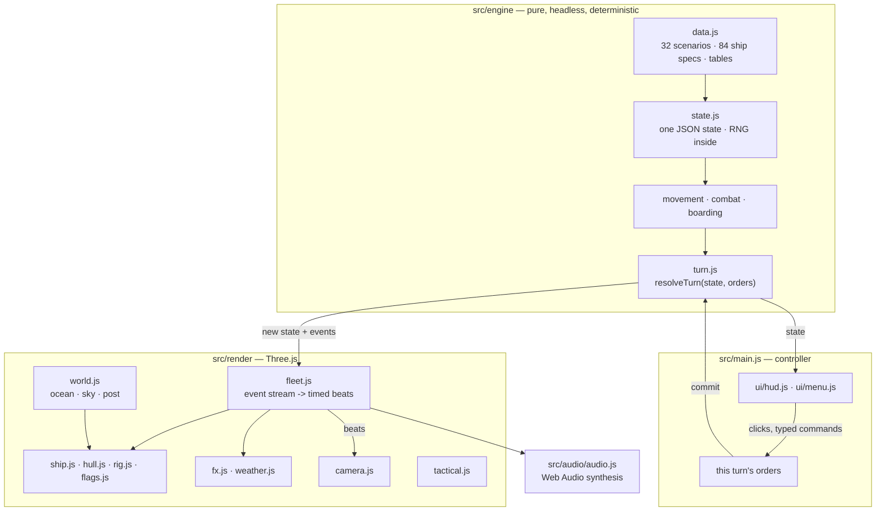
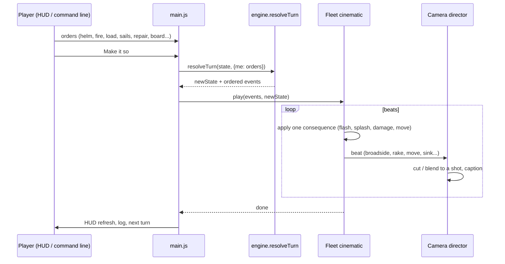

# `sail / fancy-web` — Port Architecture

> How *Broadside — Wooden Walls* is put together. For the ORIGINAL
> program's architecture (player/driver processes, tempfile, `link()`
> lock) see the canonical [`../../../docs/architecture.md`](../../../docs/architecture.md).

---

## 1. Layers



The engine imports nothing from Three.js, the DOM, timers or
`Math.random`. Everything below the dashed line of `main.js` only *shows*
what the engine decided.

## 2. The turn



Inside `resolveTurn` the order is exactly the original driver loop
(`sail/dr_main.c:90-112`), preceded by the human "window"
([ADR 004](./decisions/004-rules-fidelity.md) §Turn structure):

| Step | Code | Original |
|---|---|---|
| human orders: grapple, unfoul, sails, boarders, **fire**, unload, load, helm, repair | `turn.js applyPlayerOrders` | `pl_2.c play()` |
| turn counter, weather, hurricane | `next` | `dr_1.c:400` |
| computer ships cut fouls | `unfoul` | `dr_1.c:50` |
| burning/sinking hulks finish | `checkup` | `dr_2.c:88` |
| prize crews overthrown | `prizecheck` | `dr_2.c:119` |
| computer helm search + lock-step movement, collisions, fouls | `closeon`, `moveall` | `dr_2.c:147`, `dr_3.c:52` |
| grapples, boarding parties | `thinkofgrapples`, `boardcomp` | `dr_2.c:57`, `dr_1.c:73` |
| computer broadsides | `compcombat` | `dr_1.c:268` |
| melee | `resolve` / `fightitout` | `dr_1.c:237` / `:138` |
| housekeeping, computer sails | `reload`, `checksails` | `dr_3.c:316`, `:326` |
| human reloading, sails settle, end check | `newturn`, `checkEnd` | `pl_7.c:116` |

## 3. Engine state and events

One plain object holds the battle (`createGame`): scenario, turn, wind,
RNG state `{s}`, and per ship the live `specs` (the original mutated
`struct shipspecs` in place), `max` (pristine copy for the UI),
position `row/col/dir`, loads and readiness bits, boarding parties
`OBP/DBP`, snag counters, `struck/captured/sink/explode`, sails `FS`,
repair counters. `cloneState` is a JSON round trip; the tests prove a
saved battle continues identically.

`resolveTurn` returns `events`, an ordered list the renderer consumes:

| Event | Emitted by | Shown as |
|---|---|---|
| `fire` (+`damage` before/after, rake, roll, to-hit parts) | `broadside()` | ripple of muzzle flashes and smoke along the gun deck; shot flight; splinters or splashes; hull decals; torn sails; masts falling |
| `move` (`paths` per ship, per step) | `moveall` | ships follow the exact step poses; the bow stays put while turning |
| `collision`, `foul`, `grapple`, `board`, `repel`, `melee` | movement / boarding | creaks, captions, musketry flashes |
| `strike` (fate) | `strike` | ensign hauled down, bell |
| `sink`, `explode`, `blast` | `checkup` | the plunge / fireball + debris + blast damage |
| `capture`, `overthrown` | melee / prizecheck | ensign change |
| `wind` | `next` | sky, sea and rain transition over seconds; storm |
| `sails`, `load`, `repair`, `msg` | various | sail set/furl; log lines |

## 4. The renderer

### Ocean (`render/ocean.js`, `render/waves.js`)

- A camera-centred **radial grid** (280 × 400 on High, 150 × 200 on
  Low) to 12 km, displaced by a sum of 12 **Gerstner waves**.
- Wavelengths are a **fixed ladder** (150 m … 6 m); the engine's wind
  (0–7) only moves the spectrum's peak and scales amplitudes, so waves
  never change speed mid-flight ("swimming"). Even waves are swell (fixed
  direction); odd waves are wind-sea, faded out and back in when the wind
  veers.
- The vertex shader drops any wave shorter than ~4 grid cells *at that
  distance* (the grid spacing is analytic), which removes moiré; the
  fragment shader restores small scales with noise-derivative normals,
  fades them by pixel footprint (`fwidth`) and replaces what is lost with
  a blurred, rougher reflection plus a mid-scale normal band.
- Shading: Fresnel reflection of the *same* `skyColor()` the dome uses;
  deep colour + back-lit subsurface scatter on thin crests; sun sheen,
  highlight and glitter; whitecaps (patchy, crest-driven), veined residue
  and spindrift, all scaled by wind; ship wakes, bow waves and hull
  shading from a uniform array filled by the fleet; horizon haze.
- `heightAt()` in JS evaluates the same waves (with a 3-step inverse of
  the horizontal displacement) so ships heave, pitch and roll on exactly
  the water that is drawn.

### Sky, weather, post (`render/atmosphere.js`, `sky.js`, `weather.js`, `post.js`)

- Per-scenario **mood** (time of day, palette) blended with the engine's
  smoothed wind: from 3.5 the sky greys and clouds thicken; from 4.2 a
  storm term darkens everything; at 7 there is rain and lightning (flash
  uniform + a directional light + thunder).
- Clouds are two fbm layers on a virtual plane, drifting downwind.
- Eight moods (`golden`, `gale`, `tropic`, `dusk`, `haze`, `night`,
  `overcast`, `lake`), chosen per scenario in `src/engine/commands.js`.
  A mood sets sun/moon position and strength, sky colours, cloud cover and
  cloud light, water colours, a post-process grade and saturation, and
  optionally stars (night), a hidden sun (overcast), lower waves and a
  distant procedural shoreline (lake).
- Post: HDR target → half/quarter-resolution bloom → exposure, ACES
  filmic, saturation (drops in a gale), vignette, grain.

### Ships (`render/hull.js`, `rig.js`, `ship.js`, `flags.js`)

See [ADR 005](./decisions/005-ship-rigging-and-masts.md) for the
engine-value → visual table. Hulls are lofted from cross-sections
(sheer, tumblehome, raked stem and transom, the run), painted on a
per-ship canvas (copper, wales, gun-deck bands, ports, planking,
weathering; port openings marked in alpha so fire shows through them).
The hull material carries 24 shot-hole slots, soot and burn uniforms.
Sails bulge in the vertex shader (normals from finite differences),
tear in the fragment shader, glow when back-lit. Rigging is line
segments per mast group, so it falls with the mast.

### Effects (`render/fx.js`)

A CPU particle pool drawn as two instanced passes: alpha-blended (smoke,
spray, splinters, cloth, sorted back to front) and additive (flashes,
fire, embers). Smoke puffs are shaded as lit spheres with fbm edges; they
drift with the engine's wind and live 20–40 s, so a battle's smoke
lingers across turns. Budgets: 3200 + 1400 particles on High, 900 + 500
on Low, oldest recycled first. A pool of 6 (High) / 3 (Low) point lights
serves muzzle flashes and fires.

### Cinematic and camera (`render/fleet.js`, `camera.js`)

`Fleet.play()` turns events into a timeline: human broadsides → hulks
finishing → wind → sails and movement → grapples → computer broadsides →
melee and captures → settle to the final state. Each beat carries a hint
for the director: **broadside** (over the firing ship's shoulder),
**rake** (from beyond the target's stern or bow, looking down its length
at the shooter), **follow**, **establish**, **impact**. Shots blend with
critically damped springs or cut; the player can skip at any time.
Under `prefers-reduced-motion` the timeline runs faster, the camera
blends instead of cutting, never shakes, and changes shot at most every
four seconds.

### Tactical chart (`render/tactical.js`)

An orthographic top-down camera over the same scene, a dark wash, the
chart grid (one square = one original grid cell = 40 m), nation-coloured
chart pieces, exact range contours (the engine's distance metric makes
them octagons), the symmetric firing arcs of ADR 004, and the ghost path
of the helm order being typed (also shown in the 3D view).

## 5. UI and input

- `ui/hud.js`: captain's slate (the original status pane, plus bars),
  wind vane with the original **direction rose** (battle/full allowance
  at each heading), roster, signal log (`aria-live`), orders panel.
- The **command line** accepts the original helm grammar verbatim
  (`l1r1r2`, `d`) and the original single-key commands with their prompt
  answers on the same line (`f l h`, `ld r d`, `rp h`, `b b0 2`, …) —
  `src/engine/commands.js`. Every click in the orders panel edits the
  same orders object.
- Keyboard-only: `/` focuses the command line, Enter on an empty line
  commits, Space/Esc skips, `T` chart, arrows orbit/pan, digits look at
  ships, `?` help. All controls are buttons/inputs with labels.
- Nationality colours are Okabe–Ito (colour-vision-deficiency safe) and
  always paired with the glyph letter; flags and paint keep period colours.

## 6. Audio (`audio/audio.js`)

All synthesised with Web Audio: looping noise through filters for wind
(level and pitch follow the engine's wind), sea (brown noise with a slow
swell LFO), rigging whistle (wind ≥ 5), rain; one-shots for cannon
(sine thump + filtered noise + crack), impacts, splashes, explosions, the
ship's bell (inharmonic partials), musketry, timber creaks, thunder.
Positional: gain, low-pass and stereo pan from the camera, delayed by the
speed of sound — a distant broadside flashes before it booms.

## 7. Performance

Measured at 1600 × 900, device pixel ratio 1, Algeciras (10 ships)
mid-broadside:

| GPU | High | Low |
|---|---:|---:|
| NVIDIA RTX 4060 Laptop | 60 fps (vsync) | 60 fps |
| Intel UHD Graphics (integrated) | 56 fps | 60 fps |

Low halves the ocean grid, drops shadows and MSAA, uses fewer noise
octaves in the sea and sky, caps the pixel ratio at 1, cuts particle
budgets to under a third and the flash lights to half. In the engine, a
10-ship Algeciras turn (including every computer captain's helm search)
takes 0.3 ms median, 3.6 ms worst, in Node on the same laptop.

## 8. Files

```
fancy-web/
├── index.html            UI shell, CSS (parchment + brass, no images)
├── lab.html              visual test bench (isolated sea / ship scenes)
├── package.json          scripts; dev deps: playwright, three (for vendoring)
├── src/
│   ├── main.js           controller
│   ├── lab.js            bench
│   ├── engine/           rules (no DOM): data, constants, rng, state,
│   │                     geometry, movement, combat, boarding, turn,
│   │                     commands, hints, scoreboard, index
│   ├── render/           world, waves, ocean, glsl, atmosphere, sky, post,
│   │                     hull, rig, flags, ship, fleet, fx, weather,
│   │                     camera, tactical
│   ├── ui/               hud, menu
│   ├── audio/            audio
│   └── vendor/           three.module.js, three.core.js (r186, MIT)
├── tests/                node --test: geometry, canonical T-01..T-25, autoplay
├── scripts/              serve, snap, screenshots, ui-smoke, ui-flows,
│                         check-no-raster, extract-data
├── media/                screenshots of this port
└── docs/                 diff-log, architecture, test-scenarios, notes, decisions/
```
